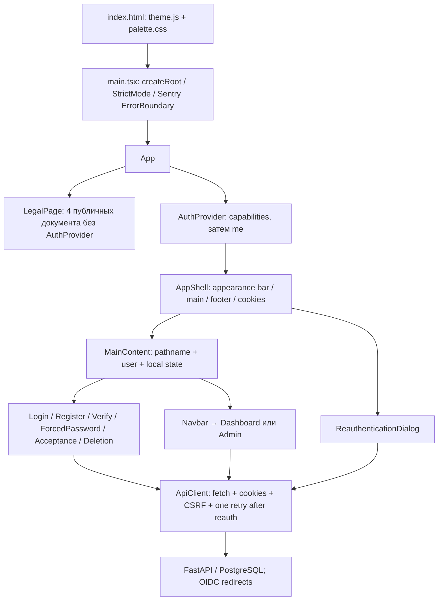
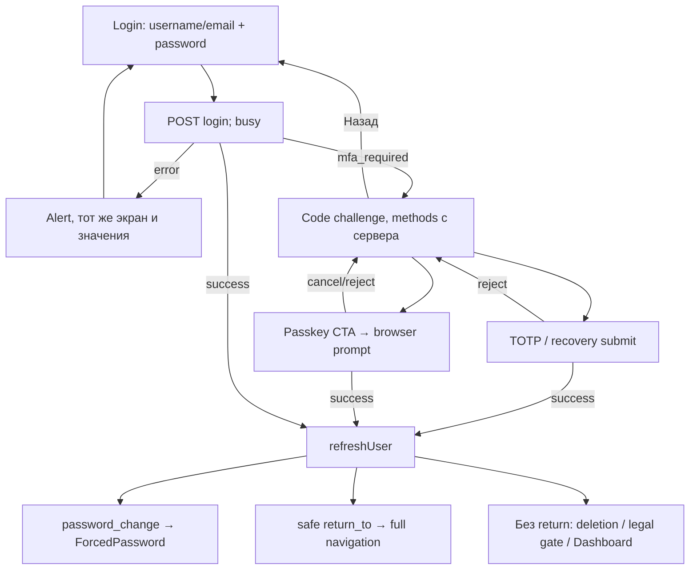
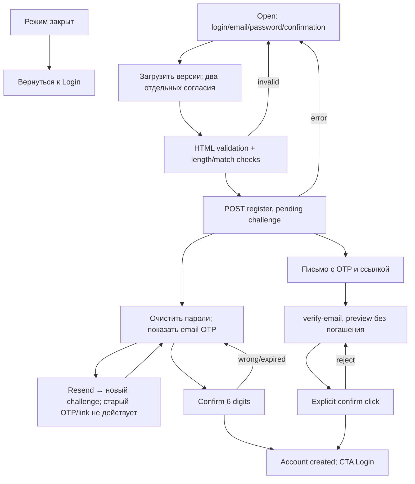

# FRONTEND UI DISCOVERY — ALXPRGS SSO

> Анализ текущего интерфейса, без редизайна и изменений реализации.

## Паспорт и ход исследования

- Исполнитель: Codex. Задача: UI-DISCOVERY-01.
- Фактическое начало: 2026-10-05T02:26:28+03:00.
- Фактическое завершение: 2026-10-05T03:18:01+03:00. Статус UI-DISCOVERY-01: **done**; приоритет P1; зависимости — предоставленная цель и доступ к текущим исходникам, выполнены.
- Учёт исследования: DOC-TRACK-02–06 применены внутри единственного разрешённого отчёта. Это завершение анализа UI, не общей цели разработки из GOAL.
- Исходная ревизия: `3a53257365802bd838ee4af269b34d67666f7b91`, ветка `new/resend-email-provider`; рабочее дерево чистое до создания отчёта.
- Основание: прочитанный `goal-objective.md`, переданный владельцем через `/goal`; требования к интерфейсу сопоставляются с `AGENTS.md` и `GOAL.md` без изменения задания разработки.
- Приоритет нового задания: разрешён только этот новый файл. Поэтому план и журнал исследования ведутся здесь, существующие `docs/plan.md`, `docs/worklog.md`, `docs/status.md` не изменяются.
- План: (1) инвентаризация исходников, документации и конфигурации; (2) трассировка маршрутов, состояний, форм, API и демонстрационных клиентов; (3) визуальные значения и доступность; (4) безопасная проверка доступного настоящего рендера; (5) полный отчёт с доказательствами и проверкой единственности изменения.
- Критерий готовности: покрыты все разделы задания, каждый существенный вывод привязан к источнику, факты отделены от вывода и непроверенного поведения; реализация не изменена.

### Журнал

| Время | Статус | Действие / результат | Следующий шаг |
|---|---|---|---|
| 2026-10-05T02:26:28+03:00 | in_progress | Прочитана цель; проверены Git, структура репозитория, текущие документы и состав frontend. Создан только отчёт. | Последовательно изучить фактические компоненты и зависимости. |
| 2026-10-05T02:34:08+03:00 | in_progress | Прослежены страницы, контекст, API, CSS, privacy/telemetry, OIDC и оба demo; сверены lock, CI и тесты. Текущие исходники собраны Vite в памяти (`write:false`, без исходного build-плагина записи файлов). Настоящий рендер публичных поверхностей проверен во встроенном браузере; API недоступен, ответы capabilities и пользователей не подменялись. | Оформить спецификации, каталог состояний и ограничения, проверить отчёт. |
| 2026-10-05T03:18:01+03:00 | done | Codex, UI-DISCOVERY-01: завершены анализ и редактура FRONTEND_UI_DISCOVERY.md. Проверено наличие всех 75 отслеживаемых frontend-файлов в инвентаре, 31 уникальной спецификации и 80 уникальных состояний; 15 локальных ссылок разрешаются; UTF-8 без replacement characters, без trailing whitespace; обязательный заголовок на месте. Git diff HEAD пуст, status содержит только новый отчёт. Временная вкладка закрыта, сервер preview остановлен; listener 5189 отсутствует. Защищённые live-сценарии/полный suite не запускались, ограничения записаны. | Передать отчёт для review; дальнейшие изменения UI — отдельное поручение. |

## 0. Границы, способ чтения и результат инвентаризации

Это описание ревизии выше, а не целевого продукта из GOAL и не предложение нового дизайна. Интерфейс рассматривается в трёх слоях: React SPA; HTML двух демонстрационных relying parties; HTML подтверждения OIDC logout и уведомление email, генерируемые Python. Дополнительно отмечен тестовый telemetry harness. Backend API сам по себе не считается экраном, но его ответы определяют доступность интерфейса.

Маркировка доказательств:

- **Код** — непосредственно прочитанное условие, значение или структура текущих исходников.
- **Рендер** — наблюдение текущего frontend, собранного в памяти и открытого в браузере в этой сессии.
- **Вывод** — следствие CSS/кода, не проверенное в соответствующем живом сценарии.
- **Тест в репозитории** — описывает существующее покрытие; не означает, что этот тест заново выполнен в данной задаче.
- **Не проверено** — требует backend/PostgreSQL, реального аутентификатора, email или другого стенда. Исторические PASS из `docs/status.md`/приёмки не переносятся на эту сессию.

Обнаружены **8 файлов страниц**, экспортирующих **9 page-компонентов** (в `LegalPage.tsx` находятся также `AcceptancePage`, `ConsentFields` и hooks); **11 значимых URL-путей SPA**, из которых `/accept-terms` и `/change-password` работают через состояние пользователя, а не отдельные pathname-ветки; **4 вкладки администратора**; **6 типов собственных диалогов** (пароль, новый пользователь, новый клиент, секрет клиента, детали аудита, reauthentication); **2 demo-клиента** с общим HTML-шаблоном. Каталог ниже содержит 80 именованных состояний сценариев. Это счётчик зафиксированных ветвей, не число всех комбинаций ошибок, фокуса, темы и viewport.

Основные источники: [App.tsx](frontend/src/App.tsx), [index.css](frontend/src/index.css), [palette.css](frontend/public/theme/palette.css), [API client](frontend/src/api/client.ts), [demo_app.py](examples/demo_app.py), [OIDC router](backend/app/api/oidc.py). Связанные документы: `README.md`, `GOAL.md`, `docs/architecture.md`, `docs/api.md`, `docs/privacy.md`, `docs/security.md`, `docs/04-operator-guide.md`, `docs/adr/0011-privacy-and-deletion.md`, `0012-web-theme-and-cookie-layout.md`, `0013-pr-quality-refactoring.md`, `0015-security-revision-and-reauth.md`, `0018-security-flow-decomposition.md`, `docs/status.md`, `docs/plan.md`, `docs/worklog.md`. Документы интерпретируются совместно с кодом: некоторые ранние описания уже не совпадают с реализацией.

## 1. Архитектура frontend

### 1.1. Фактически используемый стек

Версии установлены по `frontend/package-lock.json`, а не выведены из диапазонов manifest.

| Область | Реализация и версия | Как действительно используется |
|---|---|---|
| UI | React / ReactDOM 18.3.1 | `createRoot`, `StrictMode`, функциональные компоненты, hooks. Вся основная SPA рендерится на клиенте. Нет SSR, hydration, Next.js или серверных React-компонентов. |
| Язык | TypeScript 5.9.3 | Strict TS, JSX `react-jsx`, DOM/ES2020, bundler resolution; DTO в `types/api.ts`. Типизация не является полной runtime-проверкой ответов API. |
| Сборка | Vite 8.3.1, plugin-react 6.1.1 | `index.html` → `src/main.tsx`; npm `build` выполняет `tsc && vite build`. Версия и SHA внедряются как `__BUILD_IDENTITY__`; обычная сборка без sourcemaps, release — hidden maps. |
| Управление пакетами | npm + package-lock.json | `npm ci` в CI; иных frontend lock-файлов нет. Версия продукта 0.2.0 берётся из корневого `VERSION`, manifest тоже 0.2.0. |
| Навигация | Собственная логика App | Нет React Router. Чтение `window.location.pathname/search`, `history.pushState/replaceState`, локальные `currentPage/authView`. Dashboard/admin — состояние, URL при переключении не меняется. |
| Состояние | React Context + useState | `AuthProvider`: user, capabilities, isLoading и функции обновления. Формы, диалоги, списки и результаты — локальные состояния страниц. Нет Redux/Zustand/query cache. |
| Формы | Native HTML + controlled inputs | `form onSubmit`, `required`, HTML patterns и отдельные ручные условия. Нет React Hook Form/Formik. Нет Zod/Yup или общего frontend schema engine. |
| CSS | Ручной CSS и семантические variables | `index.css` содержит utility-классы, похожие по именам на Tailwind, но Tailwind/PostCSS-конфигурации и соответствующей зависимости нет. Классы не генерируются. |
| UI components | Собственные компоненты + HTML controls | Нет внешнего UI-kit/headless framework; `AccessibleDialog` реализует собственный focus trap. Button/Input/Card не выделены как компоненты. |
| QR | qrcode.react 4.2.0 | `DashboardPage` использует реальный `QRCodeSVG` для TOTP; в component test QR отдельно замокан. |
| Иконки | Символы и inline SVG | A, !, ✓, ✕, +, ⚠️; icon library отсутствует. Favicon — встроенный SVG в data URL, QR генерируется. |
| Motion | CSS | Одна общая transition opacity 0.15s ease-in-out на button; animation library нет. `transition-colors` написан в JSX, но CSS-правила для него нет. |
| Auth/browser API | Native fetch и Credentials API | Нет frontend OAuth SDK. Основная SPA использует cookie-auth; OIDC клиента выполняет Python SDK на server side demo. WebAuthn — `navigator.credentials.create/get`, преобразование Base64URL в utils. |
| Наблюдаемость | @sentry/react 11.2.0 | ErrorBoundary, optional errors/static traces и staging Replay с privacy projection. Это не библиотека интерфейсных уведомлений: Sentry Feedback UI отключён. |
| Локализация | Русские строки в TSX/Python | Нет i18n-библиотеки, переводных словарей или переключателя языка. Даты — `toLocaleString("ru-RU")`, часовой пояс браузера; удаление форматирует long date/time. API может содержать машинные английские identifiers. |
| Темы | Общие palette.css + theme.js | Синхронный script до первого paint; data-theme, `system/light/dark`; React ThemeControl обращается к `window.alxprgsTheme`. Те же файлы подключают demo. |
| Проверки | Node test runner, Vitest 5.0.2, jsdom 30.1.1, Testing Library, Playwright 1.63.0 | Unit, component и browser suites разделены. Chromium — единственный проект основного Playwright config; retries 0. Storybook, отдельный component explorer, axe и visual-diff snapshots отсутствуют. |

### 1.2. Связи компонентов



`AppShell` ставит `data-sentry-block` и `.sso-sensitive` на весь интерфейс. Это privacy-контракт, а не визуальный utility. В штатном приложении глобальная оболочка присутствует и на публичных документах, и при ErrorBoundary fallback. Публичные legal routes не инициализируют AuthProvider, но CookieBanner всё равно получает telemetry-config отдельным fetch.

`AuthProvider` при mount последовательно получает capabilities и me. Ошибка capabilities только записывается в console и оставляет null/предыдущее значение; ошибка me любого типа превращается в `user=null`. Нет polling сессии, глобального обработчика 401/403 и оповещения о приближении timeout. `refreshUser` вызывается после отдельных операций. В StrictMode эффекты в development могут исполняться повторно; это не отдельное UI-состояние.

### 1.3. API и эксплуатационная связность

`ApiClient.request` всегда отправляет `credentials:"include"`, Accept JSON, Content-Type для строкового body; для POST/PUT/DELETE/PATCH добавляет имеющийся `X-CSRF-Token`. Токен хранится только в поле singleton и обновляется из response header или login/MFA body. 204 превращается в `{}`. Остальные successful responses должны быть JSON object/array; cast `as T` не проверяет содержимое каждого DTO.

Ошибка становится `ApiError(message,status,code,canonicalRoute)`. Текст выбирается из `detail.detail`, `detail`, `error_description`, `error`; неподходящий object заменяется HTTP-сообщением. Страницы в основном показывают Error.message. Для `reauthentication_required` клиент вычисляет SHA-256 нормализованного JSON body, открывает глобальный диалог и ровно один раз повторяет исходную операцию с `X-Reauthentication`. Второй ответ обрабатывается без рекурсивного подтверждения. Export аудита реализован отдельным fetch → Blob → временная ссылка → revokeObjectURL, без общей request-ветки.

Vite dev/preview: порт 5173, `/api`, `/oauth`, `/.well-known` proxy к `VITE_BACKEND_TARGET` (default `http://localhost:8000`). Production Nginx раздаёт SPA с `try_files ... /index.html` и проксирует также `/health/`. Compose предоставляет frontend на localhost:3000; это отличается от Vite-порта. Переменные MFA/registration — серверные: пользователь не задаёт их через VITE_* или query. Release plugin/CLI Sentry — инструменты сборки; upload credential не должен попадать в browser. В этой задаче они не активировались.

## 2. Полная инвентаризация UI-файлов

Ниже перечислены исходные UI-файлы, включая проверки и интеграцию. `node_modules`, generated `dist`, reports и ignored artifacts не являются отдельной реализацией. В `frontend/public` обнаружены только три theme-файла; изображений, каталогов шрифтов и внешнего брендового logo asset нет.

| Группа | Пути | Ответственность |
|---|---|---|
| Entry | `frontend/index.html`, `frontend/src/main.tsx`, `frontend/src/App.tsx` | Document metadata/favicon/theme, mount/boundary, dispatch экранов. |
| State | `frontend/src/context/AuthContext.tsx` | Cookie-session user/capabilities lifecycle. |
| Pages | `frontend/src/pages/LoginPage.tsx`, `RegisterPage.tsx`, `VerifyEmailPage.tsx`, `DashboardPage.tsx`, `AdminPage.tsx`, `ForcedPasswordPage.tsx`, `AccountDeletionPage.tsx`, `LegalPage.tsx` | Все page-компоненты; AcceptancePage и ConsentFields находятся в LegalPage. |
| Layout/navigation | `frontend/src/components/AppShell.tsx`, `Navbar.tsx`, `ThemeControl.tsx`, `PrivacyControls.tsx` | Viewport shell, navbar, appearance selector, legal footer/cookies. |
| Dialogs | `frontend/src/components/AccessibleDialog.tsx`, `ReauthenticationDialog.tsx` | Keyboard/modal mechanics; глобальное повторное подтверждение. Остальные диалоги написаны прямо в Dashboard/Admin. |
| Styles/theme | `frontend/src/index.css`, `frontend/public/theme/palette.css`, `theme.js`, `demo.css` | Utility layer, общая palette, preference script, отдельный demo layout. |
| API/types | `frontend/src/api/client.ts`, `frontend/src/types/api.ts`, `frontend/src/types/build.d.ts` | Endpoint methods/errors/CSRF, DTO и compile-time build identity. |
| Utils | `frontend/src/utils/error.ts`, `security.ts`, `reauthentication.ts`, `webauthn.ts` | Displayable message, safe return URL, request digest, browser binary contracts. |
| Privacy/telemetry | `frontend/src/telemetry/consent.ts`, `privacy.ts`, `sentry.ts`, `replay.ts`, `replay-envelope.ts`, `replay-worker-prefix.js` | Storage choice, metadata allowlists, init/revoke, recorder and worker sanitization. |
| Configuration | `frontend/package.json`, `package-lock.json`, `vite.config.ts`, `tsconfig.json`, `tsconfig.tests.json`, `eslint.config.js` | Locked toolchain, commands, strict compiler, quality checks. |
| Browser config | `frontend/playwright.config.ts`, `playwright.email.config.ts`, `playwright.telemetry.config.ts` | Main Chromium; external email; isolated SDK browser harness. |
| Unit/components | `frontend/src/utils/security.test.ts`, `frontend/src/telemetry/privacy.test.ts`, `frontend/src/App.component.test.tsx`, `Privacy.component.test.tsx`, `telemetry/sentry.component.test.tsx` | URL rejection, privacy projection, mocked page branches, dialog/privacy tests, real SDK boundary. |
| Browser scenarios | `frontend/e2e/sso.spec.ts`, `multi_client_sso.spec.ts`, `protocol_lifecycle.spec.ts`, `passkey.spec.ts`, `totp.spec.ts`, `privacy.spec.ts`, `appearance.spec.ts`, `email.spec.ts`, `telemetry.spec.ts`, `csp.spec.ts` | SSO/default/enabled/auth/privacy/appearance/email/CSP journeys. Appearance explicitly uses mocked API contracts. |
| Browser helpers | `frontend/e2e/helpers/prepare.ts`, `legal.ts`, `reauthentication.ts`, `testmail.ts`, `emailReporter.ts` | Guarded fixture preparation, acceptance/reauth flows, email bridge/report redaction. |
| Harness | `frontend/telemetry-harness.html`, `frontend/e2e/telemetry/harness.tsx`, `telemetry.spec.ts` | Техническая синтетическая SDK-страница и её tests; не обычный production entry. |
| Serving/build | `frontend/Dockerfile`, `Dockerfile.release`, `Dockerfile.release.dockerignore`, `.dockerignore`, `nginx.conf`, `nginx-main.conf`, `csp.conf`, `security-headers.conf` | Compile/distribution, unprivileged serving, SPA fallback, headers/maps policy. |
| Demo HTML/state | `examples/demo_app.py`, `examples/demo_sessions.py`, `examples/client1/app.py`, `examples/client2/app.py`, `examples/__init__.py`, `examples/README.md` | Один HTML-шаблон, два брендинг-заголовка, отдельные RP sessions и callback/CSRF. |
| Backend-generated surfaces | `backend/app/api/oidc.py` (`_logout_confirmation`), `backend/app/services/verification_email.py` (`build_message`), `backend/app/legal.py` | Plain logout page, email variants, тексты/versioned documents. |
| Backend contracts | `backend/app/api/auth.py`, `mfa.py`, `privacy.py`, `reauthentication.py`, `admin.py`, `deps.py`; `backend/app/schemas/auth.py`, `mfa.py`, `admin.py`; `backend/app/config.py`, `main.py`, `core/security.py`, `core/exceptions.py` | Валидация, guarded endpoints, cookies/session purpose, безопасные error envelopes и flags. |
| Backend scenarios/data | `backend/app/services/auth_service.py`, `registration_service.py`, `privacy_service.py`, `reauthentication_service.py`, `oidc_service.py`, `mfa_service.py`, `totp_service.py`, `recovery_codes_service.py`, `webauthn_assertion.py`, `security_state.py`, `admin_service.py` | Источник auth state/security invariants; UI не является их authority. |
| Integration/checks | `.github/workflows/ci.yml`, `release.yml`; `scripts/run_e2e_suite.py`, `manage_test_server.py`, `prepare_e2e_data.py`, `test_smtp_capture.py`, `render_sentry_csp.py`, `check_sentry_build.py`, `check_sentry_sourcemaps.mjs`, `build_release_artifacts.py`, `sentry_artifacts.py`, `sentry_release.py`; `docker-compose.yml`, `.env.example`, `deploy/nginx.conf`, `start.ps1`, `start.sh` | Как UI реально запускается/проверяется/поставляется; release не активирует CD. |
| Связанные regression tests | `tests/test_demo_theme.py`, `test_demo_sessions.py`, `test_registration.py`, `test_verification_email.py`, `test_documented_api_contract.py`, `test_sentry.py`, `test_g8_sso_regression.py`, `test_g8_sec_regression.py`; `tests/integration/test_registration_pg.py`, `test_email_verification_pg.py`, `test_features_pg.py`, `test_passkey_pg.py`, `test_reauthentication_pg.py`, `test_temporary_password_pg.py`, `test_privacy_pg.py`, `test_oidc_contract_remediation_pg.py` | Связывают frontend expectations с отдельными unit/настоящими PG/protocol проверками. Перечень backend tests здесь ограничен влияющими на UI сценариями. |

Нет отдельных директорий routes/layouts/forms/primitives/hooks/assets/design-system. Hooks расположены в context, LegalPage и PrivacyControls; видимые primitives повторяются в TSX. Наличие названия класса не доказывает наличие CSS-реализации.

## 3. Карта маршрутов, экранов и приоритетов

### 3.1. Dispatcher App и важный порядок проверок

`App.tsx:83` сначала отделяет четыре publicDocument. В `MainContent` порядок: `/verify-email` → loading session → forced password session → `/login?force_login=1` → anonymous login/register → deletion/purpose/path → legal acceptance → Navbar + local dashboard/admin. Следовательно, URL и user state нельзя описывать независимо.

| Путь / состояние | Пользователь и вход | Экран / регионы / основная задача | Дальнейшие состояния и escape | Responsive/security |
|---|---|---|---|---|
| `/` | Любой; fallback-path | Anonymous: Login; full account: Dashboard; legal/deletion/password gate имеют приоритет. | Login→MFA/account/return_to; account→локальное admin; logout. | Общая оболочка; серверные gates. |
| `/login` | Обычно anonymous | Бренд A/заголовок, password form, optional passkey/register, policy summary при capabilities. | Error/MFA/успех; register callback; auth user без force видит account/gate. | 448px начиная с 640px, mobile fluid; cookies. |
| `/login?force_login=1&return_to=...` | Даже существующая full-session | Login принудительно. Password_change всё же выше этой ветки. | После auth same-origin `return_to`; MFA; ошибка остаётся в карточке. | Параметр создаётся OIDC; sanitization обязательна. |
| `/register` | Anonymous; authView инициализируется по path | Закрытая регистрация либо четыре поля + два согласия; потом OTP/успех в той же карточке. | Resend; login. Уже auth user проходит gates/account вместо формы. | Проверка режима сервером; до email user не создан. |
| `/verify-email?token=...&mode=registration` | Публично, без требования сессии | Карточка link-confirmation и optional details preview. | Explicit confirm → success/error; link /login. | Token удаляется из address bar через replaceState; fetch preview не погашает. |
| `/verify-email?token=...` / без параметров | Публично | Existing-email confirm либо сообщение отсутствующего token. | Busy/success/error; login. | `main` внутри shell-main, собственный min-height:100vh. |
| `/privacy` | Любой, без AuthProvider | Policy: один article с paragraphs и версией. | Другие документы в footer; login. | legal-page ≤832px, px16; plain text. |
| `/terms` | То же | Условия аккаунта, доступа, security и удаления. | То же. | Explicit acceptance выполняется на других экранах. |
| `/cookies` | То же | Политика cookie, browser storage, themes/telemetry. | Cookies settings в footer. | Choice UI не совпадает с чтением policy. |
| `/data-consent` | То же | Отдельное согласие на обработку, цели и сроки. | То же. | Не является согласием на диагностику. |
| `/account-deletion` | Auth user любого назначения, кроме password_change | Статус/предупреждения/password→MFA→confirmation. | Pending/cancel/cooldown/deadline; logout; account link лишь вне pending. Anonymous видит Login. | UTC на сервере, local display; explicit proof и CSRF. |
| `/accept-terms?return_to=...` | Backend redirect; branch driven by `legal_acceptance_required` | AcceptancePage, если required !== false; otherwise Dashboard. Отдельного path-match нет. | accept→refreshUser→resume `/oauth/authorize`; deletion/logout. | Fresh exact versions + два checkboxes. |
| `/change-password` | Backend redirect; `session_purpose=password_change` | ForcedPasswordPage независимо от текущего path. Без такого purpose путь сам экран не включает. | Change→/login + refreshUser; logout; error. | Limited session; не пропускает к RP до смены. |
| Admin / 4 tabs | `is_superuser || roles.includes("admin")`, через Navbar button | Users, clients, audit, system и dialogs; текущий pathname сохраняется. | Dashboard/logout; переключение tabs; loading/action feedback. | Tables overflow-x; кнопки tabs wrap; server RBAC. |

Всего 11 различных SPA-путей в таблице; варианты query у одного path считаются состояниями. `/admin`, `/profile`, `/dashboard`, неизвестные URL не имеют dedicated routing. Full user на них получает обычный Dashboard; anonymous — Login. В `docs/architecture.md` схема перечисляет `/admin, /profile`, но это не реальная карта dispatcher. Нет 404-screen. `Navbar.currentPage="login"` допускается типом, однако Navbar реально монтируется после auth gates и эта ветвь штатным dispatch не используется.

`pushState` между login/register не устанавливает popstate-listener; браузерная history не является полноценной state machine. `currentPage` и activeTab сбрасываются при reload/unmount; admin deep-link и сохранение tab отсутствуют. `authView` не перечитывается как подписанное состояние URL. В force-login callback `onNavigateToRegister` лишь меняет authView: force-login pathname-ветка снова возвращает Login, поэтому этот переход не открывает Register (**код**).

### 3.2. Серверные HTML и RP-пути

| Origin / путь | Что пользователь действительно видит |
|---|---|
| SSO `/oauth/authorize` | Обычно HTTP redirects, отдельной visual consent page нет. Client/scopes/redirect/PKCE валидируются сервером. При отсутствии interaction → forced login; limited password/deletion/legal → соответствующий gate; full accepted account → callback с code/state. |
| SSO `/oauth/logout` GET без id_token_hint с активной session | Plain HTML confirmation: H1, POST «Выйти из SSO», link «Отмена». Без theme/SPA footer/CSS. Валидный hint-путь может завершить выход redirect без этой формы. |
| Demo1 `http://localhost:8001/`, demo2 `http://localhost:8002/` (defaults) | Anonymous: heading + link «Войти через ALXPRGS SSO»; session: user-info, peer link, local/SSO logout forms. |
| Demo `/dashboard` | Те же authenticated contents; без RP session redirect к /login. |
| Demo `/login` | Немедленный redirect к authorize; собственных input fields нет. |
| Demo `/callback?code&state` | Серверный обмен/проверка → /dashboard; no loading/callback component. Invalid flow/SDK error → HTTP JSON error, не styled page. Недостающий code/state — native FastAPI validation. |
| Demo `/logout` POST | CSRF guarded local revoke → `/` (303). SSO-сессия остаётся. |
| Demo `/sso-logout` POST | CSRF guarded local revoke → provider logout с id_token_hint (303). Нет federated logout iframe или отдельного frontend widget. |
| `/telemetry-harness.html` в Vite development | Синтетические controls для SDK tests. В production index build не включён как entry; не часть auth navigation. |
| Backend `/docs` | Swagger только при DEBUG; `redoc_url=None`. Техническая developer surface, не login/administrator application. В браузере этой задачи не открывалась. |

### 3.3. Что отсутствует или не достигается штатно

Не найдены: forgotten-password/reset-by-email, самостоятельный recovery-code login, login magic-link, OTP passwordless login, social/provider chooser, account chooser, OIDC approve/deny consent screen, application grants list/revoke UI, trust-device checkbox, device approval workflow, отдельные access denied/rate limit/session expired/callback/logout-success pages, avatar/profile editor, locale switch, invitations, CAPTCHA UI. Подтверждающая email-ссылка подтверждает email/создание аккаунта и **не выполняет login**. Recovery codes заменяют второй фактор после password, не пароль.

Физически присутствует, но недоступно при штатных условиях: disabled TOTP/passkey/recovery controls и QR; legacy ветка `email_verification_enabled=false` в Dashboard (Settings отвергает выключение обязательного подтверждения email); Navbar anonymous markup (Navbar вызывается только в auth branch); `LegalPage` «Документ не найден», если API не возвращает document для одного из разрешённых paths; machine `ApiClient.updateAdminUser` поддерживает `new_password`/profile fields, но UI вызывает его только для is_active — editor/reset-password формы нет. `user.has_passkey` в DTO не определяет отдельный badge/гейт карточки passkeys; отображается fetch credentials list.

## 4. Каталог состояний сценариев

Каждая строка — отдельная обозримая ветвь. Условные UI в защищённых разделах подтверждены исходниками и существующими tests, не живым backend этой сессии. Hover/focus и состояния theme рассмотрены отдельно в каталогах controls, не умножают этот счётчик.

| ID | Поверхность / состояние | Триггер и видимый результат | Источник |
|---|---|---|---|
| UI-S-001 | Session loading | `isLoading`: центрированный текст «Загрузка данных сессии...». | App |
| UI-S-002 | Capabilities unavailable | Нет policy summary/passkey/register-link; caps null, user refresh продолжается. | AuthContext/Login |
| UI-S-003 | Anonymous after me failure | Любая ошибка getMe → Login, без отдельного сообщения причины. | AuthContext/App |
| UI-S-004 | Render failure | ErrorBoundary fallback: alert и «Перезагрузить». | main |
| UI-S-005 | Password login idle | Два поля, CTA Войти. | Login |
| UI-S-006 | Password login busy | CTA «Выполняется вход...», disabled. | Login |
| UI-S-007 | Password login failure | Red alert над form, values сохраняются. | Login |
| UI-S-008 | MFA code challenge | Одно поле TOTP/recovery, условный confirm, Back. | Login |
| UI-S-009 | MFA rejected code | Тот же alert, MFA сохраняется. | Login |
| UI-S-010 | MFA recovery branch | Recovery при доступном method; после success refreshUser. | Login |
| UI-S-011 | Passwordless passkey | Capability-button → browser prompt → auth verify. | Login |
| UI-S-012 | MFA passkey | available_methods includes passkey → отдельный CTA. | Login |
| UI-S-013 | Passkey cancellation/failure | Error/DOMException.message в общем alert. | Login |
| UI-S-014 | Return redirect | Success + safe returnTo → full document navigation. | Login |
| UI-S-015 | Register caps pending | Пока caps null, isClosed falsy; форма может видеться, documents ещё нужны. | Register |
| UI-S-016 | Registration closed | ! marker, explanation, return-to-login CTA. | Register |
| UI-S-017 | Registration form | Четыре поля + два explicit checkboxes. | Register |
| UI-S-018 | Legal fetch failure at registration | Alert, submit disabled. | Register/Legal |
| UI-S-019 | Client validation failure | Username length/password length/mismatch или missing consents. | Register |
| UI-S-020 | Registration request busy | CTA «Регистрация...», disabled. | Register |
| UI-S-021 | Registration request failure | Red banner, введённые поля остаются. | Register |
| UI-S-022 | Pending email challenge | Password fields очищены/скрыты; six-digit field + details/resend. | Register |
| UI-S-023 | OTP failure | Error сохраняет challenge; resend доступен после busy. | Register |
| UI-S-024 | Resend success | New challenge/code cleared; old link/code invalidation сообщается текстом. | Register |
| UI-S-025 | Registration completed | Success + «Перейти ко входу», без auto-login. | Register |
| UI-S-026 | Verification missing token | Plain paragraph об отсутствующем token + login link. | Verify |
| UI-S-027 | Verification link ready | Confirm button, 10-minute text. | Verify |
| UI-S-028 | Registration preview details | Native details/dl, если preview successful. | Verify |
| UI-S-029 | Preview unavailable | details=null без видимого preview-error, confirm остаётся. | Verify |
| UI-S-030 | Link confirmation busy | «Подтверждение...», disabled. | Verify |
| UI-S-031 | Link confirmation failure | role=alert, token остаётся в component memory. | Verify |
| UI-S-032 | Link confirmation success | role=status; token cleared; login link. | Verify |
| UI-S-033 | Legal loading | «Загрузка документа…», role=status. | Legal |
| UI-S-034 | Legal document ready | Article/title/version/paragraphs. | Legal |
| UI-S-035 | Legal failure/not found | Alert fetch-error либо H1 «Документ не найден». | Legal |
| UI-S-036 | Acceptance required | Два непредвыбранных consent fields; protected screen отсутствует. | App/Acceptance |
| UI-S-037 | Acceptance busy/failure | CTA disabled while busy; role=alert при отказе/version conflict. | Acceptance |
| UI-S-038 | Password modal open | Три password controls, Save/Cancel, initial focus. | Dashboard |
| UI-S-039 | Password modal failure/busy | Red alert либо «Обновление...», close blocked busy. | Dashboard |
| UI-S-040 | Password modal success | Закрывается, green status в родительской card; refresh sessions. | Dashboard |
| UI-S-041 | Forced temporary password | Restricted explanatory page; current/new/confirmation, logout. | ForcedPassword |
| UI-S-042 | Forced password failure/busy | Inline alert/«Сохранение…»; после success refreshUser и /login. | ForcedPassword |
| UI-S-043 | Sessions loading | «Загрузка сессий...». | Dashboard |
| UI-S-044 | Sessions load error | Red text вместо table; error не сбрасывается fetchSessions. | Dashboard |
| UI-S-045 | Sessions empty | Table headings с пустым tbody, отдельного empty copy нет. | Dashboard |
| UI-S-046 | Sessions populated | Current badge; revoke только не-current. | Dashboard |
| UI-S-047 | MFA features disabled | Три cards видны, controls отсутствуют, текст флага. | Dashboard |
| UI-S-048 | TOTP available | Setup button, доступность badge. | Dashboard |
| UI-S-049 | TOTP enrollment | QR/manual key/copy/code/confirm/cancel. | Dashboard |
| UI-S-050 | TOTP active | Check-mark text + disable action. | Dashboard |
| UI-S-051 | TOTP failure/success | Локальные red/green feedback blocks; copy status отдельно. | Dashboard |
| UI-S-052 | Passkey empty | Registration field/button + italic «Нет зарегистрированных ключей». | Dashboard |
| UI-S-053 | Passkey list | Name, truncated ID, sign counter, delete. | Dashboard |
| UI-S-054 | Passkey operation failure/success | Local text block, passkeyLoading disabled actions. | Dashboard |
| UI-S-055 | Recovery prerequisite missing | Text о необходимости TOTP, generate action отсутствует. | Dashboard |
| UI-S-056 | Recovery generated | One-time codes list + warning/save copy. | Dashboard |
| UI-S-057 | Email unverified | Send button + numeric-code field + confirm. | Dashboard |
| UI-S-058 | Email verified | Green check/status/text с email, challenge controls отсутствуют. | Dashboard |
| UI-S-059 | Email send/confirm result | Локальные red/green blocks; отправка не создаёт новый screen. | Dashboard |
| UI-S-060 | Admin users loading/empty/list | Loader либо table; empty tbody без separate explanation. | Admin |
| UI-S-061 | Create user modal | Три поля и admin checkbox, Create/Cancel. | Admin |
| UI-S-062 | User action rejected/result | Browser alert; block/unblock сначала confirm. | Admin |
| UI-S-063 | Admin clients loading/empty/list | Loader либо table + register-client action. | Admin |
| UI-S-064 | Create client modal | Name/type/scopes/URI lines, register/cancel. | Admin |
| UI-S-065 | Client secret revealed | One-time select-all text + close acknowledgement. | Admin |
| UI-S-066 | Audit loading/empty/list | Filter/export controls, table или loader. | Admin |
| UI-S-067 | Audit details dialog | dl + pretty JSON; close via ✕/Escape/backdrop. | Admin |
| UI-S-068 | Audit error/export busy | role=alert, exports disabled; page navigation 50 records. | Admin |
| UI-S-069 | System status | Four metric blocks (фактически максимум 2 columns); refresh. | Admin/CSS |
| UI-S-070 | Registration policy mutation | Radios + password; result block success/error. | Admin |
| UI-S-071 | Global reauthentication password | API-request pause, centered dialog. | ReauthenticationDialog |
| UI-S-072 | Global reauthentication factor | Select + code или browser passkey prompt; error/Cancel. | ReauthenticationDialog |
| UI-S-073 | Deletion status unavailable | Loader/ prominent alert, operation controls отсутствуют. | AccountDeletion |
| UI-S-074 | Deletion request/cancel proof | Password → optional factor → explicit checkbox → operation. | AccountDeletion |
| UI-S-075 | Deletion pending | Scheduled date, suspended SSO, cancel flow и logout. | AccountDeletion |
| UI-S-076 | Deletion cooldown/deadline | Eligibility date либо expired cancel deadline; form скрыта. | AccountDeletion |
| UI-S-077 | Cookie initial choice | Necessary/diagnostics/configure, не modal. | PrivacyControls |
| UI-S-078 | Cookie settings/storage fallback | Two checkboxes + save; storage failure status after save. | PrivacyControls/consent |
| UI-S-079 | Demo anonymous/authenticated | Общая theme toolbar; login-link либо user+peer+logout forms. | demo_app |
| UI-S-080 | OIDC logout confirmation | Plain server HTML без SPA theme; approve/cancel. | api/oidc |

Комбинации (например, busy+error прошлого запроса, dark+mobile, cancel proof+factor_error) возможны дополнительно. Формальные истечение token/rate limit/CSRF/access denied превращаются в локальные ошибки своих screens, а не новые routes. В тестовом harness отдельные controlled error/rejection/flush состояния не включены в 80 продуктовых ветвей.

## 5. Карта пользовательских потоков

### 5.1. Password, MFA и возврат в приложение



Исходник `LoginPage.handleSubmit` не очищает username/password. С обычным успешным password response `AuthContext.login` обновляет user. Ответ MFA не создаёт full user в контексте: переключается локальная форма, mfaToken хранится в памяти. Единственное поле MFA принимает и цифровой TOTP, и recovery string. Для шести цифр сперва пытается TOTP; если тот отказал и recovery_code входит в methods, пробует recovery. Иначе выбирает recovery или TOTP по доступности. В UI это не выбор метода в select. При passkey-only MFA текстовое required-поле всё равно нарисовано, но passkey button type=button не требует его заполнения; кодовая submit-кнопка отсутствует.

Code confirm в MFA не имеет `disabled={loading}` и не меняет подпись на busy. Back также остаётся доступен; он лишь снимает mfaStep, не очищая code/token/error. Passkey buttons disabled при busy. Нет автоматического focus на MFA field и нет отдельного success page. `refreshUser` выполняется перед return navigation. Обычный return redirect подавлен для limited password-change response; server authorize всё равно остаётся окончательной проверкой gates. Registration-link переход через pushState удаляет исходный query и может потерять return context (**код/вывод**).

Passwordless passkey начинается кнопкой под password CTA при `passkey_enabled`. Username не отправляется для options: это discoverable credential selection браузером/OS. Опции от backend → Base64URL conversion → browser get → serialize → auth verify → refreshUser → safe redirect/гейт. Нет «автоматически предложить passkey», conditional mediation, progress illustration или собственной biometric-кнопки. Браузерное окно не рисуется React и зависит от платформы. `NotAllowedError` отображается как Error.message, не отдельный локализованный cancel screen.

### 5.2. Самостоятельная регистрация и email



Form submits только при documents+terms+consent, username.trim≥3, password≥15, matching confirmation; браузер проверяет required/type=email/minLength. Backend проверяет более полный формат/длины/password blocklist/exact legal_versions/open-mode. После register заменяет все credential fields challenge-экраном, password/confirmation очищены. `challenge_id/expires_at/request_details` получены с backend; expiration countdown в UI нет. OTP onChange удаляет non-digits, срезает до 6; submit disabled до ровно 6 и при loading. Confirm code success создаёт аккаунт, но не логинит его.

Resend не имеет видимого cooldown/countdown. При успехе меняется challenge, очищается code, success сообщает отмену старого code/link. Request details отображаются native details/dl с **сырыми ключами** `ip,time,os,browser,device`; frontend не переводит их. Production source деталей не возвращает city/country, хотя старые unit fixtures содержат city. Успех имеет green banner без role=status. После перезагрузки challenge памяти теряется; restore pending registration из storage не реализован.

Email link читает token/mode один раз в refs, затем удаляет все query через `replaceState("/verify-email")`. Mode registration вызывает POST preview; отказ preview тихо убирает details. Погашение только по confirm click. Success token=null, role=status; retry ошибки работает на том же token, пока сервер разрешает. Нет авто-login, автоперехода, countdown, resend на link page; escape — link /login.

### 5.3. TOTP, recovery и existing email в кабинете

TOTP: card available → «Настроить TOTP» → `setupTotp` (может открыть global reauth) → QR 192px+manual secret → copy/manual entry → `confirmTotp` → refreshUser → active check и «Отключить». Copy имеет success/failure status и ручную альтернативу. Cancel убирает только setupData, не вызывает delete endpoint. Disable сначала native confirm, затем API/при необходимости reauth; после успеха очищает recovery codes и refreshes user. Ошибки остаются в card. Требование обязательного user verification / configured MFA не заменяется удобством UI.

Recovery: capability enabled + user.has_totp → generate button → API/reauth → массив кодов в памяти, warning «только один раз». Новые коды заменяют прежние по серверному контракту; подтверждающего native confirm перед regenerate в UI нет. Нет copy-all/download/print и счётчика оставшихся кодов. `select-all` облегчает ручное копирование. Logout/reload/unmount теряет открытую коллекцию.

Existing email: unverified account → send email → остаётся та же card, code field был доступен и до send → six digits confirm → refreshUser → verified block. Поле numeric/pattern/maxLength, но autoComplete=one-time-code отсутствует. Стандартное подтверждение новой регистрации обязательно; legacy/admin login eligibility регулирует сервер `REQUIRE_VERIFIED_EMAIL`, UI не решает это самостоятельно.

### 5.4. Пароли и реальное восстановление доступа

Кабинет: change trigger → AccessibleDialog/current password/new/confirm → mismatch/minimum check → `changePassword` с cookie/CSRF/возможным reauth → success закрывает dialog, показывает green status и обновляет sessions. Значение `requires_login` присутствует в response type, но этот handler его не использует и `refreshUser` не вызывает. Поэтому смена, отозвавшая текущую session, не обязана немедленно перевести уже открытый UI на Login; следующий protected API даст отказ. Это различие со ForcedPasswordPage, не доказательство сохранения доступа на сервере.

ForcedPassword: limited session → отдельный page с временным/current и new/confirm → success очищает поля, pathname `/login`, `refreshUser`; после новой аутентификации user снова проходит legal/deletion/full gates. Logout — явный escape. Self-service «Забыли пароль?» и reset-by-link отсутствуют. Возврат после потери password осуществляется вне существующего публичного frontend; документация/API возможностей администратора не означает наличие reset editor в UI.

### 5.5. OIDC authorize и logout

```mermaid
sequenceDiagram
  participant RP as Demo / Python SDK
  participant B as Browser
  participant OP as SSO backend
  participant UI as React frontend
  RP->>B: Redirect authorize (PKCE/state/nonce)
  B->>OP: GET /oauth/authorize
  alt Необходима новая аутентификация
    OP->>B: /login?force_login=1&return_to=encoded
    B->>UI: Login / MFA
    UI->>OP: login и factor verify
    UI->>B: safe return_to
    B->>OP: исходный authorize
  end
  alt Требуются актуальные согласия
    OP->>B: /accept-terms?return_to=encoded
    B->>UI: AcceptancePage
    UI->>OP: explicit versions/consents
    UI->>B: resume authorize
    B->>OP: authorize
  end
  OP->>B: registered callback?code&state
  B->>RP: callback
  RP->>OP: token + verifier
  RP->>B: RP cookie; /dashboard
```

До redirect backend валидирует client и буквальное совпадение URI. Request разрешает prompt None/login/none и max_age; неподдерживаемый prompt, including consent/select_account, не рисует consent/chooser. `prompt=none` при недопустимой session возвращает login_required/interaction_required к проверенному callback и не показывает UI. Full accepted user выдаёт code автоматически: scopes — настройки зарегистрированного клиента, а не запрашиваемое пользователем consent dialog. Ошибки неизвестного client/URI могут показать JSON непосредственно в browser; отдельной страницы их перевода нет.

Navbar «Выйти» вызывает cookie API logout: визуальный user очищается в finally даже при API error, capabilities обновляются; полного logout error UI нет. Demo «Локальный выход» завершает только свою RP session; «Выход из SSO» дополнительно направляет к provider logout. Logout GET без допустимого hint и с session показывает server confirmation с CSRF hidden input; Cancel link `/`. Другие RP sessions не превращаются автоматически в logged-out React/HTML screens: limits локальных сессий/JWT должны сохраняться.

### 5.6. Согласия, удаление и sensitive operations

Acceptance: me legal_required !== false → documents fetch → оба checkboxes false → disabled CTA до готовности → accept exact versions → refreshUser → authorized-only resume of `/oauth/authorize`. Версии изменились — API reject, alert; hook не делает automatic refetch на 409, текст предлагает обновить документы. Escape: delete page/logout, чтение документов в новых вкладках.

Deletion: status → request/cancel выбирается pending → password confirmation → optional method selector (TOTP/recovery/passkey) → signed/hashed server proof → отдельный explicit consequences checkbox → schedule/cancel. Request result обновляет status и user, обычный access suspended. Cancel результат → refreshUser → `location.assign("/login")`. Error final submit сбрасывает proof/checkbox: необходимо подтвердить доступ заново. Proof expiration показывается датой, countdown нет. Cooling-down/deadline — вычисление при render (`Date.now()`), interval для немедленной перерисовки ровно на границе нет; сервер остаётся authority. Pending deadline disables cancel form; logout и documents доступны.

Global reauth появляется по error contract, удерживает исходный Promise. Password → при configured MFA select/code/passkey → proof → ApiClient один раз повторяет исходные method/endpoint/body. Cancel отклоняет Promise «Операция отменена», которое исходный screen показывает своим error способом (иногда alert). Пока другой proof уже pending, следующий запрос отвергается «Дождитесь завершения текущего подтверждения». Secret values/proof/digest не рисуются. В диалоге нет названия конкретного пользователя/client или action: только общее объяснение.

## 6. Текущая визуальная композиция

### 6.1. Оболочка и ширины

`AppShell` — вертикальный flex высотой `100vh`, затем `100dvh`. Внутри `.app-scroll` flex:1/min-height:0/overflow-y:auto, appearance bar, main и footer; CookieBanner — отдельный flex:none sibling снизу. Это **не position:fixed banner**. Main имеет flex:1, min-width:0; контент прокручивается над баннером. Appearance bar right aligned, padding 8px 16px, border-bottom 1px. Тема — текст и native select min44px, поэтому observed bar около61px. Footer text centered, 24px vertical/16px horizontal, border-top, wrapping nav gap12px, email contact ниже.

Login/Register `.auth-page`: column, justify-center, py48px, горизонтально16px. Поздняя `.auth-page` переопределяет ранние responsive horizontal padding classes. При ≥640px оба внутренних контейнера width100/max448px и auto margins. Card py32px/px16px, с ≥640px px40px/radius12px. На узких устройствах sm radius отсутствует: auth card без заданного скругления. До карточки margin-top32px; до heading после A —16px; helper —8px. 48×48 blue A/radius12/shadow-md; heading30/36 weight800 letter-spacing−.025em; paragraph14/20. Заголовок входа переносится на две строки даже на desktop из-за448px контейнера.

Dashboard/Admin: max1280px, margins auto, py32, side padding16/24/32px при base/640/1024. Card padding24/radius12/light border/shadow. Dashboard sections separated32px, Admin24px. Profile/security grids одна колонка до768, две с768. Таблицы плотные: headers px16/py8, body обычно px16/py12, audit rows py8, text14/20 либо12/16. Admin header and card toolbars wrap под1024px; tabs всегда flex-wrap. Никакой sidebar, хлебных крошек, hero illustration, gradients или картинок.

Legal/Acceptance/Deletion: max832px включая padding32px сверху/снизу и16px сбоку. Форма/paragraph margin16px. Plain flow без большого brand A и без shadow-card. H1 1.8rem (28.8px), inherited line-height1.5. ForcedPassword: max512/p24, plain content, H124/32. VerifyEmail: inner main min100vh/p24/flexcenter, section max448/p24/radius8/shadow, gap16; global shell уже имеет main, поэтому вложены два main и возникает дополнительная вертикальная прокрутка.

### 6.2. Цвета: реальные CSS variables

`palette.css` — deliberate semantic palette. Ниже **все цветовые variables**, значения dark при отсутствии override наследуют light. Названия `text-gray-*`/`bg-white` не означают буквальные gray/white: они привязаны к semantics темы.

| Variable | Light | Dark | Назначение/употребление |
|---|---|---|---|
| `--bg-main` | #f8fafc | #0b1220 | Page и table heads через bg-gray-50. |
| `--surface` | #ffffff | #111c2f | Cards, inputs, dialogs, active tab, generic white backgrounds. |
| `--surface-muted` | #f1f5f9 | #18253b | Secondary controls, gray badges, secret background. |
| `--surface-raised` | #e2e8f0 | #25354e | Demo hover; нет отдельной main-SPA elevation surface. |
| `--text-main` | #0f172a | #e2e8f0 | Body, heading, text-gray-800/900. |
| `--text-secondary` | #334155 | #cbd5e1 | Labels, text-gray-700. |
| `--text-muted` | #475569 | #b0bfd3 | Text-gray-600. |
| `--text-subtle` | #64748b | #94a3b8 | Text-gray-400/500 и placeholders. |
| `--border-color` | #e2e8f0 | #334155 | Card/table/dividers, bg-gray-200. |
| `--control-border` | #64748b | #7f91aa | Input/select outline border, gray-300. |
| `--primary` | #2563eb | #2563eb | Blue filled CTA, A, checkbox/radio accent. |
| `--primary-hover` | #1d4ed8 | #1d4ed8 | Blue hover / bg-blue-700. |
| `--link` | #1d4ed8 | #93c5fd | Links, text-blue-600/700. |
| `--focus` | #1d4ed8 | #60a5fa | Focus outline, cookie upper border. |
| `--info-bg` | #eff6ff | #142744 | Cookie banner, active nav, info blocks. |
| `--info-strong-bg` | #dbeafe | #1d3558 | Role badges. |
| `--info-text` | #1e40af | #bfdbfe | Blue-800/900; secret/code accent. |
| `--danger-bg` | #fef2f2 | #351b27 | Red errors/destructive hover. |
| `--danger-strong-bg` | #fee2e2 | #49202c | Blocked badges. |
| `--danger-text` | #b91c1c | #fecaca | Text-red-600/700/800 (same value). |
| `--danger-border` | #dc2626 | #f87171 | Red side borders/deletion alert. |
| `--success-bg` | #f0fdf4 | #123329 | Success boxes. |
| `--success-strong-bg` | #dcfce7 | #194535 | Verified/current/active badges. |
| `--success-text` | #166534 | #86efac | Text-green-600/700/800 (same value). |
| `--success-border` | #15803d | #4ade80 | Success side borders. |
| `--warning-bg` | #fef9c3 | #332b12 | Yellow-100 и bg-amber-100. |
| `--warning-text` | #854d0e | #fde68a | Yellow-800 и amber-600. |
| `--purple-bg` | #f3e8ff | #2d2146 | Admin badge. |
| `--purple-text` | #6b21a8 | #d8b4fe | Admin badge text. |

Отдельные literal colours: white #fff для CTA text/QR background; modal overlay rgba(0,0,0,.5), reauth .4; black low-opacity shadows; favicon #2563eb; HTML email не использует theme variables. Палитра системна, назначение utility aliases местами историческое: green-600/700/800 не различаются, gray-400/500 одинаковы. Secondary accent отдельной переменной нет. Hover изменяет background немедленно, focus outline без glow. Disabled цвета получаются opacity, а не полным набором disabled tokens.

### 6.3. Типографика, интервалы и геометрия

Body `--font-sans: -apple-system,BlinkMacSystemFont,"Segoe UI",Roboto,"Helvetica Neue",Arial,sans-serif`, line1.5, antialias. Fonts не загружаются по сети; результат зависит от OS. `--font-mono:ui-monospace,SFMono-Regular,Menlo,Monaco,Consolas,monospace`; в IP/client IDs/codes/secrets. В обычных inputs CSS задаёт font-size14, но не font-family: измеренный Chrome input — **Arial**, тогда как button explicitly inherits body family. Theme select получает font:inherit.

Типографические utilities: xs12/16, sm14/20, base16/24, lg18/28, xl20/28, 2xl24/32, 3xl30/36px; weights500/600/700/800; tracking-tight−.025em, tracking-widest .1em. `leading-none`, `leading-relaxed`, `tracking-wider` отсутствуют. uppercase применяется к client-type и metric labels; English Admin/RFC/FIDO2/Argon2id/REG-02/Bootstrap прямо присутствуют в русском интерфейсе. Generic input rule расположен после typography/padding/radius utilities и более специфичен: задуманные `text-lg/text-2xl`, `font-mono`, `p-3`, `rounded` в OTP input не гарантируют ожидаемый вид; font-size14/padding8×12/radius8 задаются общим правилом. `font-mono` class specificity сохраняет family, если применён. Это важно для воспроизведения.

Spacing utilities образуют четверть-rem сетку:2,4,6,8,10,12,16,20,24,32,48px; распределены между margin/padding/space-x/space-y. Это implicit scale, не CSS spacing variables. Реализованы gap12/16/24px, но gap-2/gap-1.5 отсутствуют. Legal/cookie используют .6rem/.8rem/.9rem/.4rem (9.6/12.8/14.4/6.4px), отдельную шкалу. Общие controls min44px, но не все buttons: Login измерен42px (font14/20 + py10 + 2px border), компактные MFA/admin actions часто28–36px; checkbox native13px в проверенном Chrome.

Shape utilities: rounded4px, rounded-md6px, rounded-lg8px, rounded-xl12px; `rounded-full` отсутствует. Статусные badges фактически небольшие rounded rectangles4px, не pills. Input глобально8px; legal/cookie buttons6.4px; ui-button8px. Auth mobile-card без sm rounding. Border преимущественно1px solid semantic; alerts left4px, cookies top2px, outlines2px/3px. Main cards border-gray-100 привязан к surface-muted и потому очень малоконтрастен. Основной border-opacity token отсутствует.

Shadows literal: sm `0 1px 2px 0 rgb(0 0 0/.05)`; shadow `0 1px 3px 0/.1,0 1px 2px -1px/.1`; md `0 4px 6px -1px/.1,0 2px 4px -2px/.1`; xl `0 20px 25px -5px/.1,0 8px 10px -6px/.1`; 2xl `0 25px 50px -12px/.25`. Cookie shadow `0 -4px 16px/.1`. Dark не меняет shadow definitions. Нет blurred backdrop и animated elevation.

### 6.4. Иконки и бренд

Бренд — имя ALXPRGS/SSO, letter A в blue square, доменная подпись alxprgs.tech, footer ©2026 и контакт. Header A36×36/radius8, auth A48×48/radius12; это HTML text, не графический logo. Header слово ALXPRGS20px/700/tight, SSO20px/500/link; auth title30px/800. Favicon — blue outlined circle с exclamation/information-подобным glyph, не A и не shield; embedded SVG viewBox24×24. Warning emoji цветной/system-dependent, check/cross обычные glyphs, stroke weight не контролируется. Нет consistency policy для размеров icons. QR — функциональный код, не декоративный asset. Брендинг повторён в copy и blue, без фирменных иллюстраций/уникального шрифта/орнамента.

## 7. Каталог компонентов и primitives

Условные имена Button/Input/Card ниже — **терминология отчёта**, а не экспортируемые компоненты. Все настоящие компоненты перечислены явно.

| Компонент / источник | Где используется и presentation contract | Вид/варианты/размер | Состояния, responsive, accessibility |
|---|---|---|---|
| `AppShell` / components/AppShell.tsx | Все SPA pages и boundary; prop children. | Viewport column; appearance/main/footer; cookie нижняя строка. | Main tabIndex−1/skip-link; sensitive block; inner scroll. Нет themed prop — palette global. |
| `ThemeControl` / components/ThemeControl.tsx | Appearance bar; state preference, window bridge. Demo использует собственный HTML-select с тем же theme.js. | Label14px + native select auto width/min44/radius8. Options system/light/dark. | Disabled если global bridge отсутствует; keyboard native; OS preference/storage synchronization. Нет icon. |
| `Navbar` / components/Navbar.tsx | Authenticated full account. Props currentPage/setCurrentPage. | Sticky surface, A36px, wordmark, nav buttons, separator1×20px, username/email, purple Admin, red logout. | Active nav info-bg/link + aria-current; hover muted. Wrap mobile; email нет truncate/break-anywhere, длинные значения — риск. |
| `LegalFooter` / PrivacyControls.tsx | Все shell screens. | Centered copyright, 4 underlined anchors, settings text-button, mail link. | Wrap links; labelled nav. Settings открывает cookie region; обычные legal links выполняют полную navigation. |
| `CookieBanner` / PrivacyControls.tsx | Initial/expired/malformed storage или settings event. | Info surface, focus-colour upper line2px, h2 19.2px, body16, outline buttons min44/radius6.4, max-width1152 inside. | Simple/settings/persisted-memory modes; max55dvh/inner scroll; не modal, не trap, initial не забирает focus. Explicit settings focuses checkbox; save возвращает trigger. |
| `ConsentFields` / pages/LegalPage.tsx | Register и Acceptance. Props terms,consent,onTerms,onConsent. | Fieldset без border; legend; checkbox+linked consent copy; paragraph privacy. Label14.4px, vertical9.6px. | Required boolean, false initial; new-tab links объявлены текстом, rel=noopener. Нет preselected consent. |
| `AccessibleDialog` / components/AccessibleDialog.tsx | Все 6 собственных dialog types. Props label,onClose,children,className,busy,initialFocus. | Geometry/overlay задаёт caller, собственного padding/radius token нет. Wrapper div. | role=dialog/aria-modal/aria-label/tabIndex−1; initial focus→first control; Tab boundary trap; Escape close unless busy; restore previous focus. Stack верхнего диалога, нижний dialog inert. |
| `ReauthenticationDialog` / components/ReauthenticationDialog.tsx | API-triggered global dialog поверх любой sensitive form. | Max448/p24/radius12/shadow-xl; overlay40%/z70; password или select/code; bottom Cancel/blue Confirm. | Password/factor/busy/error; busy buttons disabled; focus via AccessibleDialog. `justify-end`, `gap-3` присутствуют, но justify-end не определён. |
| Filled CTA / повторяемый JSX | Login/Register/Dashboard/Admin. | Blue primary/white text, обычно14px500/radius8, py8 или10, px16; full-width auth. Small MFA12px/radius4/px12/py6. | Hover primary-hover; disabled opacity. Нет общий loading prop/spinner/active style; разные handlers включают disabled по-разному. |
| Secondary/button-link / повторяемый JSX | Back/Cancel, nav, admin actions, legal escape. | Gray fill либо plain coloured text. Legal `.ui-button` min44/border1/radius8/font inherit; специфичный selector снимает underline у этих anchors, сохраняя вид обычной кнопки. | Hover только если реализован class. Native Button defaults остаются для неполностью стилизованных controls. |
| Input/PasswordInput / повторяемый JSX + index.css | Все forms, search, codes. | Общий width100/min44/p8×12/radius8/border1/control-border/font14/surface. Password masking browser. | Focus2px + border-primary, focus-visible3px important/offset3; disabled .65/muted. Password visibility toggle нет; OTP — одно поле, без segmented UI. |
| Select/textarea/checkbox/radio / HTML | Theme, reauth, deletion, client type, URI lines, consent, system mode. | Select/textarea generic input rules; textarea rows3, mono for URI. Checkboxes/radios native, accent-primary. | Native keyboard; scope/mode labels обёрнуты label. Не custom dropdown/listbox. Radios одного name registration_mode. |
| Inline feedback / JSX | Auth, password, feature cards, deletion, audit, configuration. | Auth/password red/green fills+p12/left4/radius4; MFA cards xs small fill; deletion p16/left4/radius8/strong. | role=alert/status выборочно; нет общей Alert, Toast/notification queue или autodismiss. Browser alert/confirm — отдельный механизм admin/sessions. |
| Card/Badge/Table / JSX + index.css | Profile/security/admin. | Cards p24/radius12/shadow; nested security p16/radius8/border1. Badges xs12/16,p2×8,radius4. Table collapse/width100, divisions1px. | Badges используют text+colour, not colour-only. Table может скроллиться по X, headers th без scope/caption; empty tbody часто без message. |
| `QRCodeSVG` / qrcode.react | TOTP enrollment. Props value otpauth_url,size192,levelM,marginSize4,title,role,aria-label. | Black QR/white background, дополнительная qr-surface padding12/radius8 остаётся белой dark. | role=img+label/title; manual secret/copy alternative. Нет logo внутри QR, animation/skeleton нет. |
| Native details / Register,Verify | Request details. | Border1/radius4/p12/sm; summary cursor-pointer, dl margin8/space4. | Browser disclosure keyboard; no custom animation/icon. dt/dd `.inline` utility отсутствует → default block elements. |
| ErrorBoundary / main.tsx | Uncaught rendering exception. | Shell + legal-page alert + reload button. | showDialog=false; нет raw stack/user data; может работать при выключенной отправке Sentry. |

Не найдены отдельные IconButton/ProviderButton/PasswordVisibility/OTPInput/Toast/Spinner/Skeleton/DropdownMenu/Avatar/Tooltip/Tabs primitives. Navbar и admin «tabs» — обычные buttons, не tabs component. `AccessibleDialog` не использует portal; fixed overlays находятся в page tree. Root backdrop/inert всех siblings не устанавливается: нижний активный dialog inert только для вложенного modal stack.

## 8. Подробная карта форм

### 8.1. Поля, подсказки и validation timing

| Форма | Поля и attributes | Client rules / сообщения / submit | Feedback / отличие |
|---|---|---|---|
| Password login | `loginpage-field-1`: text/name=username/autocomplete=username/required, placeholder user@alxprgs.tech. `field-2`: password/name=password/current-password/required, без placeholder. | Нет trim/length checks; native required до handler. Backend username≤64/password≤128. | Common top alert id=login-error; CTA disabled/busy, inputs остаются editable. |
| Login MFA | `field-3`: text/required, placeholder000000, no inputMode/pattern/maxLength/autocomplete/name. | trim nonempty, then methods routing. Нет six-digit filter, recovery должен сохранить буквы. | Top alert; confirm/back не disabled при loading; focus не перемещается автоматически. |
| Register | Username auto=username, minLength3, helper 3–50/ASCII chars; email type=email/auto=email, placeholder alex@alxprgs.tech; два password/new-password/minLength15; два consent required. | Username.trim≥3, min15, equality, documents/consents. max50/regex у username и max128 у password не заданы в HTML; backend проверяет. | Error top registration-error; label14px/helper12px; submit зависит от documents/consents/loading/success. |
| Registration OTP | Label «Код из письма», id=registration-code, inputMode numeric, auto=one-time-code, pattern[0-9]{6}, maxLength6, required. | Strip non-digits, slice6; button disabled length≠6/loading. | Common error/success banner; resend disabledbusy; no expiration UI. |
| Password dialog | Current/new/confirmation с htmlFor fields1–3, required; не заданы name/autocomplete/minLength/maxLength. | New≥15 и equality только onSubmit; helper «мин.15» в label. | Error внутри dialog, success снаружи после закрытия. Current field initialFocus. |
| Forced password | Wrapped label, current-password/new-password; new/confirmation min15/max128/required. | Native lengths, equality message «Новые пароли не совпадают». | Busy Save/Logout disabled, fields editable; alert; после success Login. |
| TOTP enrollment | Placeholder000000/maxLength6/required, testid totp-code-input; текст-инструкция без label/aria-label. | Только nonempty trim frontend; valid6 numeric проверяет backend. | Local error/success; copy separate status; no inputMode/auto. |
| Passkey enrollment | Name text, placeholder «Название ключа (например, Ноутбук)», no label/required/maxLength/name. | Trim или default Passkey; action type=button. | Browser UI then local feedback; registration/delete disabled passkeyLoading. |
| Existing email OTP | text/required/aria-label/email-token, inputMode numeric/pattern6/max6; no auto=one-time-code. | Native pattern, nonempty trim; email берётся user.email. | Green-labelled confirm использует undefined bg-green-600; not stable filled-green CTA. |
| Admin search users | Placeholder «Поиск по логину или email...», no label/ARIA/name. | Enter loadUsers(0,50,search), change сам запрос не делает; no search button. | Loader/table; errors native alert; нет visible result count/paging. |
| Admin create user | Username/email/password required, email type=email; separate admin checkbox id=isAdmin. | Нет frontend min/max/policy helper; native email; backend full rules. Admin checkbox устанавливает roles admin+user и is_superuser=true. | Native alerts поверх modal, submit/Cancel не имеют own busy flag. |
| Admin create client | Name required; type confidential/public select; profile/email checkbox; URIs textarea required/rows3. | Split lines/trim/dropempty; alert если нет URI. openid fixed; exact URI/тип/scopes валидирует backend. | Нет URI field errors/scopes summary, no own busy/loading. |
| Audit filter | Placeholder «Фильтр по типу события или IP...», no label/aria-label. | Каждое change resets offset=0 и делает запрос через effect; без debounce/abort. | Separate refresh/export, inline alert. Responses may arrive out of order (**вывод**). |
| System registration | Two labelled radios; current admin password required, placeholder explanatory; auto/name/maxLength отсутствуют. | Nonempty guard; POST mode/password; режим меняется централизованно. | Result left-border block без live role; busy CTA; duplicate global reauth возможен по backend response. |
| Legal acceptance | `ConsentFields` + versions from hook. | Documents+two checkboxes+notbusy; handler отправляет true только после state. | Error role=alert; no page-loader skeleton; CTA readiness supplies disabled. |
| Deletion password/factor | Password/current-password/required; factor select; code required/one-time-code (без pattern/maxLength). All relevant fields disabled busy. | Proof/action methods с backend; explicit consequence checkbox для final submit. | Prominent alert resets proof after mutation failure, expiry display. |
| Global reauth | Current-password required/max128; factor select; code required/one-time-code/max128. | Action+payload hash server-bound; method driven by proof.methods. | Busy buttons disabled; inputs не disabled; code/password cleared on finish, password cleared after successful first proof. |

### 8.2. Общие наблюдения

Errors преимущественно submit-time. Нет validation-on-blur, inline password-strength meter, field-specific server mapping, success check inside input, aria-invalid/aria-describedby привязки к ошибкам. Нативные required/email/pattern сообщения принадлежат браузеру и могут отличаться по локали; application errors русские или message из API/DOMException. Смена field values обычно не снимает error до следующего submit. Auth/register top errors объявляются role=alert, MFA local small boxes часто без live regions.

Обычная HTML form поддерживает Enter; non-submit actions имеют type=button там, где важно избежать погашения/отмены как submit. При disabled submit required поля могут оставаться editable. Checkbox/radio/summary/select управляются native keyboard. Новые consent links открывают вкладку и оставляют original form в памяти. Browser autofill **может** распознать явно заданные autocomplete login/register/forced/deletion/reauth; реальные password managers, Safari/iOS OTP suggestions и autofill visual colours не проверены. Принудительного `:-webkit-autofill` CSS нет. Наблюдаемый generic control font — Arial14px, даже когда окружающая форма использует system font.

Passwords не trim: spaces/Unicode поддерживает backend policy. Backend `validate_new_password` ограничивает15–128 и проверяет whole-password blocklist; композиционные обязательные upper/lower/digit/symbol требования не введены. Registration frontend обещает минимум15, а не весь policy. Нет show/hide password toggle нигде; masked text — native input, копирование/paste не запрещено кодом. Администратор задаёт временный пароль, его первый пользовательский login проходит forced-change gate.

## 9. Interaction design и feedback

- **Hover:** blue filled controls переключаются на primary-hover; destructive text/button hover red-bg, secondary muted-bg. Где class не определён, hover отсутствует. На dark link hover `hover:text-blue-800` меняет link93c5fd на info-textbfdbfe, а green/red shade aliases не различаются. Disabled hover CSS не исключается отдельным selector, но control остаётся disabled.
- **Focus:** inputs/select/textarea получают outline2px focus и border-primary; keyboard focus-visible всех элементов outline3px important с offset3. `focus:outline-none/ring-*` в JSX ничего не добавляют. Mouse-focused buttons используют native browser focus, inputs — явный outline. Skip link hidden top−100px, focus top8px/z100.
- **Pressed/selected:** CSS `:active` controls нет; результат native. Selected nav/tab рендерит другой class набор. Радио/checkbox selected native accent blue. Нет custom ripple, scale или haptic UI.
- **Motion:** единственная явная button opacity transition150ms ease-in-out; `prefers-reduced-motion:reduce` снимает её. Цвета, появление dialogs/banner, route replacements и QR не анимируются. Нет keyframes, delays, spinners, skeleton shimmer.
- **Loading:** текст CTA/отдельный paragraph и disable; глобальный session loader без aria-live. Не все actions показывают busy: create user/client, revoke sessions, block/delete/rotate не имеют собственной pending state. Ошибки API не требуют full-page reset, за исключением user refresh превращающего failure в anonymous.
- **Dialogs:** centered fixed overlay, immediate show/hide; Escape/busy behaviour в AccessibleDialog. Password/audit closing backdrop только при event target равен backdrop; secret/createuser/createclient backdrop-click не закрывает. Reauth имеет Cancel/Escape. Некоторые admin dialogs не защищают escape/Cancel во время их API mutation, поскольку busy не передан.
- **Feedback:** постоянные inline errors/successes до следующего изменения state. Некоторые success прежнего действия могут сосуществовать с новой ошибкой. Нет timeout auto-hide/toast queue. Native `alert/confirm` при admin/session действиях блокируют browser и визуально зависят от него.
- **Navigation:** React local switch мгновенный; anchors/location выполняют полную navigation; `pushState` не вызывает автоматический scroll/focus/page announcement. Document title всегда «ALXPRGS SSO — Единая система входа», не уточняется screen. Нет unsaved-changes confirmation.

## 10. Responsive-поведение

### 10.1. Только реально реализованные breakpoints

| Threshold | Изменение, подтверждённое CSS | Что не следует приписывать breakpoint |
|---|---|---|
| min640px | sm:px-6/px-10/mx-auto/w-full/max-w-md/rounded-xl/text-sm. Auth card max448 и px40; Dashboard/Admin outer padding24. | sm:flex-row/items-center/w-auto/w-64 не определены, поэтому audit toolbar не становится указанным в JSX desktop-row. |
| min768px | md:grid-cols-2 | Profile/security и system metric grid:2cols. |
| min1024px | lg:px-8 | Dashboard/Admin outer px32. `lg:grid-cols-4` нет: system metrics остаются2cols. |
| max1024px (inclusive) | `.admin-page .flex.justify-between` wrap + gap16 | Не применяется к Dashboard header/actions. |
| max640px (inclusive) | Navbar account fullwidth/justifybetween, nav wrap; demo main margin16 | Граница640 одновременно попадает в min640/max640, что допустимо и влияет на разные selectors. |
| prefers-reduced-motion | Button transition none | Нет иных animations, для снятия которых нужен отдельный profile. |

Нет orientation/height/device-specific media queries, container queries, clamp typography или touch interaction override. Controls не масштабируются на широком desktop: auth max448, app max1280, legal max832, demo max768. Browser font-size/zoom пользовательский, поэтому rem-значения масштабируются.

### 10.2. Реальный просмотр и предсказуемые границы

Проверены viewport1254×884 (исходный),390×844,320×480,768×1024,1920×900, system dark и explicit light. На login/register без auth данных horizontal document overflow не наблюдался при320/390. Auth card outer width448 на768/1920; на390 её контейнер343px из-за16px margins и vertical scrollbar; desktop content controls366px, input44px, login CTA42px. С закрытым cookies banner app-scroll занимает весь доступный viewport. Initial mobile banner390×844:261.17px; раскрытые settings:464.19px (55vh limit). При320×480 settings ограничены264px (55%), main remaining216px и обе области прокручиваются независимо.

**Короткий экран:** large py48 и branding остаются, несколько form fields/CTA уходят ниже fold. Cookie panel не накрывает форму, но оставляет мало высоты; mobile keyboard/safe-area на реальном телефоне не проверены. `100dvh` снижает зависимость от browser toolbar, но не доказывает iOS virtual-keyboard behaviour. Cookie padding использует safe-area left/right/bottom, остальных экранов специальные inset нет.

**Protected screens — вывод из кода:** max-width tables и overflow-x-auto помогают широким таблицам, но header actions Dashboard не wrap; email/username/roles могут переполнить flex rows. TOTP code+confirm+cancel, passkey name+register, email code+confirm и audit toolbar имеют gap-2, который не реализован, и не везде wrap. Fixed modals с p24 и без max-height/overflow не гарантируют доступность всех кнопок при short-height. Audit dialog явно просит max-h85vh/overflow-auto/max-w2xl, но все три utilities отсутствуют, поэтому задуманный scroll/width limit не работает. QR192+24px inset предполагает минимум216px доступной ширины, плюс card/form padding; desktop two-column ширины это допускают, экстремально узкие devices могут не поместить surrounding controls.

Recovery `.grid grid-cols-2 gap-1.5` фактически получает display:grid без заданных columns/gap, то есть auto-placement в одну колонку. Closed-register круг `rounded-full` и system mode pill выглядят без запрошенного полного radius. Измеренные пустые/disabled screens не заменяют верификацию populated admin tables на всех mobile sizes.

## 11. Доступность существующей реализации

### 11.1. Что действительно сделано

`lang=ru`, native forms/inputs/labels, semantically grouped fieldsets/legend, heading levels, footer labelled nav и main/skip link. Большинство auth/password/admin field labels имеют htmlFor/ID или оборачивают control. Navbar buttons aria-current и branding aria-label; header A aria-hidden. Modal role=dialog/aria-modal/label, autofocus и keyboard trap; restore previous focus при unmount. Nested top dialog делает lower dialog inert. QR имеет role=img/title/aria-label и manual key alternative. Deletion warnings/OTPlink errors/boundary используют alert/status; colours сопровождаются текстом. Reduced motion обработан для actual transition.

Privacy region не крадёт initial focus. «Настроить» переводит focus на checkbox; сохранение переводит его к originating external trigger или footer settings-button. Necessary refusal не блокирует cookie-auth. Public documents доступны без auth и inline-HTML injection: paragraphs как React text. Диагностика/Replay не включаются при required consent.

### 11.2. Наблюдаемые пробелы и ограничения

- Login/Register используют H2 без H1; VerifyEmail/ForcedPassword рисуют вложенный main в shell-main. Это фактическая landmark/heading структура, не схема из макета.
- TOTP code, passkey name, user search, audit search имеют только placeholder/соседний текст; programmatic label отсутствует. Похожие forms различаются autocomplete/numeric pattern.
- MFA errors/successes, session error, registration success и system results не всегда role=alert/status. Нет aria-invalid/описательной привязки к полю; screen-reader не получает uniform error summary/focus-to-error.
- Main route changes не объявляют новое название/не перемещают focus в заголовок. Native `alert` имеет browser announcements, но не общий продуктовый error pattern.
- Admin tabs без role=tablist/tab/tabpanel и aria-selected; обычная Tab navigation работает, arrow-key tab pattern не реализован. System mode field labels есть, но внешний explanatory label без associated single input.
- AccessibleDialog controls filter исключает `[hidden]` и disabled, но не все CSS-invisible/negative-tabindex cases; внешняя page не inert. Keyboard Tab trap есть, полного screen-reader background isolation и return-focus при всех malformed async states не проверяли. Body scroll lock отсутствует.
- Таблицы th есть, caption/scope нет; current user-agent truncate не сопровождается tooltip или expanded control. Icon emoji имеет platform voice/appearance; display A в auth card не aria-hidden.
- Touch targets неоднородны: form controls44px, login CTA42px, мелкие actions существенно ниже44. Native checkbox13px сопровождается label, но отдельной44px hit-area договорённости нет.

### 11.3. Расчёт контраста по CSS

В этой задаче отдельно вычислено `(Lmax+.05)/(Lmin+.05)` из hexadecimal sRGB palette, без DOM/autofill/opacity blending. Это измерение объявленных пар, не сертификация WCAG и не результат screen-reader audit.

| Пара | Light | Dark |
|---|---:|---:|
| text-main / surface | 17.85:1 | 13.84:1 |
| text-subtle / surface | 4.76:1 | 6.65:1 |
| text-subtle / bg-main | 4.55:1 | 7.30:1 |
| link / surface | 6.70:1 | 9.46:1 |
| focus / surface | 6.70:1 | 6.71:1 |
| control-border / surface | 4.76:1 | 5.31:1 |
| danger-text / danger-bg | 5.91:1 | 10.85:1 |
| success-text / success-bg | 6.81:1 | 9.77:1 |
| warning-text / warning-bg | 6.38:1 | 11.28:1 |
| White / primary | 5.17:1 | 5.17:1 |

Определённые palette пары поддерживают читаемый contrast. Disabled opacity снижает фактический contrast; missing bg-green-600 и белый text на native button background нельзя оценивать через white/primary. Цвета всех комбинаций one-off markup/overlay, browser high-contrast mode, NVDA/VoiceOver, zoom200–400%, Safari/Firefox и реальные mobile screen readers не проверены. `appearance.spec.ts` содержит похожий contrast calculation и mocked browser UI checks; это отдельное имеющееся покрытие.

## 12. Токены, стилистическая системность и consistency audit

### 12.1. Explicit, implicit и isolated values

**Explicit:** 29 semantic colour variables (с наследованием primary в dark), font-sans/font-mono, root data-theme+color-scheme и valid system/light/dark preferences. Палитра общая для SPA/RP. Отдельно privacy storage/version/expiry — functional constants, не design tokens.

**Implicit:** quarter-rem spacing utility scale; font size/weight utility scale; rounded4/6/8/12; five shadow classes; widths320/448/512/832/1152/1280; breakpoints640/768/1024; z10/20/50/70/100; 44px native form minheight, 150ms button opacity. Эти значения повторяются или находятся в common stylesheet, но не имеют общей typed theme/token object. Component contracts/variants для reusable design primitives отсутствуют.

**Isolated:** legal title28.8px, label14.4px, cookie title19.2px; .4/.6/.8rem control values; QR192px; cookie max55dvh/safe-area; email max560/radius18/buttonradius9/codeletterspacing10; reauth overlay.4 против обычных.5; legacy .legal-page form rules; utility-like names без CSS. Нет tokenized shadows/z-index/motion/spacing/typography families beyond font variables. Design-system documentation/Storybook/primitive test matrix нет.

### 12.2. Конкретные расхождения без предложения исправлений

| Наблюдение | Классификация | Доказательство и практическое следствие |
|---|---|---|
| Shared theme palette SPA/demo | intentional | ADR0012 + одни asset paths; другие layout CSS у RP. |
| QR всегда белый | intentional | `.qr-surface` #fff + qrcode black; preserved scanning in dark. |
| Legal pages проще auth/admin | probably intentional | Отдельный legal-page layout; читательский article вместо auth-card. Нет явного design spec, подтверждающего все детали. |
| Plain provider logout не themed | definitely inconsistent | `_logout_confirmation` не подключает palette/theme/CSS; auth branding отсутствует. Оправданность plain page security/CSP вероятна, единая theme фактически отсутствует. |
| Missing utility selectors | definitely inconsistent | JSX требует поведения, которого index.css не объявляет. Tailwind генератора нет. Особенно green fill/recovery grid/audit modal/system4cols. |
| В JSX focus-ring имена, CSS другой | intentional result / misleading implementation | Global focus-visible важен и работает; ring utilities отсутствуют. Не считать JSX ring полноценной second styling system. |
| Input sizes и font не равны JSX typography | definitely inconsistent | Generic selector позже utilities задаёт14px/min44/p8×12/radius8; Chrome измерил Arial14. OTP обещанный text2xl не достигается одной class. |
| Form autocomplete/limits/error association | definitely inconsistent | Регистрация/forced/reauth имеют attributes, dashboard modal/TOTP/admin частично не имеют. |
| Inline feedback + blocking alert/confirm | definitely inconsistent | Login/Deletion error blocks против Admin load/create/browser alert; successes разные role/padding. |
| Primary button height/load feedback | definitely inconsistent | min44 generic inputs/legal, measured Login42, small MFA; MFA confirm и create dialogs не busy-disabled. |
| Радиусы/pills | likely accidental | `rounded-full` существует в markup, не CSS; closed marker/system badge не circle/pill. Mobile auth-card sm-only rounding, вероятно intentional breakpoint. |
| Server features текст «default-профиль» даже enabled | definitely inconsistent | Login heading статичен, values динамичны. Технически activated factors перечислены под default-heading. |
| Enabled recovery warning colour/padding/grid | likely accidental | bg-amber-50/border-amber-200/text-amber-700/800/p-2/grid-cols-2/gap1.5 undefined. Main semantic yellow palette существует, но другие class aliases отсутствуют. |
| Session/email/profile freshness | definitely inconsistent | После password mutation dashboard не делает refreshUser/не читает requires_login; forced screen делает. Ошибка sessions не reset при successful reload. |
| Два типа date/time copy | probably intentional | Deletion long date/time timezone, остальные simple ru-RU; server metadata time UTC. Общее date formatter API отсутствует. |
| Admin/client user identifiers английские | probably intentional | Infrastructure terminology/roles/scopes нужны оператору; mix REG-02/RFC в ordinary account увеличивает плотность. |
| Документация routes/navbar/banner | definitely inconsistent with current code | Architecture diagram /admin/profile, operator «Панель управления», actual «Администрирование»; ADR0012 superseded by0013. |
| Details dt/dd `.inline` | likely accidental | Utility отсутствует: display remains block, предполагаемая строка «ключ: значение» раскладывается по native block topology. |

Список подтверждённо отсутствующих значимых classes: `gap-2`, `gap-1.5`, `grid-cols-2`, `lg:grid-cols-4`, `sm:flex-row`, `sm:items-center`, `sm:w-auto`, `sm:w-64`, `items-start`, `justify-end`, `max-w-xl`, `max-w-2xl`, `max-h-[85vh]`, `overflow-auto`, `rounded-full`, `bg-green-600`, `hover:bg-green-700`, `bg-amber-50`, `border-amber-200`, `text-amber-700`, `text-amber-800`, `border-blue-600`, `bg-blue-50/50`, `p-2`, `p-1.5`, `px-5`, `py-6`, `pt-1`, `pt-4`, `pb-3`, `mb-2`, `ml-2`, `ml-4`, `mr-4`, `mt-3`, `min-w-0`, `inline`, `leading-none`, `leading-relaxed`, `tracking-wider`, `whitespace-nowrap`, `whitespace-pre-wrap`, `list-disc`, `list-inside`, `appearance-none`, `placeholder-gray-400`, `transition-colors`, all JSX `focus:ring-*`, `focus:border-blue-500`, `focus:outline-none`, `disabled:opacity-40/50`, `hover:bg-gray-300`, `hover:bg-gray-50`. Часть default behaviour всё же обеспечивает native HTML или generic selectors: отсутствие `underline` не снимает native anchor underline; отсутствие `divide-gray-*` не снимает border-color от `.divide-y`; отсутствие disabled utility не снимает глобальную opacity. `.sso-sensitive` — intentional privacy selector, не дефект CSS.

## 13. UX-наблюдения по существующим сценариям

Главный login action ясно выделен единственной full-width blue CTA. Email и username объединены, registration ссылка условна. Policy summary содержит много protocol/flag terminology, особенно default account: пароль, Argon2id, TOTP/WebAuthn/recovery, open/closed. Это показывает security capability, но требует чтения технических строк и не сообщает название входящего RP, его logo/scopes, trusted callback или текущий шаг OIDC. Видимый auth.alxprgs.tech в коде Navbar anonymous branch не является production deployment proof и эта branch штатно не достигается.

Registration — четыре input, два explicit checkboxes, submit, отдельный email confirm, затем самостоятельный login. Никогда не скрывается факт обязательного email, но no countdown/resend cooldown progress и pending-memory loss при reload увеличивают uncertain state. Проверка username helper подробнее, чем client validation. Error recovery — повтор формы/кода или resend; приглашение обратиться к администратору при closed не содержит отдельного контакта в card (footer email остаётся).

MFA code field совмещает TOTP/recovery; available methods backend-driven, но пользователю не показан метод как selected state. Passkey-only case всё ещё показывает code label/input. «Назад» возвращает password screen без сброса старого error/code. Recovery warning поясняет одноразовый показ, однако regenerate не спрашивает подтверждения замены прежнего набора и не имеет export. TOTP подробно объясняет QR/manual key; key/copy и status useful, но card показывает технический RFC и флаги в default-off.

Password change modal требует old/new/confirmation, а configured MFA может дополнительно открыть global reauth, в том числе поверх самого dialog. UI глобального подтверждения обобщён, поэтому одинаковое «Подтвердите операцию» встречается при разных critical mutations. Backend action/digest binding сохраняет техническую точность, но в visible prompt нет конкретного operation target. Config registration mode уже спрашивает current password и может иметь ещё confirmation-layer.

Admin workflows относительно плотные: таблицы с мелкими row actions и mixed English terms; users list ограничен50 без pagination, audit имеет50-per-page controls и exports. User search требует Enter, audit search делает запрос на каждое изменение; рядом нет явной подсказки этой разницы. OIDC creation одноразово показывает secret и требует acknowledgment, но Escape закрывает тот же dialog — это escape без подтверждения сохранения. Native confirm используется для block/rotate/deleteclient/TOTP/other sessions; revoke-user-sessions и passkey-delete не имеют собственного confirmation-dialog до API reauth.

Session expiry не является отдельным journey: открытый Dashboard остаётся до user refresh, API actions показывают authentication errors; нет restore-destination/error-aware global redirect. Logout очищает local user в finally даже при HTTP failure, поэтому visual logged-out state сам по себе не доказывает серверный logout. Deletion UI подробно сообщает14/7дней, irreversible final erasure, limits чужих RP/JWT/backups, не отменяет pending простым login, ограничивает escape. Это много текста в одной plain странице; основной destructive CTA не получает red-fill variant, предупреждение ошибки — prominent red alert.

## 14. Security-sensitive UI: что сохраняет значение при смене вида

| Область | Фактический UI/contract и инвариант |
|---|---|
| Phishing/passkey | Browser Credentials API с server options; RP ID/origin/challenge/signature/user verification проверяются backend. UI не определяет trusted RP и не разрешает alternate origins. Native browser prompt appearance не управляется React. |
| Feature flags | Controls зависят capabilities; default TOTP/passkey/recovery false. Cards explaining disabled остаются. Enabled UI не является доказательством API availability; backend rejects disabled endpoints. Уже обязательный factor нельзя обходить switching server flag. |
| Secrets | Passwords/OTP/MFA proof/TOTP setup/recovery codes/client secret только memory/DOM где нужно; нет bearer/refresh storage. Theme/consent localStorage не является auth storage. QR/key/code/secret screen закрыты replay-block всей оболочки. |
| Email | Pending registration без account до explicit verification. Link preview не потребляет; confirm click потребляет. Token query убирается после mount, error token не выводит. Server no-referrer+safe logs важны до React effect. Preview route всё же хранит token в refs/memory для confirm. |
| Required consents | Separate true booleans + exact versions, no preselection. Legal acceptance required by default when flag absent (`!==false`). Refusal diagnostics не влияет auth. Public docs не проходят auth provider. |
| CSRF | Cookie-auth mutation credentials include, header from server; demo logout hiddenCSRF; OP confirmation hiddenCSRF+Origin. Не заменять actions обычными GET или потерей CSRF при будущих wrappers. |
| Reauth | 5-minute one-use action/user/session/revision/payload-bound proof; digest exact body; factor challenge when configured. «Отмена» действительно rejects pending operation; concurrent proof requests не share один authorization. |
| OIDC | Same-origin return_to, точный registered callback URI, PKCE/state/nonce/code one-use, no ID-as-access-token. Не трактовать returnTo как свободный внешний URI. Login/MFA success не заменяет authorize gates. |
| RBAC | Navbar hides admin; App also checks roles before rendering Admin; server RBAC/IDOR/last-admin guard решает доступ. Изменение обычного пользователя на synthetic admin для красоты не является current behavior. |
| Enumeration/errors | Login general API errors, registration server-controlled answers, masked format validation и SQL conflicts. UI передаёт displayable message без своего mapping/account-existence promise. По исходникам frontend нельзя доказать весь anti-enumeration side-channel profile. |
| Sessions/security revision | Credential/factor/admin changes revoke or invalidate scopes на сервере. UI не имеет local token bypass; external offline JWT до TTL и RP data/session limits остаются. Ререндер/успешный статус не является криптографическим доказательством. |
| Deletion |14дней UTC, cancel строго before deadline, aftercancel7days, pending-only limited scope, explicit proof+consequences; last-admin protected. Нет browser immediate physical-delete API/button. |
| Diagnostics | Opt-in; Replay separate, только staging+server enable+choice, production hard-off. Initial URL query/hash suppress recorder. Revocation stops without flush; entire AppShell blocked. Это не обычная UI skin-настройка. |

## 15. Технические ограничения будущего редизайна

1. **Dispatch state:** session_purpose, legal_acceptance_required, deletion_pending, force_login и return_to определяют порядок screens. Ни `/admin`, ни `/change-password` сами по себе не имеют привычной router semantics. URL conventions backend redirects и proxy fallback — части интеграции.
2. **API payload:** стабильные names/booleans, exact documents.required_versions, challenge_id/mfa_token/authorization, operation action strings. Reauth proof связан с hash нормализованного payload: повтор mutation должен сохранить body. Arrays/order также участвуют в digest, object keys сортируются.
3. **Capabilities authority:** UI показывает включённые функции лишь по серверу; новое отображение не может фабриковать flags. Feature-off cards могут выглядеть иначе только при будущем поручении, endpoint denial обязателен отдельно.
4. **Cookie/CSRF/session boundaries:** auth tokens не переносить в localStorage; header обновления и credentials/include должны проходить через actual client. 401/403/422/429/503 нельзя объединить в success. GetMe failures и existing freshness gaps нужно учитывать как current constraints, не считать исправленными этим отчётом.
5. **WebAuthn browser requirements:** secure context или согласованный localhost profile; challenge/user/credential id binary conversion, transports, browser cancel. Preserve UV/RP ID/exact origin; no retry с relaxed verification. OS prompt не кастомизируется CSS.
6. **Legal/privacy safety:** public plain text, version receipts, separate consents, diagnostics choice/revocation/storage180days, production replay-off, sensitive blocks на новых roots/portal surfaces. CSP-compatible theme.js before firstpaint.
7. **One-time disclosure:** recovery/clientsecret/provisioning отображаются только как ответ конкретной операции; reload не должен восстанавливать их из storage. Saved-secret acknowledge/expiry/cleanup относятся к behavioral contract, даже если нынешний Escape закрывает dialog без acknowledgment.
8. **CSP/assets:** production script/style self; worker self; img self/data; no object; frame-ancestors none/form-actionself; external telemetry connect только validated configuration. Inline script/style, CDN fonts/icons и embedding OP требуют отдельного изменения безопасности, не простой skin. HTML email имеет другой CSP/rendering domain.
9. **Source maps/release:** public maps blocked Nginx и не включены в release image; VERSION/fullSHA/Sentryrelease согласованы. Не смешивать старый dist с новой ревизией; existing dist в этом workspace имел другой build-infoSHA и для проверки не использован.
10. **Tests as contracts:** labels, button strings, field IDs и testids используются Playwright/TestingLibrary. Значимы `passkey-login-button`, `passkey-mfa-button`, `totp-section`, `totp-qr-code`, `totp-secret`, `copy-totp-secret-button`, `totp-code-input`, `confirm-totp-button`, `setup-totp-button`, `disable-totp-button`, `passkeys-section`, `passkey-name-input`, `register-passkey-button`, `passkeys-empty`, `passkeys-list`, `passkey-row-{id}`, `delete-passkey-{id}`, `recovery-codes-section`, `generate-recovery-codes-button`, `recovery-codes-display`, `email-verification-section`, `email-token-input`, `confirm-email-button`, `request-email-verification-button`, `audit-filter-input`, local `*-success/error`; demo IDs `btn-login`, `user-info`, `username`, `email`, `roles`, `link-client-peer`, `btn-logout`, `btn-sso-logout`. При последующем authorized markup change tests должны проверять прежнее поведение, не удаляться ради результата. <!-- pragma: allowlist secret -- UI selector names in supplied discovery prose, no credential -->
11. **Keyboard/layout:** preserve focus-visible, skip-link, modal top-stack trapping/restoration, explicit confirm clicks, consent labels, manual QR alternative, cookie non-overlay layout. Audit data может быть длинным/nested; tables populated и short-height dialogs требуют проверки, которую данный partial render не заменяет.
12. **Backend scope:** UI не имеет setters текущего profile/email/admin roles/reset-password edit, несмотря на часть API contracts. Новый visual screen с таким action будет расширением поведения, а не описанием current screen. Demo layout может share palette без React SPA; его отдельные origins/preferences/session lifetime нельзя скрыть design abstraction.

## 16. Рендер, screenshots и проверочное окружение

Встроенный browser показал настоящий текущий React/CSS. Vite `build` вызывался программно с `configFile:false`, plugin-react и `build.write:false`; outputs удерживались в Map и выдавались localhost:5189 NodeHTTP server. Для metadata определён current SHA/version; это **не** официальный release build, не `tsc && vite build` и не Nginx/CSP стенд. Исходный vite.config не запускался, чтобы его closeBundle не писал dist/build-info/worker/maps. Theme assets читались из текущего public. Старый existing dist от другого SHA исключён из evidence. Preview не имеет backend: `/api`/`/oauth` возвращают unavailable503; **нет mock-user/capabilities/enabled contract**, никакая защищённая функция не выдана за live.

| Просмотр | Доказанный результат | Ограничение |
|---|---|---|
| Login1254×884/system-dark | Actual dark card, A, fields, footer/cookie; inputs44px/14px/radius8, CTA42px. | Нет policy summary/capabilities из-за unavailableAPI. |
| Login390×844 + settings | No horizontal document overflow; cookie bottom844; initial261.17px/settings464.19px; first checkbox gets focus. | Нет actual mobile OS/keyboard. |
| Settings320×480 | Panel264px, app216px, independent scroll, width fits320. | Не проверяет long protected dialogs. |
| Register320×480 и768×1024/light | Form/labels/consents; document-fetch alert; disabled CTA; max448 at768. Input fontArial14. | Closed-mode/OTP/success не живые. |
| VerifyEmail без token768×1024 | Missing-token text/link, nested mainCount2, inner minheight1024. | Token success/error/preview не live. |
| Privacy / unavailableAPI | Fetch failure message and footer accessible without auth. | API paragraphs rendering при success inferred from plain mapping. |
| Login1920×900/light | Card448px/p32×40, input14pxArial, CTA42; centered within app area. | Нет дополнительных auth controls/policy summary. |
| Register→Login button→browser Back | URL снова `/register`, heading остаётся Login. | Прямое подтверждение отсутствующей history-state synchronization, не assumption. |

Screenshots были получены и визуально просмотрены в tool output этой сессии. Отдельные PNG не создавались, чтобы соблюсти правило «единственный новый файл — отчёт». Поэтому этот документ содержит измерения и textual visual specifications, а не ссылки на несуществующие screenshot-файлы. В репозитории appearance tests умеют сохранять consent screenshots, но их старые артефакты не выдаются за evidence текущей задачи.

Для живой проверки защищённых ветвей нужен named isolated backend/PostgreSQL стенд с синтетическими accounts, default-off и явно enabled profile, email capture/provider и exact WebAuthn origin/virtual authenticator. Непроверены authentication/mutations/server permissions/crypto races, delivery, native hardware credentials, production HTTPS/cookies/CSP, sensitive fields на populated mobile admin screens, screen readers. Их запуск не требуется для честного analysis report и не заменяется mocks. Existing CI checks и tests изучены, заново весь suite не запускался: это задача документации.

# Current ALXPRGS SSO Design Language

## 17. Спецификация существующего визуального языка

**Визуальный характер.** Практический инфраструктурный UI с системным sans-serif, синими действиями и хорошо различимыми текстовыми security states. Основная форма компактна по ширине и окружена большой пустой площадью; кабинет/администратор используют широкие белые или тёмно-синие рабочие cards. Это две согласованные palette, а не исключительно dark-продукт. Нет иллюстраций, декоративных gradients, изображений, animation marketing или фирменного display-font.

**Композиция.** Верхняя appearance строка right aligned. Auth: centered column448px с blue A48px, bold30px heading, explanatory14px line, separation32px и card. Card desktop padding32×40/radius12/shadow-xl; mobile px16 и прямые углы. Account: navbar и vertical stack в max1280px, cards p24/radius12, профиль/факторы grid2columns начиная с768px. Legal: max832px plain flow; headings28.8px, paragraph spacing16px. Footer centered, разделитель и wrapping underlined links. Cookies образуют самостоятельную viewport-bottom row, не перекрывают scrolling main.

**Цветовая логика.** Light background #f8fafc и white surface, blue #2563eb CTA/#1d4ed8 hover. Dark background #0b1220 и surface #111c2f; blue CTA сохраняется, links становятся #93c5fd. Слои выделяются background/border/shadow, а не brightness gradient. Основной текст почти black/slate light и светлый slate dark; helper text умеренно приглушён. Red — failure/destruction, green — success/verified/current, yellow — warning/unverified/closed, purple — Admin. Badges всегда содержат слова. Variables deliberate, shade-number classnames — aliases, не полная цветовая шкала.

**Типографика и hierarchy.** Sans system stack; body16/24, forms14/20, small helper/table details12/16, card title20/28 weight700, admin24/32 weight700, auth30/36 weight800 с tight spacing. Моноширинные secret/client/IP/codes. Inputs фактически Arial14 в проверенном Chrome. В account hierarchy card-heading→fieldlabel→value/badge; в admin toolbar/table headers→rows→small actions. Legal paragraph типографика ближе к обычному browser document. Plain OIDC logout полностью native, поэтому не воспроизводится common style.

**Shape и spacing.** Rectangular controls rounded8px; cards12px; compact badge4px; secondary nav6px. Border1px, vertical error stripe4px, focus3px+offset3px. Ритм большинства forms16/20px, cards32px section gap, admin24px, nested MFA12px. Form height44px, основной Login button42px, compact security buttons меньше. Общий border palette, extra depth shadow cards/dialogs; нет всех значений в explicit typed token system.

**Controls и feedback.** Native input/password/select/textarea/radio/checkbox. Password reveal и segmented OTP отсутствуют. Primary blue/fullwidth auth, secondary gray or plain link text, destructive mostly red text. Loading обозначается words/disable, ошибок не скрывают; красный block или browser alert. Success остаётся visible, нет toast/autodismiss. One-time секреты shown mono/select-all. QR всегда white-backed. Каждый dialog отдельный caller-style поверх .5black, reauth .4black выше остальных. Focus trap/Escape/return focus часть общего behavior.

**Иконография/бренд/motion.** Wordmark ALXPRGS SSO и текст A; glyphs +/✕/✓/⚠️/! вместо icon package. Favicon blue круг, не A. Motion ограничена button opacity150ms ease-in-out; остальные changes immediate и reduced-motion выключает transition. Brand identity опирается на blue/name/domain, не на уникальную иллюстративную систему.

**Responsive и UX personality.** Узкий auth fluid, wide content capped; grids1→2, Navbar/admin tools wrap, tables horizontal scroll. На short-height используется internal vertical scroll и banner≤55dvh. В интерфейсе явно объясняются factor flags, protocols, one-time секреты, сроки14/7дней, JWT/backups; copy техническая, иногда длинная. Нет social chooser/consent-per-RP. Существующая palette уже пригодна как общая цветовая основа; полная согласованная библиотека controls, layout/motion/spacing tokens и design-system contract отсутствуют.

## 18. Сводная таблица текущих наблюдаемых значений

Имена CSS variables/classes ниже — существующие. Описания типа «Auth card» — лишь labels этого отчёта; новых implementation-token names не вводится. Все размеры px ниже рассчитаны при1rem=16px; реальные font/browser preferences могут масштабировать rem.

| Категория | Token / usage | Текущее значение | Источник | Использование / согласованность |
|---|---|---|---|---|
| Colour | --bg-main / --surface / --surface-muted / --surface-raised | light #f8fafc/#fff/#f1f5f9/#e2e8f0; dark #0b1220/#111c2f/#18253b/#25354e | palette.css | Общие страницы/surfaces; raised преимущественно demo. |
| Colour | --text-main/secondary/muted/subtle | light #0f172a/#334155/#475569/#64748b; dark #e2e8f0/#cbd5e1/#b0bfd3/#94a3b8 | palette.css | Semantics системны, utility shades partly aliases. |
| Colour | --primary / --primary-hover | #2563eb / #1d4ed8 обе темы | palette.css | CTA/A/native accents; consistent. |
| Colour | --link / --focus | light #1d4ed8/#1d4ed8; dark #93c5fd/#60a5fa | palette.css | Text links/focus/cookie border. |
| Colour | --border-color / --control-border | light #e2e8f0/#64748b; dark #334155/#7f91aa | palette.css | Dividers и более выраженные controls. |
| Colour | info bg/strong/text | light #eff6ff/#dbeafe/#1e40af; dark #142744/#1d3558/#bfdbfe | palette.css | Navigation/banner/roles/secret text. |
| Colour | danger bg/strong/text/border | light #fef2f2/#fee2e2/#b91c1c/#dc2626; dark #351b27/#49202c/#fecaca/#f87171 | palette.css | Errors/destructive/badges. |
| Colour | success bg/strong/text/border | light #f0fdf4/#dcfce7/#166534/#15803d; dark #123329/#194535/#86efac/#4ade80 | palette.css | Verified/current/success; green fill alias missing. |
| Colour | warning bg/text, purple bg/text | light #fef9c3/#854d0e; #f3e8ff/#6b21a8; dark #332b12/#fde68a; #2d2146/#d8b4fe | palette.css | Unverified/closed/admin; not all amber aliases implemented. |
| Colour/depth | bg-black/50; reauthentication-overlay | black50%; black40% | index.css | Two overlay opacity values, no variable. |
| Typography | --font-sans | -apple-system,BlinkMacSystemFont,Segoe UI,Roboto,Helvetica Neue,Arial,sans-serif | index.css | OS-dependent body/buttons; self-hosted fonts нет. |
| Typography | --font-mono | ui-monospace,SFMono-Regular,Menlo,Monaco,Consolas,monospace | index.css | Secret/IP/IDs/codes. |
| Typography | text-xs/sm/base/lg/xl/2xl/3xl |12/16,14/20,16/24,18/28,20/28,24/32,30/36px font/line | index.css | Implicit type scale; inputs generic14px overrides font-size classes. |
| Typography | font-medium/semibold/bold/extrabold |500/600/700/800 | index.css | Body labels/cards/auth headings. |
| Typography | tracking-tight/widest |−.025em / .1em | index.css | Branding/headings / OTP. |
| Typography | legal h1/cookie h2/consent label |1.8rem/1.2rem/.9rem =28.8/19.2/14.4px | index.css | Separate one-off sizing. |
| Spacing | Implemented utilities |2,4,6,8,10,12,16,20,24,32,48px; gap12/16/24 | index.css | Quarter-rem implicit scale; не полный Tailwind набор. |
| Spacing | Auth card / page / sections |Card pY32,pX16→40≥640; page pY48,pX16; top-to-card32 | Login/Register/index.css | Consistent two auth pages. |
| Spacing | Account/admin cards and page |Cards24; outer pX16→24→32, pY32; sections32/24 | Dashboard/Admin/index.css | Shared geometry, modal/style variations. |
| Spacing | Legal/footer/cookies |legal32×16, footer24×16, cookies16+safe-area; legal control9.6×12.8 | index.css | Distinct reader/privacy layouts. |
| Radius | rounded/md/lg/xl |4/6/8/12px | index.css | No rounded-full; generic inputs8. |
| Radius | Cookie/legal generic / ui-button |6.4 /8px | index.css | Different controls for same broader privacy area. |
| Radius | Email card/CTA |18 /9px | verification_email.py | Standalone literal design. |
| Shadow | shadow-sm/shadow/shadow-md |sm0 1 2 0/.05; shadow0 1 3 0/.1+0 1 2−1/.1; md0 4 6−1/.1+0 2 4−2/.1 | index.css | Small brand/cards; identical both themes. |
| Shadow | shadow-xl/shadow-2xl/cookie |xl0 20 25−5/.1+0 8 10−6/.1;2xl0 25 50−12/.25;cookie0−4 16/.1 | index.css | Auth/dialog/banner, literal black. |
| Border/focus | controls / alerts / focus |border1px; alert-left4px; cookie-top2px; focus2px and focus-visible3px/offset3 | index.css | Focus visible; not actual Tailwind rings. |
| Heights | Inputs/select/textarea / legal/cookie buttons |min44px; theme select44px | index.css/palette.css | Explicit lower bounds, textarea may grow with rows. |
| Heights | Login CTA / compact action |Observed42px; compact calculated28–36 depending text/padding | Login/CSS/browser | No universal button height token. |
| Widths | max-w-xs/md/lg/7xl; legal/cookie/demo |320/448/512/1280;832/1152/768px | index.css/demo.css | Missing max-w-xl/2xl не выдумывать. |
| Graphic | Header A/Auth A/QR |36×36 /48×48 /192×192+12px white surface per side | Navbar/auth/Dashboard | No standard icon sizing contract. |
| Breakpoints | sm/md/lg and max overrides |min640/768/1024; max640/1024 | index.css/demo.css | Partial utility implementation. |
| Viewport | app-shell / cookie cap |100vh→100dvh; cookie max55vh→55dvh | index.css | Flex rows with independent scroll. |
| Z-index | header/banner/dialog/reauth/skip |10/20/50/70/100 | index.css | Convention literal, no tokens. |
| Motion | button transition / reduced-motion |opacity .15s ease-in-out / none | index.css | No route/dialog/colour animation. |
| Time/functional | privacy/theme/session |privacy180days/version2026-10-03; theme preference until change; session default12h idle/7d absolute | consent.ts/theme.js/config.py | Functional constraints, не visual tokens. |

## 19. Спецификации экранов и больших интерфейсных поверхностей

Эти описания читаются совместно с точными palette/scale таблицами 6 и 18. «Light/dark surface» означает соответствующее значение --surface, «primary» — #2563eb. Если поверхность не открывалась с backend, её геометрия ниже — **код и CSS-вывод**, а не описание вымышленного screenshot. Разные состояния вынесены отдельно; CTA и escape приведены явно.

### SC-01. Вход по паролю

**Route:** `/login`, anonymous fallback, forced OIDC login. **Purpose/entry:** установить SSO-session после password; initial capabilities/me уже запрошены, либо force_login overrides existing full user.

**Layout/header:** общая appearance/footer/cookies оболочка; centered auth column448px≥640, A48 blue rounded12/shadow-md, title «Единая система входа ALXPRGS»30/36 weight800, helper14/20 с bold alxprgs.tech. Card margin-top32,pY32,pX40 desktop/16mobile, surface/shadow-xl/border-muted/radius12 desktop. Никакого входящего app name/logo.

**Controls/CTA:** два stacked labelled14px fields, mt4 между label/input, form gap20; username/email placeholder и password без visibility. На всю ширину blue «Войти»14/20,radius8, measured42px. Optional passkey outlined surface button, optional registration text button. После form separator и policy summary12/16 с security value rows при capabilities: Argon2id, open/closed, TOTP, Passkey, recovery. Email mandatory state отдельно в этом summary не перечислен.

**States/error:** busy меняет подпись/disabled только CTA; role=alert red-bg/left4/p12/radius4 над form, values остаются. Caps failure убирает дополнительную UI, не блокирует password CTA. Нет отдельного success/expired/denied page. **Responsive/accessibility:** narrow fluid, same content, header text wraps; label/auto attributes, keyboard focus3px; H2 без H1, no route autofocus. **Components/source:** LoginPage, AppShell; [LoginPage.tsx](frontend/src/pages/LoginPage.tsx), AuthContext, App.

### SC-02. Второй фактор при входе

**Route:** тот же `/login`/fallback; `mfa_required` response. **Purpose:** завершить password+factor flow, не самостоятельный recovery login.

**Layout:** тот же auth brand/card/policy; credential form заменяется code form gap20. Label «Одноразовый код (TOTP или код восстановления)»; single text field centered, letter-spacing.1em/font-mono, placeholder000000; generic CSS задаёт 14px/min44/radius8, несмотря на requested text-lg. Buttons горизонтально: conditional blue confirm, conditional blue passkey, gray Back, каждый width100 в flex-space12.

**States/actions:** code dispatch по methods, error в общем login-alert; passkey native prompt, Back лишь local mfaStep=false. Code confirm и Back не блокируются loading, passkey блокируется; при passkey-only поле code остаётся без submit CTA. **Responsive/accessibility:** ряд 2–3buttons не wrap, может быть тесным; field htmlFor есть, numeric/one-time auto нет, no focus-on-step-change. **Source:** LoginPage.handleMfaSubmit/handlePasskeyLogin; utils/webauthn и api/client.

### SC-03. Регистрация: открытая форма

**Route:** `/register`, anonymous, server registration_mode=open (при caps null эта form также interim возможна). **Purpose:** отправить pending request с двумя explicit consents.

**Layout/header:** та же auth card, A48/title30/helper14; title «Регистрация в ALXPRGS SSO», helper о сервисах экосистемы. Четыре stack fields gap16: username/helper, email, password/helper, confirmation; затем ConsentFields legend, два wrap-labels и privacy paragraph. Placeholder username alex_ivanov/email alex@alxprgs.tech, password fields blank.

**CTA/actions/colour:** на всю ширину primary14px «Зарегистрироваться», disabled до versions/checkboxes. Footer внутри card margin-top24: «Уже есть учётная запись?» + text «Войти». Errors red top alert, green success banner без role=status. **States:** loading «Регистрация...», local/backend validation, documents fetch-error blocks submit, pending replaces credentials. **Responsive/accessibility:** высокая форма обычно scroll, desktop448/mobilefluid; exact autocomplete, required/min15; no max50 username validation mirror. **Source:** [RegisterPage.tsx](frontend/src/pages/RegisterPage.tsx), ConsentFields/useLegalDocuments.

### SC-04. Регистрация закрыта

**Route:** `/register`, caps mode не open. **Layout:** неизменный registration branding/card, внутри center text vertical space16,48px warning container bg-warning/text-warning с !. `rounded-full/py-6/pt-4` не определены, поэтому не обещать circle/дополнительный padding. H3 18/28 weight600 «Самостоятельная регистрация закрыта», explanatory14px с просьбой обратиться к administrator.

**CTA:** на всю ширину primary «Вернуться на страницу входа». No input/consent/OTP/actions. **States/error:** UI closed condition не отменяет server guard; page не показывает форму even direct path. **Responsive/accessibility:** text wraps same card, button native; warning icon не заменяет заголовок. **Source:** RegisterPage.isClosed branch, index.css.

### SC-05. Регистрация: pending OTP и завершение

**Route:** прежний `/register`, challenge в component memory. **Layout:** auth card, green message «Письмо отправлено...», credentials исчезли. Код form gap12, labelled centered six digits; width100/min44,14px actual,fonttracking .1em. На всю ширину confirm blue py12/radius4; resend underline-requested text (как button, underline utility отсутствует), details bordered disclosure ниже. Request keys и values идут native dt/dd blocks.

**CTA/escape:** «Подтвердить адрес» disabled при length≠6/loading; «Отправить новый код» disabled при busy; bottom Login remains. Resend success clearcode/newchallenge/textinvalidold. Error red banner, challenge persists; TTL/countdown не рисуются. Completed: форма/OTP/resend/details исчезают, success о создании account и на всю ширину «Перейти ко входу», bottom login line тоже остаётся. **Accessibility:** numeric/pattern/one-time attributes, no auto focus/green announcement. **Source:** RegisterPage.handleVerify/handleResend/render challenge/verified.

### SC-06. Подтверждение email по ссылке

**Route:** `/verify-email`, optional token/mode=registration. **Entry:** public; не зависит user/loading. **Layout/header:** inner main min100vh/p24 centered; card max448/p24/radius8/shadow, space16. H1 «Подтверждение адреса электронной почты»20/28 weight600. Отдельного A/wordmark в card нет, только shell/footer.

**Ready:** body16px объясняет explicit click и 10 минут, registration preview optional details. CTA «Подтвердить адрес» background primary-hover#1d4ed8,white,p8×16,radius4; busy «Подтверждение...». **Missing:** только paragraph об отсутствующем token. **Success:** только status paragraph «Адрес подтверждён. Теперь можно войти...» + link «Перейти ко входу». **Failure:** same ready UI + red role=alert, no resend. Previewfailure убирает details без alert.

**Responsive/accessibility:** own100vh приводит scroll внутри shell; nested main подтверждён DOM; native link underline сохранён. Token удалён из URL, no auto-consumption. **Source:** [VerifyEmailPage.tsx](frontend/src/pages/VerifyEmailPage.tsx), api confirm/preview methods.

### SC-07. Личный кабинет: профиль, сессии и управление данными

**Route:** любое full-account fallback, обычно `/` или сохранившийся `/login`; currentPage=dashboard. **Entry:** user, current acceptance, нет limited purpose/pending deletion. **Layout/header:** общий Navbar, outer max1280/pY32/pX16→24→32; vertical cards gap32. H2 каждого card20/28 weight700; body14, helpers12, surfaces/borders semantic. Первый profile card p24/radius12/shadow: separator под «Учётная запись», four fields в grid1→2 при 768. Username/email semibold, email рядом с green/yellow badge; roles blue badges, date ru-RU. Editing fields нет.

Вторая card «Смена пароля» с blue right trigger, optional green success. Третья «Активные сессии»: title/helper слева, red outlined «Завершить все другие сессии» справа; table headings device/client,IP,lastactivity,action. User-agent text truncate/max448, IP mono12, даты 12; current session badgegreen/current-action «Активна», чужие rowactions red «Отозвать». Запрошенный current bg-blue-50/50 не определён: badge выделяет session, special background не гарантирован. Loading paragraph заменяет table, error red text; пустой список показывает только table headers. Session error сохраняется и после последующего successful fetch.

Следующая security card описана SC10–13. Последняя plain bordered «Управление данными» p24/radius12 содержит 14days explanation и единственный red anchor «Удаление аккаунта»; no duplicate nav deletion link. **Actions/escape:** Navbar Dashboard/Admin/logout, session revoke/native confirm для остальных, deletion full navigation. **Responsive/accessibility:** grid1/2, tables Xscroll; profile email flex row и session header не wrap-specific, длинные значения риск; native table semantics, role=status лишь password success. **Source:** [DashboardPage.tsx](frontend/src/pages/DashboardPage.tsx), Navbar, API sessions.

### SC-08. Модальный диалог смены пароля

**Route:** поверх SC07. **Entry:** «Изменить пароль», error/reset из предыдущей сессии формы. **Layout:** black50% overlay fixed/z50/inset0/p16; card max448/p24/radius12/surface/shadow2xl. Header20px bold и plain ✕ с aria-label; ниже optional red error. Form gap16, label14, input min44/p8×12/radius8: current/new/confirmation; новый label уточняет минимум 15.

**CTA/actions:** primary «Сохранить новый пароль»14/py8/radius8, gray «Отмена» рядом/gap12; close icon/Escape/backdrop доступны, busy блокирует close и buttons. Success closes, message переходит в cardSC07, focus возвращается trigger; ошибка оставляет modal. No showpassword/autocomplete attrs/fieldmax128. **Responsive/accessibility:** initialFocus=current, dialog label/trap, explicit restoration; no max-height/overflow, shortviewport может обрезать нижние controls. **Source:** DashboardPage.showPasswordModal, AccessibleDialog.

### SC-09. Принудительная смена временного пароля

**Route:** user purpose=password_change на любом nonpublic path; backend использует `/change-password`. **Layout:** plain inner mainmax512/p24; H124/32 weight600, paragraph16px/muted; form margin-top24/gap16. Нет A, shadowcard или Navbar. Три wrapped labels с current/new/confirmation; native input14/min44, current/new autocomplete, new15–128 limits.

**CTA/actions/states:** blue-hovercolour «Сменить пароль»radius4/p8×16 + plain «Выйти» (ml-4 отсутствует). Busy «Сохранение…»/disabled обе кнопки, alertred; equality error «Новые пароли не совпадают». Success очищает значения, replacepathname/login и refreshUser; новый login required. **Responsive/accessibility:** max512 fluid; nested main, no initial autofocus, native labels/error announcement. **Source:** [ForcedPasswordPage.tsx](frontend/src/pages/ForcedPasswordPage.tsx), App purpose priority, changePassword API.

### SC-10. TOTP: disabled, enrollment и active

**Route:** security region Dashboard. **Layout:** nested p16/radius8/border1/space12 card в outer grid1→2. Header h3 semibold/body16 и badge12; description12 про RFC6238. Disabled: gray «Отключено по умолчанию» и italic12 имя флага, no action.

Enabled/unconfigured: badge«Доступно», compact blue «Настроить TOTP». Busy label«Загрузка...». Enrollment: inset form p12/bgmain/border/radius8, scanning instruction12, QR192+white inset12 (total216) centered, manual-key hint, mono bold select-all secret и compact copy. Secret wrapper p-2 не реализован. Copy success/failure role=status12. Далее numeric-requested field с placeholder000000/max6 и confirm/cancel row gap-2 отсутствует. Field no programmatic label/numeric auto/pattern. Confirm компактная синяя «Проверка...» disabled при busy, Cancel убирает setup. Active: green ✓ text и red «Отключить» right; native confirm предупреждает revoke recovery.

Success/error в небольших зелёных/red12px blocks без live role; p-2 отсутствует. **Security/accessibility:** QR title/role/label/manual alternative; global proof может предшествовать setup/delete. **Responsive:** row с 3controls не wrap, white QR сохраняется dark. **Source:** DashboardPage TOTP branch/handlers, QRCodeSVG, index.css.

### SC-11. Passkeys: inventory и registration

**Route:** Dashboard security region; capability passkey. **Layout:** тот же p16 nestedcard, header/key label, availabilitybadge (не меняется на «Активен» при наличии keys), description12 про biometric/hardware FIDO2. Disabled flag paragraph без actions.

Enabled: unlabelled name input с длинным placeholder и compact blue «Зарегистрировать Passkey» рядом; width100 input внутри flex1, gap-2 отсутствует. Native OS prompt после options, локально label «Регистрация...»/disabled; no custom browser prompt visual. Нижний 12px label «Зарегистрированные ключи», emptyitalic либо dividedrows: name semibold, first12characters id+ellipsis+sign countergray, right delete red. Sign counter — technical detail, не last-used date/device metadata.

**States/actions:** local green/red feedback, fetch credentials failure silently ignored (может выглядеть как empty), delete no native confirmation, API может trigger reauth; defaultname Passkey. **Responsive/accessibility:** no associated label for name, no capability API support message до попытки; rows могут тесниться/overflow, no device icon. **Source:** DashboardPage.fetchPasskeys/register/delete, utils/webauthn.

### SC-12. Recovery codes

**Route:** Dashboard security region. **Entry:** recovery capability; generate requires user.has_totp. **Layout:** nested cardp16/radius8/border1/space12, title/availability and12px copy. Disabled shows flag; enabled withoutTOTP shows prerequisite copy. Requested amber warning backgrounds/text/border aliases не реализованы, поэтому inherit/native styles вместо обещанного yellow design.

Configured TOTP: compact blue generate («Генерация...»/disabled при busy). Success/error small12px text blocks; generated display p12/radius8/border, caution⚠️, mono bold codes в individual borderedcenteredcells. `grid-cols-2/gap-1.5/p-1.5` не определены: list фактически не получает 2columns/gaps/cellpadding. Whole gridselect-all; no download/print/copy button. **States/escape:** contents in memory до unmount/regenerate/TOTPdelete; confirmation замены набора отсутствует. **Accessibility:** text warning, no status-role announcement, codes readable text; future view должен сохранять one-time-secret semantics. **Source:** DashboardPage.handleGenerateRecoveryCodes/recoveryCodes rendering.

### SC-13. Подтверждение почты существующего аккаунта

**Route:** Dashboard fourth security card. **Layout:** p16/border/radius8, title 16 semibold, badge green verified/yellow unverified; copy12 про six-digit code/link. Verified: green✓ text с email, send/form отсутствуют. Unverified: blue compact «Отправить письмо с подтверждением», ниже code+confirm row; numeric six-digit labelled through aria-label, no OTP autocomplete.

**CTA/feedback:** send busy«Отправка...»; confirm button text«Подтвердить»,white and requested bg-green-600/hover-green-700, которых нет в stylesheet; фактический fill зависит native background, не palettegreen. Green/red local result12px без role=status/alert. Code clears on success; refreshUser togglesverified. Legacy capabilityfalse branch renders contradictory disabled badge и copy«Подтверждение ... доступно», но Settings отвергает emaildisabled. **Responsive/accessibility:** row gap отсутствует, no newtab/no direct link to verify page; форма кода видна до отправки письма. **Source:** DashboardPage.email branch/handlers, api.requestEmailVerification/confirmEmailCode.

### SC-14. Администрирование: пользователи

**Вход:** `currentPage=admin`, `activeTab=users` по умолчанию; полноценный admin/superuser. Отдельного URL вкладки нет.

**Композиция:** Navbar, max-width 1280 px, padding 32 px по вертикали и 16→32 px по горизонтали; H1 «Административная панель» 24/32 px bold, пояснение 14 px. Четыре rounded toolbar buttons переносятся: активная — surface/link/shadow-sm, остальные — muted. Карточка padding24/radius12/shadow/border-muted. Search шириной18rem/max100%; справа синяя «+ Добавить пользователя», текст14/paddingY8.

**Таблица:** username14 semibold, email14 muted, серые role badges12 и фиолетовый Admin badge; зелёный/красный active-status badge12 bold. Действия справа12 medium: красное «Заблокировать», зелёное «Разблокировать», muted «Отозвать сессии».

**Поведение и состояния:** поиск по Enter, без live-filter и pagination; первые50 пользователей. Loading — центрированный текст/paddingY32, empty — заголовки без отдельного пояснения. Блокировка имеет native confirm; ошибки и результат отзыва сессий — native alert.

**Адаптивность и доступность:** таблица X-scroll, верхние ряды wrap при max1024. Нет label поиска и ARIA tabs; roles отдельно не переносятся. Источники: [AdminPage.tsx](frontend/src/pages/AdminPage.tsx), loadUsers/action handlers, Navbar.

### SC-15. Создание пользователя администратором

**Вход:** диалог поверх SC-14.

**Композиция:** fixed overlay black .5/z50/padding16; dialog448/surface/padding24/radius12/shadow-2xl/border-muted/space16. H3 «Новый пользователь»,18/28 px bold. Форма gap12; labels12 medium, поля username/email/password14/min44/radius8 с ID/label. Native admin-checkbox около13 px, label12, padding-top8.

**Действия:** синяя «Создать» и серая «Отмена», одинаковые width100 в flex/gap12/padding8×16/radius8. Собственного pending/disableflag нет; password policy отдельно не поясняется. Checkbox одновременно задаёт roles и is_superuser. Успех закрывает/очищает форму и перечитывает пользователей; ошибка — browser alert.

**Закрытие и доступность:** Cancel/Escape, без ✕ и backdrop-dismiss; busy не передаётся в dialog. При простом закрытии значения остаются в Admin state. Initial focus на первом поле, Tab trap; height cap нет. Источники: AdminPage.showCreateUserModal/handleCreateUser, AccessibleDialog.

### SC-16. OIDC-приложения

**Вход:** Admin, `activeTab=clients`.

**Композиция:** общая панель вкладок; карточка padding24/radius12/shadow. H2 «Зарегистрированные OIDC приложения»18 px bold и protocol-helper12 слева, синяя регистрация справа. Таблица: name14 semibold, client_id mono12/link, type12 uppercase/gray badge, список redirect URI mono12, действия справа. `list-disc/list-inside` не определены; список использует native/reset CSS.

**Действия и состояния:** confidential-клиенты имеют синее «Сменить секрет», все — красное «Удалить». Обе операции имеют native confirm; ошибки — native alert, возможен SC-25. Secret открывается в SC-18 и не показывается в таблице. Loading — абзац по центру/paddingY32, empty — tbody без пояснения. Нет редактирования клиента/scopes/active-status, хотя DTO содержит эти данные.

**Адаптивность и доступность:** X-scroll; для длинных URI/ID нет общего break-all. Текст можно выделить, dedicated copy нет. Источники: clients-ветка Admin, rotate/delete handlers, API methods.

### SC-17. Регистрация OIDC-клиента

**Вход:** диалог поверх SC-16.

**Композиция:** overlay/dialog как SC-15: до448/padding24/radius12/shadow-2xl. H3 «Регистрация OIDC-клиента»18 px bold, labels12/gap12. Name с placeholder «Портал аналитики»; native select Confidential/Public с пояснениями. Fieldset permissions содержит обязательный openid и checkbox profile/email. Redirect URI — textarea rows3, mono, пример https://app.alxprgs.tech/callback.

**Действия и состояния:** синяя «Зарегистрировать» и серая «Отмена», fullwidth в общем ряду; собственного pending-disable нет. Пустые URI дают native alert, остальное проверяет backend. Успех закрывает dialog, очищает name/URI и обновляет список; confidential secret открывает SC-18. Type/scopes не сбрасываются после create; cancel не очищает inputs. Public-клиент не имеет secret-modal.

**Доступность и адаптивность:** native labels для select/textarea, checkbox labels, Tab trap/Escape; height cap нет. Protocol-термины английские, отдельных validation markers по URI нет. Источник: createClient-modal, AdminPage.handleCreateClient.

### SC-18. Одноразовый Client Secret

**Вход:** ответ создания/ротации confidential-клиента с client_secret.

**Композиция:** overlay .5/z50; dialog до512/padding24/radius12/shadow-2xl/border-muted/space16. Warning emoji24 и H3 18 px bold; пояснение14 выделяет «только один раз». Secret сразу виден: mono14/select-all/break-all, muted background/padding12/radius8/border и info-text. ClientId хранится в state, но отдельной подписи target-client в markup нет.

**Действия:** синяя fullwidth «Я сохранил секрет, закрыть»,14 px/paddingY10/radius8. Нет copy/download/reveal toggle и checkbox сохранения. Escape закрывает без этой кнопки; backdrop не закрывает. При setSecretModal(null) secret очищается; browser storage не используется.

**Доступность и адаптивность:** единственная CTA получает initial focus; long secret переносится break-all. Height cap и aria-describedby пояснения нет. Источники: AdminPage.secretModal, AccessibleDialog.

### SC-19. Журнал аудита

**Вход:** Admin, `activeTab=audit`.

**Композиция:** карточка surface/padding24/radius12/shadow/space16. H2 «Журнал событий безопасности (Audit Log)»18 px bold. Toolbar имеет flex-col. `sm:flex-row/sm:items-center/sm:w-*` отсутствуют, поэтому ожидаемый по JSX desktop-ряд ими не задаётся. Filter фактически14 px, несмотря на text-xs; «Обновить» серая, exports JSONL/CSV синие12 px. Gap-2 и whitespace-nowrap отсутствуют.

**Таблица и paging:** время12 muted, event_type12 mono/info badge, IP12 mono, синее «Показать детали». Footer flex/gap12/14px: назад, «Страница N», далее. Размер страницы50; Next disabled при менее50 rows, Back — на первой странице/loading. Empty — таблица без отдельного текста; loading — абзац по центру/paddingY32. Ошибка role=alert красная14 px.

**Поведение:** каждое изменение filter вызывает fetch без debounce/abort. Export получает Blob и имя alxprgs-audit.csv/jsonl; busy блокирует оба export, success-banner нет.

**Адаптивность и доступность:** X-scroll таблицы, нет label поиска и ARIA tabs. Источники: audit-ветка/handlers Admin, API downloadAudit.

### SC-20. Детали события аудита

**Вход:** dialog поверх SC-19, выбранная запись.

**Композиция:** fixed overlay .5/z50/padding16; surface/padding24/radius12, H3 18 px bold и ✕ с aria-label. Definition list14 px/space8: ID, time, type, user UUID, IP, UserAgent, details; null выводится тире. UserAgent имеет break-all. Details — pretty JSON с indent2 в pre, фон страницы/padding12/radius4/break-all.

**Фактический CSS:** `whitespace-pre-wrap` отсутствует, остаётся native pre-форматирование. Также отсутствуют `max-w-2xl/max-h-[85vh]/overflow-auto`: ширина100 не получает ожидаемый cap672, высота — внутренний scroll/max. Длинные details особенно значимы в коротком viewport.

**Действия и доступность:** ✕, Escape, backdrop; мутаций нет. Именованный dialog/Tab trap, без отдельного accessible JSON-summary. Выводится полный details record в пределах серверного audit-контракта, не произвольные raw logs. Источники: AdminPage.selectedAudit, AccessibleDialog/index.css.

### SC-21. Конфигурация системы

**Вход:** Admin, `activeTab=system`.

**Композиция:** две карточки surface/padding24/radius12/shadow с интервалом24. Первая: H2 «Состояние системы ALXPRGS SSO»18 px bold, синее обновление. Четыре muted metric boxes padding16/radius8/border: режим регистрации, Bootstrap со статусом/датой, число пользователей24 bold, число активных администраторов24 blue bold. Grid1→2 при768; `lg:grid-cols-4` отсутствует. Labels12 uppercase; tracking-wider, amber800/rounded-full для closed не реализованы.

Вторая: H2 18 px bold с REG-02, пояснение14 о PostgreSQL/нескольких instances/audit. Radio-режимы — полноширинные bordered rows padding12/radius8; closed с рекомендацией, open с пояснениями14 bold/12 muted. Далее password-label14/input14/min44, helper12 и длинный placeholder. `max-w-xl` отсутствует: form не получает cap576.

**Действия и состояния:** синяя «Применить режим регистрации», paddingY10, px-5 не реализован; busy «Применение изменения...». Нужен password с manual guard. Ответ обновляет status/capabilities. Result padding16/left4/green либо red без status/alert-role. Refresh disabled с «Обновление...». Ошибка загрузки — alert; отсутствующий status оставляет первую карточку без metrics, не full-page error.

**Адаптивность и доступность:** radio-labels дают большую область клика; header/toolbar wrap при max1024; metrics-grid остаётся двухколоночной на wide desktop. Нет ARIA tab keyboard contract. Источники: system-ветка, AdminPage.handleUpdateRegistrationMode.

### SC-22. Четыре публичных документа

**Маршруты и вход:** `/privacy`, `/terms`, `/cookies`, `/data-consent`; с user или без него.

**Общая композиция:** appearance bar/footer/cookies, plain legal section до832 px/padding32×16. Сверху «К странице входа», H1 28.8 px/line-height1.5/margin16, version paragraph16 и paragraphs16 с интервалом16. Нет auth-card, sidebar, иконки или оглавления. Цвета semantic text/link/background в обеих темах. JSON-hook получает documents; body-string не интерпретируется как HTML.

**Различия документов:**

- `/privacy`: «Политика конфиденциальности», версия2026-10-03. Проектный оператор, идентификационные/security данные, receipts, optional diagnostics, retention90/30 дней, deletion14/7 дней, права/контакт и границы RP/JWT.
- `/terms`: «Условия использования», версия2026-10-03. Регистрация/email, доступ к аккаунту, credentials/abuse, дополнительные факторы, diagnostics, deletion, отсутствие production SLA и собственные условия RP. Кнопки принятия внутри документа нет.
- `/cookies`: «Политика cookies и браузерного хранения», версия2026-10-03.1. Host-only cookies, local HTTP exception, session12h/7d, privacy-choice180 дней, theme storage, отказ/отзыв telemetry и Replay. Settings открываются footer-кнопкой; checkbox внутри article нет.
- `/data-consent`: «Согласие на обработку персональных данных», версия2026-10-03. Цели/данные/security/RP claims, отдельность diagnostics, отзыв через контакт и ограничения удаления. Чтение страницы не отправляет согласие.

Текст указывает проектный статус и неподтверждённую юридическую идентификацию/production-инфраструктуру; UI также печатает «Проектный документ · Версия ...».

**Состояния и действия:** loading role=status, fetch failure alert с просьбой обновить, missing-document H1. Доступны login-anchor, footer, cookies settings, mailto; print/download нет. Полный reader-scroll/wrapping footer, H1 есть, document title не обновляется. Источники: LegalPage/useLegalDocuments, [legal.py](backend/app/legal.py), index.css.

### SC-23. Принятие актуальных документов после входа

**Вход:** `legal_required !== false` после me; backend направляет на `/accept-terms?return_to=...` при соответствующем gate.

**Композиция:** legal section, H1 «Подтвердите документы», абзац: продолжить после чтения либо выйти/удалить аккаунт. ConsentFields: legend, два unchecked checkbox, links в новой вкладке. Error role=alert над form. Navbar/A/security cards нет.

**Действия:** `.ui-button.ui-primary` — min44/radius8/blue/white «Подтвердить и продолжить», disabled до documents/checkboxes и при busy. Ниже privacy-actions: centered flex-wrap/gap12, matching outline `.ui-secondary` для deletion-anchor и logout-button. Специфичный selector `.legal-page .ui-button` снимает underline у anchor, обеспечивая тот же вид, что у кнопки; appearance-test сравнивает computed styles. Сервер принимает точные версии, user обновляется, при допустимом return_to возобновляется authorize.

**Состояния и доступность:** explicit loader hooks здесь нет, readiness отражена disabled CTA. Ошибки/version conflict — alert; успех убирает gate. Native fieldset/legend/labels, новая вкладка обозначена; фокус на новый screen не переводится. Источники: AcceptancePage/useDocumentAcceptance/resumeAuthorization, index.css, appearance.spec.ts.

### SC-24. Удаление аккаунта: заявка, ожидание, отмена

**Маршрут и вход:** `/account-deletion` либо user.deletion_pending/deletion_management; auth, forced-password имеет больший приоритет.

**Композиция:** plain legal section832/padding32×16, H1 «Удаление аккаунта»28.8/43.2 px с ID/aria-labelledby. Абзацы16 объясняют14 дней, отмену до срока,7 дней до новой заявки, границы RP/backups/JWT. Deletion-alert: padding16/radius8/danger fill/left4/strong/role=alert. Navbar/A нет.

**Создание заявки:** current-password с label/autocomplete/min44, outline «Подтвердить доступ для удаления». При необходимости select метода («Код TOTP», «Резервный код», «Passkey»), поле с OTP autocomplete для code-method, «Подтвердить второй фактор». После proof — checkbox последствий и «Запланировать удаление», disabled без checkbox. Legal buttons surface/outline/text-main, destructive-filled варианта нет. Ниже срок proof и «Подтвердить доступ заново».

**Pending/отмена:** status с длинной датой/временем и выделенным сроком, пояснение остановки обычного доступа/SSO. Password→factor→checkbox повторяется для отмены; «Отменить удаление». При pending нет ссылки в кабинет, остаются logout/footer/contact. Request success обновляет limited user/status. Отмена требует checkbox про новый вход/7 дней; успех — hard navigation на login.

**Cooldown/deadline/error:** дата повторной заявки скрывает form; после deadline отмена недоступна с пояснением. До status — loader/alert без action form. Submit failure сбрасывает proof/confirmation и заметно сообщает «Подтвердите доступ заново». Inputs/select/action disabled при busy. Countdown/interval границ времени нет. Даты локализует браузер с timezone-текстом; серверная истина — UTC.

**Адаптивность и доступность:** block forms, wrapping bottom actions/gap12, labels/required checkbox и объявляемый error; modal trap не нужен. Источники: [AccountDeletionPage.tsx](frontend/src/pages/AccountDeletionPage.tsx), API privacy methods/backend privacy service.

### SC-25. Подтверждение чувствительной операции

**Вход:** API-ошибка reauthentication_required, исходная operation ожидает Promise.

**Композиция:** fixed inset0/padding16/black .4/z70; dialog448/surface/padding24/radius12/shadow-xl. H2 «Подтвердите операцию»20/28 semibold, muted пояснение16 через8 px. Конкретные target/action не показаны. Form-top16/gap16; password с wrapped label/current-password/max128, затем при факторе select и code-label/OTP autocomplete/max128. Passkey открывает native prompt.

**Действия и состояния:** primary#1d4ed8 «Подтвердить», busy «Проверка…», plain «Отмена», обе disabled при busy. Красный alert; success-screen нет, proof разрешает повтор underlying mutation. Cancel/Escape отклоняют operation, fields/proof очищаются. Gap12 у кнопок есть; justify-end отсутствует, поэтому right alignment им не задан.

**Доступность и адаптивность:** focus-stack/trap/restore, нижний dialog inert. Fields editable при busy; height cap/backdrop-dismiss нет. Источники: ReauthenticationDialog, AccessibleDialog, API request/requestDigest.

### SC-26. Cookies: первый показ и настройки

**Маршрут и вход:** все SPA; нет валидного choice, срок/версия устарели либо settings-event.

**Композиция:** нижняя flex-строка viewport/info background/верхняя focus-граница2/padding16+safe-area/shadow0−4/16. Внутри max1152. H2 «Cookies и диагностика»19.2 bold, текст16, underlined «Подробнее». Кнопки «Только необходимые», «Разрешить диагностику», «Настроить» — centered/wrap/gap12. Все surface/outline/min44/radius6.4/body16, отдельной filled-primary нет.

**Настройки:** bordered fieldset/padding12/margin12, legend «Необязательные возможности», checkbox diagnostics и Replay. Replay disabled без diagnostics и staging-capability. Necessary/diagnostics/save в общем ряду; Save скрывает panel. Storage failure — role=status notice/padding16 «Выбор сохранён только в этой вкладке...». При валидном choice и без явного открытия панели нет.

**Поведение и доступность:** нет ✕/Escape/overlay; auth доступен при panel. Initial banner не забирает фокус, explicit settings фокусирует первый checkbox, save возвращает фокус. Max55dvh/internal overflow/overscroll-contain. При320×480 измерено264 px panel/216 px app. Storage хранит flags/version/expiry без user ID, theme choice отдельный. Источники: PrivacyControls, consent.ts/index.css.

### SC-27. Appearance bar, Navbar и footer

**Маршрут:** shell везде, Navbar только при full auth.

**Appearance:** ThemeControl справа в bordered bar/padding8×16; label14/native combobox min44/radius8/system-light-dark. Semantic theme до React-render; при отсутствии bridge select disabled. OS/system и storage updates учитываются.

**Navbar:** sticky z10/surface/shadow-sm/max1280/min64/wrap/gap12/paddingY12. Слева A36 и wordmark20. Nav-buttons14/radius6/padding6×12, active info/link. Справа username14 semibold/email12 subtle/разделитель20×1; purple Admin только privileged, red logout14. Anonymous-ветка Navbar текущим dispatch не используется.

**Footer:** ©2026 литералом, текст16, четыре underlined legal anchors/settings-button/contact mailto. Padding24×16/border-top/centered wrap/gap12.

**Адаптивность и доступность:** account-region занимает width100 при max640, buttons wrap. Nav label/aria-current, brand aria-label; длинные username/email без общего break-anywhere. Footer settings участвует в focus restoration. Источники: AppShell/Navbar/ThemeControl/PrivacyControls, theme.js/palette.css.

### SC-28. Серверное подтверждение выхода из SSO

**Маршрут и назначение:** GET /oauth/logout с активной cookie-сессией без valid hint; явный CSRF-защищённый POST logout.

**Композиция:** отдельный HTML lang=ru/charset/title «Выход из SSO», H1 «Завершить текущую сессию?». Form с hidden params/CSRF/native «Выйти из SSO», anchor «Отмена» на /. Нет viewport meta/stylesheet/main/cards/footer/theme.js. Font/controls/margins browser-dependent, SPA-theme не переносится.

**Состояния:** valid hint может пропустить confirmation по серверным условиям. Неверные hint/client/URI/CSRF — HTTP error JSON. Cancel не отправляет form; form-action self/строгий default-none CSP.

**Адаптивность и доступность:** native heading/form/link, без custom focus/loading/ARIA; mobile layout зависит от default viewport без meta. Это source/CSS evidence, серверная страница вживую не открывалась. Источник: backend/app/api/oidc.py::_logout_confirmation/logout.

### SC-29. Два демонстрационных SSO-клиента

**Маршруты и вход:** default origins8001 Analytics/8002 Documentation, / и /dashboard; login/callback/logout redirect. Каждый RP имеет свою сессию.

**Общая композиция:** body min100vh/system font16/24, palette.css/theme.js, toolbar справа/padding12×16/border-bottom. Main max768/margin32 auto/padding24/border1/radius12/surface; max640 — margin16. H1 24/native bold/margins. Нет A/Navbar/auth-footer/cookies banner/favicon asset.

**Различия и действия:** «Сервис 1: Портал аналитики»/«Сервис 2: Портал документации», разные title/client_id/callback/peer origin. Anonymous — anchor «Войти через ALXPRGS SSO», button-like outline/muted/min44/padding9.6×16/radius8. Authenticated — username/email/roles в #user-info/overflow-wrap:anywhere, «Другой клиент», два POST forms/margin16: «Локальный выход»/«Выход из SSO». Hover raised/focus3-offset3, blue primary fill нет.

**Состояния:** RP-session expiry даёт anonymous или redirect login/dashboard. Callback rejection — JSON без отдельной error-page. Peer link начинает другой login; OP-session допускает SSO без password по серверным условиям. Toast/data-edit/avatar/dates нет. Theme preferences разных origins независимы; cookies HttpOnly/CSRF hidden/auth tokens не в client JS.

**Адаптивность и доступность:** native forms/headings/links, long user-info wraps. Обе страницы изучены по общему шаблону; этот backend-render не запускался. Источники: [demo_app.py](examples/demo_app.py), client1/app.py/client2/app.py/demo.css/demo_sessions.py.

### SC-30. Email-уведомление подтверждения

**Поверхность:** build_message при регистрации/подтверждении email существующего аккаунта; не browser-route.

**HTML:** outer#f1f5f9/Arial,sans-serif/table layout/padding32Y-12X; white card max560/radius18/padding32. Blue ALXPRGS22 bold; H1 «Подтвердите почту»24/#0f172a; greeting#334155; code36 bold/#0f172a/letter-spacing10. Срок10 минут#64748b. CTA-anchor «Подтвердить адрес»#2563eb/white/padding13×22/radius9. Details H2 16/margin-top30, cells padding5×16/muted labels/main values; warning13 об приблизительности данных/неразглашении.

**Другие части:** plain text содержит code/link/details/warning. AMP — отдельная simple Arial-card max560/body-padding24/code36-spacing9/amp-accordion; EmailMessage JSON-LD может содержать ConfirmAction. SMTP/SES MIME и Resend API доставляют разный набор вариантов: Resend text/html, AMP-ограничение документировано. Link подтверждает email, вход остаётся отдельным шагом.

**Непроверенное:** inbox-render/dark transformations/AMP/Gmail-action/delivery. Literal email CSS не использует SPA-theme. Details IP/time/OS/browser/device, не город/страна; React-preview raw keys, email — translated labels. Источники: verification_email.py/resend_email.py, docs/testing/email.md/acceptance-resend.md.

### SC-31. Ошибка рендера и технический harness

**Production failure:** ErrorBoundary в main.tsx заменяет App содержимым AppShell: legal-page div role=alert, «Не удалось отобразить страницу.», native «Перезагрузить»→location.reload. Appearance/footer/cookies остаются. Stack/sensitive context/feedback-dialog не выводятся. Нет dedicated visual404/403/429: errors в page-компонентах либо JSON при прямой server-navigation.

**Тестовый /telemetry-harness.html:** development-entry без palette/shell CSS, title «Isolated telemetry SDK test harness». «Safe synthetic shell», read-only Password input с label, blocked div/SVG canary; native Controlled error/Controlled rejection/Flush SDK; boundary-fallback «Ошибка интерфейса». Environment/consent test parameters и transport interception в suite. Это техническая проверка, не user auth-flow; production build не включает entry. Его стили не являются product tokens, и в этой сессии он не открывался. Источники: main.tsx, telemetry-harness.html/e2e/telemetry/harness.tsx/browser-config.

## 20. Проверка доказательств, CI-контекст и точка продолжения

### 20.1. Проверки этого отчёта

Выполнены чтение Git SHA/status, инвентаризация UI/config/docs/tests/lock, трассировка imports/API calls/App-dispatch, сопоставление классов с CSS и ручная проверка существенных исключений. Прочитаны серверные условия связанных сценариев. Текущие React-исходники скомпилированы Vite **в памяти без записи build-файлов**. Выполнены browser-render/screenshots/DOM/computed-style проверки в условиях раздела16, расчёт контраста палитры и history Back probe.

Создан только этот Markdown. Implementation commit/ветка/PR не создавались; deployment, реальные письма и изменения БД не выполнялись. На временном preview-origin выбрано только необходимое хранение, diagnostics не включались. Backend/API на preview недоступны, и preview не считается успешной проверкой аутентификации.

### 20.2. Методики в репозитории — без нового прогона

frontend/package.json задаёт команды npm run lint, typecheck, typecheck:tests, test/test:unit, test:components, build, test:e2e, test:e2e:email, test:telemetry:browser. CI frontend-build выполняет npm ci/audit/lint/types/unit/components/build, проверки release maps/container и telemetry-browser. Основной Playwright job подготавливает PostgreSQL/backend/SMTP capture/установленный SDK/demo, проверяет default-off и enabled отдельно.

appearance.spec.ts использует явно обозначенный mock UI unit harness, поэтому не доказывает аутентификацию/PostgreSQL. passkey.spec.ts настраивает CDP virtual authenticator; totp.spec.ts проверяет TOTP; privacy.spec.ts — server gates/keyboard deletion, multi-client — FastAPI/SDK двух RP. Email config отключает trace/screenshots/video, задаёт preserveOutput=never и redacted reporter для mail secrets. Это **наличие методик в исходниках, не результат нового прогона**.

docs/status.md описывает исторические CI-результаты Resend/предыдущих исправлений и внешние пробелы. Общая приёмка проекта/production этой задачей не закрывается. Полные наборы тестов не перезапускались: изменений реализации нет, цель — анализ текущей UI. In-memory Vite compile не заменяет npm build/typecheck/backend/E2E.

### 20.3. Итог и непроверенное

**Сделано:** описаны поверхности входа/регистрации/MFA, кабинета/сессий, администратора, документов/принятия, удаления, reauthentication, двух RP, server logout, email и render fallback. Зафиксированы11 значимых SPA-путей,4 admin-вкладки,6 типов диалогов,80 именованных состояний,31 визуальная спецификация. Разделены explicit palette, повторяющиеся неформальные значения, literals, отсутствующие CSS-классы и недостижимые/отсутствующие UI-ветви.

**Проверено непосредственно:** source/configuration/lock, настоящий публичный React-render в обеих темах и desktop/tablet/mobile/short viewports, control geometry/scrolling, реакция на недоступный API, cookie focus, рассинхронизация history/state, рассчитанный контраст declared palette.

**Не проверено вживую:** protected screens с populated backend, auth-криптография/PostgreSQL, реальные email, аппаратные аутентификаторы, production transport, screen reader, все state/theme/responsive комбинации. Для них приведены source/test evidence и ограничения; PASS этой сессии не приписан.

**Точка продолжения:** файл готов для внешнего UI/design review; новый дизайн не задан. Для дополнительной живой проверки нужен отдельно согласованный изолированный стенд с синтетическими пользователями/email capture/точным WebAuthn origin, сохраняющий GOAL. Фактическое завершение и документарные проверки фиксируются в журнале.
