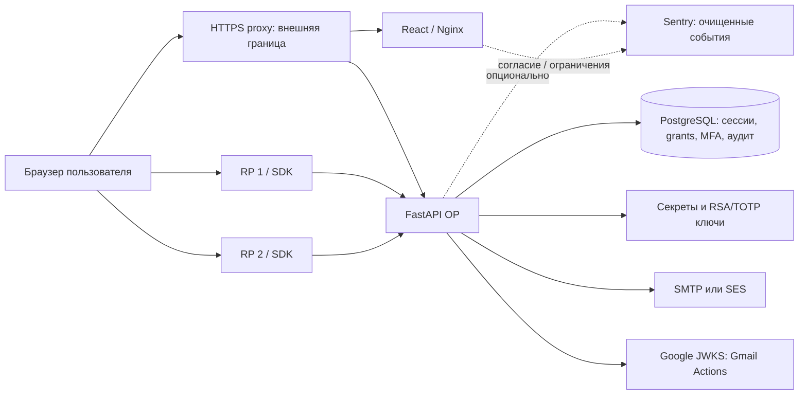

# Аудит готовности ALXPRGS SSO к production

Задача **AUDIT-PROD-01**, исполнитель Codex. Начало: **2026-10-03T23:41:27.3818608+03:00**. Дата проверки источников и результатов: **04.10.2026**. Проверяемая версия **0.2.0**, исходный commit **`7e857ab80398f8084169ee29b141c6edc6794fe8`**, ветка аудита **`new/production-readiness-audit`**. Код приложения, defaults и защитные проверки не изменялись. Отчёт относится к этому исходному коду, а не к неизвестному production-развёртыванию.

## 1. Резюме для владельца

Система содержит законченные основы собственного OP: Authorization Code + PKCE S256, RSA-подпись, Discovery/JWKS, UserInfo, ротацию refresh tokens, серверные cookie-сессии, регистрацию после проверки email, административный интерфейс, отдельный Python SDK и два demo-клиента. Реализованы TOTP, WebAuthn с обязательным user verification и recovery codes; три возможности выключены по умолчанию. Есть миграции PostgreSQL, privacy/deletion workflow, CI, подготовка релиза и отключённый шаблон CD.

Однако **прямой production-запуск текущего кода не рекомендуется**. Найдены восемь HIGH: небезопасная production-конфигурация, отсутствие лимитов входа и OTP, изменение факторов без повторной аутентификации, переживание смены пароля OAuth-grant и MFA-step, непоследовательная обязательность email, сохранение признака подтверждения при смене email, игнорирование `prompt`/`max_age` и отсутствие проверки сертификата SMTP STARTTLS. Каждая находка привязана к коду; ключевые нарушения воспроизведены локальными диагностическими тестами.

Положительные результаты существенны, но ограничены: frontend lint/types/unit/components/build, 23 browser UI cases, 9 browser telemetry cases, сборка backend/SDK, установка SDK в чистую среду, локальный полный release bundle и проверка его SHA-256 прошли. npm audit и pip-audit не сообщили известных уязвимостей. В доступном Python-наборе **268 passed / 5 failed**, дополнительно четыре G8 unit прошли. Аудиторские проверки желаемой защиты дали **27 failed / 9 passed** — это воспроизведения сгруппированных ниже дефектов, а не 27 самостоятельных уязвимостей.

В этой среде отсутствуют PostgreSQL, Docker и PostgreSQL CLI; `TEST_DATABASE_URL` не задан. Полная серверная интеграция, DB-конкурентность, два реальных SSO-клиента в браузере, enabled WebAuthn, backup/restore, внешний HTTPS issuer, доставка SES/Gmail Actions и OIF suite **не проверены**. Старые результаты из документов не засчитаны за результаты данного аудита.

### Объём и границы доверия

Рассмотрены конфигурация, API/dependencies, все основные сервисы и модели backend, четыре Alembic migrations, frontend auth/admin/MFA/privacy/telemetry, SDK, оба demo, scripts запуска/тестирования/релиза/backup/restore/ключей, Compose/Nginx/Dockerfiles, CI/release/CD и относящиеся к ним документы/ADR/тесты. Исходный репозиторий содержит 297 tracked files. Доступная Git-история: 47 commits, 987 текстовых blobs. Инвентаризация не означает криптографическую или эксплуатационную аттестацию каждого файла.

Browser → OP: host-only session cookie и CSRF, bearer tokens не хранятся в localStorage. RP → OP: зарегистрированный client, точный redirect URI, PKCE, state/nonce на стороне RP. OP → PostgreSQL: атомарность и общий state между workers. OP → почта: секрет подтверждения пересекает внешнюю границу. OP/SDK → JWKS: доверие к точному issuer, TLS и разрешённому алгоритму. Администратор — привилегированная серверная роль; последний активный администратор защищён от удаления/блокировки по исходному коду.

## 2. Вердикт

**NOT READY**.

Это вывод о текущей версии, основанный на воспроизведённых HIGH и нарушениях заявленного OIDC-поведения. Недоступность внешнего стенда не служит единственной причиной вердикта. READY нельзя получить одной успешной сборкой, скрытием MFA UI или прежним отчётом приёмки. CONDITIONALLY READY также не присваивается: подтверждённые HIGH ещё открыты, а необходимые runtime-проверки не выполнены.

Статусы далее: **PASS** — свойство подтверждено указанным способом; **FAIL** — есть противоречащее свойству доказательство; **PARTIAL** — подтверждена лишь часть; **NOT APPLICABLE** — вне заявленного профиля; **NOT TESTED** — применимо, но фактически не проверено. PASS source/unit не равен PASS PostgreSQL/E2E. Все F-01…F-27 остаются **open**; аудит не исправляет их.

## 3. Препятствия запуску: BLOCKER / HIGH

Отдельная категория BLOCKER не присвоена: нет доказанного общего обхода RSA-подписи или аутентификации любого пользователя без предпосылок. Восемь HIGH достаточно для запрета прямого запуска текущей версии. Неизвестные параметры production не представлены как подтверждённая эксплуатация.

| ID | Severity | Препятствие | Доказательство | Минимальное условие закрытия |
| --- | --- | --- | --- | --- |
| F-01 | HIGH | Production принимает dev/пустые ключи и временный RSA | Settings/probes; разные ключи после сброса process cache | Строгая startup validation, общие постоянные ключи, проверенный overlap |
| F-02 | HIGH | Нет распределённых login/MFA/token-guessing лимитов | authenticate_user/API; 20 отказов без throttling | PostgreSQL-backed quotas, отрицательные и конкурентные тесты |
| F-03 | HIGH | Session+CSRF достаточно для замены/удаления факторов | setup_totp сбрасывает is_confirmed; MFA/admin routes | Одноразовый action-bound reauth с действующим MFA |
| F-04 | HIGH | Смена/сброс пароля не отзывают OAuth grants и MFA-step | После change_password старый refresh выпускает новый JWT | Общая credential/session revision, атомарный отзыв grants/steps |
| F-05 | HIGH | REQUIRE_VERIFIED_EMAIL обходится в MFA/token issuance | MFA early return; выпуск токена unverified user | Проверка политики на всех путях установления/продления доступа |
| F-06 | HIGH | Новый email наследует email_verified=true | AdminService.update_user/probe | Сброс подтверждения; reauth и отзыв старых email challenges |
| F-07 | HIGH | RP step-up не выполняется | prompt=login сохраняет SSO; prompt=none ведёт на UI | prompt/max_age/auth_time и conformance regression |
| F-08 | HIGH | SMTP STARTTLS не проверяет сертификат | starttls() без SSLContext; CPython default unverified | CERT_REQUIRED + hostname check; отрицательный TLS-тест |

## 4. Матрица стандартов и соответствия

### Применяемый профиль и актуальные источники

Заявлен **OIDC OP, Code flow, query response, public subject, RS256**, scopes `openid profile email`, клиенты public/confidential, `client_secret_basic`, `client_secret_post`, `none`, refresh grant, UserInfo и RP-Initiated Logout. Основные нормативные источники: [OIDC Core 1.0, errata set 2](https://openid.net/specs/openid-connect-core-1_0.html), [Discovery 1.0, errata set 2](https://openid.net/specs/openid-connect-discovery-1_0.html), [RP-Initiated Logout 1.0](https://openid.net/specs/openid-connect-rpinitiated-1_0.html), [RFC 6749](https://www.rfc-editor.org/rfc/rfc6749.html), [RFC 6750](https://www.rfc-editor.org/rfc/rfc6750.html), [RFC 7636](https://www.rfc-editor.org/rfc/rfc7636.html), [RFC 7009](https://www.rfc-editor.org/rfc/rfc7009.html), [RFC 8414](https://www.rfc-editor.org/rfc/rfc8414.html), [RFC 9700](https://www.rfc-editor.org/rfc/rfc9700.html), [RFC 8725](https://www.rfc-editor.org/rfc/rfc8725.html), [JWS](https://www.rfc-editor.org/rfc/rfc7515.html), [JWK](https://www.rfc-editor.org/rfc/rfc7517.html), [JWT](https://www.rfc-editor.org/rfc/rfc7519.html).

RFC 9700 используется как текущий OAuth security BCP. OAuth 2.1 draft не выдан за окончательный стандарт. Для application controls выбран ориентир [OWASP ASVS 5.0.0](https://github.com/OWASP/ASVS/releases), уровень L2, без утверждения полного соответствия или сертификации. Дополнительно использованы OWASP Cheat Sheets по [аутентификации](https://cheatsheetseries.owasp.org/cheatsheets/Authentication_Cheat_Sheet.html), [сессиям](https://cheatsheetseries.owasp.org/cheatsheets/Session_Management_Cheat_Sheet.html), [OAuth](https://cheatsheetseries.owasp.org/cheatsheets/OAuth2_Cheat_Sheet.html), [MFA](https://cheatsheetseries.owasp.org/cheatsheets/Multifactor_Authentication_Cheat_Sheet.html), [паролям](https://cheatsheetseries.owasp.org/cheatsheets/Password_Storage_Cheat_Sheet.html), [логированию](https://cheatsheetseries.owasp.org/cheatsheets/Logging_Cheat_Sheet.html), [секретам](https://cheatsheetseries.owasp.org/cheatsheets/Secrets_Management_Cheat_Sheet.html) и [контейнерам](https://cheatsheetseries.owasp.org/cheatsheets/Docker_Security_Cheat_Sheet.html). [NIST SP 800-63B-4](https://pages.nist.gov/800-63-4/sp800-63b/authenticators/) — ориентир password/throttling, а не заявленная AAL-аттестация.

Проверки границ API/recovery/workflows дополнительно сопоставлены с [OWASP REST Security](https://cheatsheetseries.owasp.org/cheatsheets/REST_Security_Cheat_Sheet.html), [Forgot Password](https://cheatsheetseries.owasp.org/cheatsheets/Forgot_Password_Cheat_Sheet.html) и [CI/CD Security](https://cheatsheetseries.owasp.org/cheatsheets/CI_CD_Security_Cheat_Sheet.html). Права POSTGRES_USER в clean official image подтверждены [официальной документацией образа](https://hub.docker.com/_/postgres); права уже существующей неизвестной БД отдельно не проверены.

| Требование / источник | Применимость | Статус | Доказательство | Находка |
| --- | --- | --- | --- | --- |
| HTTPS issuer/endpoints, согласованный origin: Core/Discovery/9700 | Production обязательно | FAIL | Settings принимает несовместимые HTTP defaults; внешний TLS не проверен | F-01, F-19 |
| Discovery, точный issuer, jwks_uri | Заявлено | PARTIAL | main.py discovery; G8 discovery unit PASS; public HTTPS NOT TESTED | F-01, F-27 |
| `response_type=code`, исключение implicit/ROPC | Заявлено | PASS (source/unit) | authorize отвергает другое; token поддерживает только два grant | — |
| Клиент active, public/confidential; только один auth method: 6749 §2.3 | Заявлено | PARTIAL | Argon2 client secret; G8 duplicate auth methods PASS; HTTP challenge отсутствует | F-09 |
| Точное зарегистрированное redirect URI: 6749/9700 | Обязательно | PASS (source/unit) | validate_redirect_uri, equality, без wildcard fallback | — |
| S256 обязателен, plain отвергается: 7636/9700 | Обязательно | PASS (source/unit) | verify_pkce и create_authorization_code | — |
| verifier 43–128 unreserved chars: 7636 §4.1 | Обязательно | FAIL | verifier из одного символа принят при совпадении challenge | F-10 |
| Code короткоживущий, привязан к client/URI/PKCE, одноразовый | Обязательно | PARTIAL | SHA-256, 60 s, FOR UPDATE; реальная конкурентность NOT TESTED | F-04 для security-event lifecycle |
| `state` echo; проверка state и nonce у RP | Обязательно для безопасного RP flow | PASS (unit/crypto + demo smoke) | handle_web_callback, opaque flow; actual callback E2E NOT TESTED | — |
| `prompt=login/none`, max_age, auth_time: Core §3.1.2.1 | Применимо к OP Code flow | FAIL | два ASGI cases; параметры не обрабатываются; auth_time не выпускается | F-07 |
| OAuth errors/redirect/state: 6749 §4.1.2.1/5.2 | Обязательно | FAIL | Missing grant_type → 422; ошибки authorize возвращаются JSON | F-09 |
| no-store/Pragma token response: 6749 §5.1 | Обязательно | FAIL | ASGI token response не содержит cache headers | F-09 |
| RS256 allowlist, подпись, issuer/audience/time: 8725/Core | Обязательно | PARTIAL | 8 adversarial crypto cases PASS; обязательность claims неполная | F-11 |
| Не принимать ID Token как access token | Обязательно | PASS (crypto/unit) | token_use/audience, server/SDK negative checks | — |
| ID Token sub/iss/aud/exp/iat, nonce и azp: Core §2/3.1.3.7 | Применимо | PARTIAL | nonce/iss/aud/exp PASS; SDK допускает отсутствующий iat/неверный azp | F-11 |
| JWKS active/previous kid и обновление cache при неизвестном kid | Заявлено | PARTIAL | server key functions, SDK refresh; runtime multi-worker rotation NOT TESTED | F-01, F-13, F-20 |
| UserInfo scopes и актуальность active user | Заявлено | PARTIAL | get_userinfo читает БД, email по scope; Bearer challenge отсутствует | F-09, F-05 |
| Refresh rotation/replay/family absolute deadline: 9700 | Заявлено | PARTIAL | locks + family revocation + explicit commit при replay; PG races NOT TESTED | F-04 |
| Revocation RFC 7009, неизвестный token → 200 | Заявлено | PARTIAL | unknown возвращает 200; дополнительно принимается SSO session secret | F-25 |
| RP logout GET и POST: RP-Initiated §2 | Заявлено | FAIL | POST → 405 | F-12 |
| Expired id_token_hint для текущей/recent session: RP-Initiated §2 | SHOULD, применимо | FAIL | 5-min ID hint → 401, SSO session не удалена | F-12 |
| Точный post_logout_redirect_uri, user/hint binding | Обязательно при использовании | PASS (source/unit) | exact registered list и subject/session comparison | — |
| Introspection RFC 7662 | Не заявлено; SDK использует локальный JWT/JWKS | NOT APPLICABLE | endpoint/capability отсутствуют | Не blocker |
| DCR RFC 7591/7592, PAR, JAR, JARM, DPoP RFC 9449, mTLS/FAPI | Не заявлено | NOT APPLICABLE | статическая регистрация; обычный Code profile | Не blocker |
| Hybrid/implicit/password grant, SAML, SCIM, federation | Вне первой версии | NOT APPLICABLE | GOAL/metadata/endpoints | Не blocker |
| Session Management/back/front-channel logout | Не заявлено | NOT APPLICABLE | RP sessions не обещаны синхронно удалёнными | Не blocker |
| Host-only Secure/HttpOnly/Lax cookies, CSRF: ASVS/session CS | Production | PARTIAL | __Host-, Path=/, HMAC proof, серверный CSRF; реальный TLS/proxy NOT TESTED | F-01, F-19 |
| RBAC/IDOR, последний admin: ASVS authorization | Обязательно | PARTIAL | server dependencies/user-bound deletes/advisory guard; PG races NOT TESTED | F-03 для reauth |
| Action-bound recent auth для чувствительных операций: ASVS/auth CS | Обязательно по GOAL | FAIL | полноценный proof есть для privacy, отсутствует у MFA/admin | F-03 |
| Distributed anti-bruteforce: ASVS/NIST/auth CS | Обязательно | FAIL | registration/privacy quotas есть, login/OTP quotas нет | F-02, F-17 |
| Password Argon2id и password policy: ASVS/password CS | Обязательно / NIST как ориентир | PARTIAL | Argon2id t=3,m=65536,p=4; 8 chars, blocklist отсутствует | F-17 |
| WebAuthn challenge/origin/RP/signature/UV | Enabled profile | PARTIAL | библиотечная проверка с require_user_verification=True; PG/browser NOT TESTED | F-03 для lifecycle |
| Recovery после пароля, одноразовость | Enabled profile | PARTIAL | 10 codes, atomic UPDATE RETURNING, только MFA-step; PG races NOT TESTED | F-02, F-03 |
| Default-off + прямой API gate | Все поставляемые defaults | PASS (source/unit) | три false; disabled API отрицательные unit; production image NOT TESTED | — |
| Email обязателен self-registration | Всегда | PASS (source/unit); live NOT TESTED | pending registration; user создан после code/link | F-08 для SMTP |
| REQUIRE_VERIFIED_EMAIL для existing/admin users | Если true | FAIL | MFA/token issue bypass | F-05, F-06 |
| Secrets/key custody и log minimization: ASVS/secret/log CS | Production | PARTIAL | отсутствие подтверждённых history leaks; опасные defaults/key tools | F-01, F-20, F-22 |
| CSP/XSS/clickjacking: ASVS frontend | Production | PARTIAL | React escaping, DENY/nosniff; CSP только Report-Only | F-23 |
| CI privilege isolation / неизменяемый release / CD off | Обязательно по GOAL | PASS (source/local dry-run) | SHA-pinned actions, separate publish job, commented CD, bundle verified | Remote execution NOT TESTED |

В таблице нет утверждения о полном ASVS L2 или OIDC certification. Отсутствие optional extensions не использовано для ухудшения вердикта. OIDC consent UI для заранее доверенных внутренних RP сам по себе не объявлен обязательным отсутствующим протоколом; ограничения scopes для каждого client рассматриваются отдельно как согласованное требование GOAL.

## 5. Функциональная матрица

| Сценарий | Фактическое состояние | Статус и способ проверки | Ограничение / finding |
| --- | --- | --- | --- |
| Самостоятельная регистрация | closed default; pending до email; open/admin settings | PARTIAL: source/unit, frontend components | SES/реальный mailbox не проверены |
| Code/link email, resend/attempt TTL | HMAC code, hashed link, 10 min, 5 fails, resend caps | PARTIAL: source/unit | PG single-use/races и доставка NOT TESTED |
| Gmail Actions | Google RS256, issuer/audience/azp/time checks | PARTIAL: source/unit | Sender registration/token issuance не проверены |
| Password login / logout | Argon2id; opaque cookie; server logout+CSRF | PARTIAL: unit/source | F-02, F-05; реальный browser login не выполнен |
| TOTP default / enabled | disabled API gate; encrypted secret, consumed time step | PARTIAL | Enabled binding unsafe F-03; PG/реальный OTP NOT TESTED |
| Passkey default / enabled | disabled gate; mandatory UV, точный origin/RP | PARTIAL | Enrol/delete без reauth F-03; virtual authenticator E2E NOT TESTED |
| Recovery codes | Только после password, зависимость от confirmed TOTP | PARTIAL | F-02/F-03; race не проверена на PG |
| Password change | Проверяется current password, browser sessions удаляются | FAIL | Grants/MFA-step остаются F-04 |
| Admin reset / recovery | Установка обычного нового пароля | FAIL | Нет обязательной смены временного пароля F-16; F-04 |
| Email change / verified state | Admin PATCH и пользовательское подтверждение | FAIL | F-05/F-06 |
| Список/отзыв своих browser sessions | user-bound queries, current/other session | PARTIAL | Отдельный от OAuth grants lifecycle; PG NOT TESTED |
| Code exchange и refresh | single-use code, rotation и family replay detection | PARTIAL | Unit/crypto; реальная DB атомарность NOT TESTED; F-04 |
| UserInfo / claims | username/email/roles с фильтрацией scope | PARTIAL | F-05/F-09/F-14 |
| RP logout | Только GET и неистёкший ID hint | FAIL | F-12; logout RP 1 не обещает удаления local session RP 2 |
| Два demo RP / SSO | Opaque server-side flow/session, state/nonce/S256 | PARTIAL: оба /login smoke через установленный wheel | Callback, seamless SSO, refresh/logout E2E NOT TESTED |
| RBAC пользователь/администратор | server-side roles; обычный пользователь не admin | PARTIAL: исходный код/unit | F-03; полномасштабный PG/IDOR regression не выполнен |
| Клиенты и client secret | exact URI, public/confidential, Argon2 secret/rotation | PARTIAL | F-03/F-14; per-client allowed scope отсутствует |
| Последний активный администратор | advisory/user locks, отказ опасному изменению | PARTIAL: source/unit; browser refusal UI PASS | DB concurrency NOT TESTED |
| Privacy/terms/deletion | Версии receipts; одноразовый reauth; 14-day purge/7-day cooldown | PARTIAL | Истинная PG deletion/restore orchestration NOT TESTED |
| Frontend | Auth/admin/MFA/registration/privacy UI, capabilities | PASS для 11 utility + 28 components + 23 browser UI + build | Mocked API UI не подтверждает серверные возможности |
| Telemetry privacy | disabled defaults; consent; safe envelope; replay staging restrictions | PASS для 9 реальных browser SDK cases + unit | External ingestion/alerts NOT TESTED |
| SDK установка и интеграция | Самостоятельный пакет, чистая установка wheel | PASS для 8 общих + 3 isolated tests; demo initiation PASS | F-11/F-14; полный network callback NOT TESTED |
| Блокировка / разблокировка | Active check при выдаче/access to API | PARTIAL | Сохранённые grants могут снова работать после разблокировки F-04 |

**Матрица прав:** anonymous получает только public discovery/JWKS/legal/capabilities и процессы входа/подтверждения; authenticated user — свой профиль, sessions/MFA/privacy; admin — users/clients/audit/system settings. Cookie mutations требуют CSRF, кроме процессов до появления сессии со своими одноразовыми proofs. Bearer UserInfo принимает access token. В исходном коде не обнаружен общий IDOR или приём неподписанного access token. Прямое разрешение обычному user администраторских API не найдено; это не заменяет полный отрицательный PG/browser прогон.

Email password-reset по ссылке **не предусмотрен первой версией GOAL** и не оформлен как отсутствующий blocker. Проверяется обещанный admin-assisted recovery. Default password login не называется MFA-защищённым. Demo in-memory store допустим только для явно указанного single-worker demo, не предлагается как production session store.

### Криптография, секреты и persistence

| Объект / граница | Реализация и хранение | Статус |
| --- | --- | --- |
| Password / confidential client secret | Argon2id t=3, 64 MiB, p=4, salt 16 bytes, hash 32 bytes; password rehash при необходимости | PARTIAL: библиотечная проверка PASS; policy/CPU/reauth F-02/F-03/F-17 |
| Session / authorization code / refresh / verification link / privacy proof | CSPRNG `secrets`, обычно 32 random bytes; SHA-256 в БД, raw только в нужном response/cookie/mail | PARTIAL: source/crypto; single-use DB races NOT TESTED; F-04 |
| CSRF | HMAC от session identity с отдельным SESSION_SECRET_KEY; cookie mutation dependencies | PARTIAL: source/unit; production secret F-01 |
| PKCE / state / nonce | S256 Authlib; SDK CSPRNG и constant-time state/nonce comparison | PARTIAL: crypto/demo smoke PASS; verifier syntax F-10 |
| JWT | PyJWT RS256, RSA generated 2048 bits, rotation script 2048/4096; active/previous JWK | PARTIAL: crypto positives/negatives; F-01/F-11/F-13/F-20 |
| TOTP | PyOTP, 6 digits, 30-second steps; Fernet encryption, locked consumed step | PARTIAL: source/unit; enrollment/quotas/key custody F-01/F-02/F-03; PG NOT TESTED |
| Recovery | 10 symbols из 36-character alphabet: около 51.7 bits на code; SHA-256; atomic consumption | PARTIAL: source/unit; достаточность offline guessing зависит от доступа к DB, online quotas F-02; standalone login запрещён |
| Email code | 6 decimal digits, около 19.9 bits; HMAC/HKDF purpose separation, UUID context, TTL/attempt caps | PARTIAL: source/unit; PG/live NOT TESTED; SMTP F-08 |
| WebAuthn | Поддерживаемая библиотека, public credential key/sign count; exact RP/origin/challenge, обязательный UV | PARTIAL: source/unit; enabled real crypto/browser/PG NOT TESTED |
| Google bearer / JWKS | Public Google verification key; iss/aud/azp/time checks, библиотечная JOSE | PARTIAL: source/unit; live NOT TESTED; F-26 |
| Deployment secrets | DB password, SESSION_SECRET_KEY, TOTP_ENCRYPTION_KEY, RSA private key, SMTP/AWS credentials, optional Sentry upload/testmail credentials | PARTIAL: defaults/tools F-01/F-20; production values не читались/не публиковались |

Самописных RSA/Argon2/WebAuthn криптоалгоритмов не найдено: библиотеки выполняют криптографию, приложение строит HMAC/hash/protocol composition. Authlib и PyJWT применяются в разных частях, что требует единой claim policy F-11, но само наличие двух библиотек не является уязвимостью. Шифрование disks/backups, права secret mounts и key escrow — deployment decisions с NOT TESTED evidence.

В моделях и миграциях есть unique hashes для session/code/refresh, FK client/user и CASCADE, security timestamps timezone-aware; data access использует SQLAlchemy и transactions. Refresh/user lock ordering и advisory guards присутствуют. У username уникальность обычная, case normalization/registration locking реализованы приложением: не найдено оснований объявить доказанной race успешной self-registration одним просмотром предварительного SELECT. Совпадение ORM/migration constraints, upgrade previous schema, CASCADE/retention и многопроцессные гонки остаются NOT TESTED на реальной PG.

### Другая поверхность API и отказов

| Класс проверки | Наблюдение / граница доказательства | Статус |
| --- | --- | --- |
| SQL/ORM injection | User search/filter values параметризованы ORM; journal UUID/type validation; атака на живую DB не выполнялась | PARTIAL (source) |
| NoSQL/cache availability | Отдельной NoSQL или Redis service нет; process JWKS/RSA/demo caches рассмотрены | NOT APPLICABLE для NoSQL; process state PARTIAL |
| XSS/template injection | React escaping, demo HTML escaping, email templates; custom raw HTML из user input не обнаружен. Browser attack с реальным backend не выполнялся | PARTIAL; CSP F-23 |
| SSRF | JWKS/Sentry/mail targets конфигурирует оператор, request parameter не выбирает произвольный outbound URL. Network egress policy не проверена | PARTIAL (source), не доказанная SSRF |
| Command injection / unsafe deserialization | Ops вызывают фиксированные executables argv, web API не выполняет arbitrary shell/pickle/eval; malformed JWT даёт F-13 | PARTIAL (source/adversarial JWT) |
| File traversal / upload | У demo static allowlist; arbitrary upload API нет; release archive verification reviewed | PARTIAL для static/archive; upload NOT APPLICABLE |
| Mass assignment / prototype pollution | Registration не присваивает admin role из request; admin DTO и поля update явные. Общего пользовательского merge в prototype не найдено | PARTIAL (source), live privilege escalation NOT TESTED |
| Host headers / request smuggling | Нет доказанного host-driven key/redirect fetch; proxy/backend topology и HTTP parser pairing не запущены | NOT TESTED для реальной цепочки; F-19 |
| Method restrictions / malformed inputs | Routes ограничены methods, CSRF cookie mutations; OAuth 422/500/logout POST недостатки воспроизведены | FAIL: F-09/F-12/F-13 |
| Request size / dependency latency | Есть field bounds и outbound timeouts; общий explicit application body limit не найден. Proxy/runtime limits требуют подтверждения | PARTIAL: F-02/F-10/F-13/F-18 |
| DB/email/config failure | Readiness зависит от DB; SMTP/SES ошибки не должны подтверждать регистрацию; отсутствующий signing key генерируется, а не отвергается | PARTIAL/FAIL F-01/F-08; реальные outage drills NOT TESTED |
| Clock skew / replica restart | JWT temporal checks присутствуют, configured clocks/overlap/restart не измерены | PARTIAL/NOT TESTED; F-01/F-11 |

Ни один пункт «не обнаружен в source» не засчитан как доказательство отсутствия всех возможных атак. По security paths разделены проверенный код, actual cryptographic/HTTP evidence и недоступные runtime checks.

## 6. Подробные находки

У каждой F-01…F-27 **статус проверки FAIL** для конкретного описанного несоответствия и **статус исправления open**; код после выявления не исправлялся. Это не означает, что вся подсистема или вся нормативная матрица имеет FAIL. `probe` означает функцию в [test_readiness_probes.py](audit/test_readiness_probes.py). Где DB заменена doubles, это явно указано; проверка не выдаётся за PostgreSQL-интеграцию. Точные функции и исходные строки относятся к исходному SHA.

Классификация доказательств: F-01…F-08 — подтверждённое небезопасное поведение/допускаемая конфигурация с указанными предпосылками; F-09…F-14/F-16/F-25 — protocol/contract/lifecycle нарушения; F-15/F-17/F-18/F-23 — hardening и defense in depth; F-19/F-20/F-21 — configuration/operations gaps; F-22 — диагностический gap; F-24 — test/portability gap; F-26 — maintenance; F-27 — documentation. Внешние непроверенные опасения не оформлены как подтверждённые vulnerabilities. F-03 по управлению факторами применим в enabled profile; его admin-составляющая доступна и независимо от MFA flags.

### F-01 — HIGH — Production-конфигурация и ключи допускают небезопасный запуск

- **Компонент/описание:** [config.py](../backend/app/config.py), строки 65–112, `validate_feature_invariants`; [security.py](../backend/app/core/security.py), `get_rsa_private_key` строка 111. `ENVIRONMENT=production` не требует замены известных dev session/TOTP ключей, постоянного RSA, HTTPS/согласованных URL и ограниченного access TTL. Пустой SESSION_SECRET_KEY и TTL 86400 принимаются. При отсутствии RSA процесс генерирует новый ключ даже в production с тем же default kid.
- **Сценарий/риск:** оператор следует неполному env, получает публично известный TOTP encryption key или отдельные RSA keys у workers/restarts; часть валидных токенов перестаёт проверяться. Наличие известного ключа не означает автоматического получения чужого opaque cookie; риск CSRF/email derivation и TOTP усиливается при доступе к соответствующим данным.
- **Доказательство:** probes `test_production_rejects_missing_signing_key`, `test_missing_secret_cannot_survive_production_config`, `test_production_rejects_excess_access_ttl`, `test_production_missing_key_stays_stable_across_worker_restart` FAIL. Последний получает разные RSA public numbers после сброса cache. Реальное многопроцессное production-развёртывание не запускалось.
- **Основание:** GOAL SEC/SSO-06, Discovery/9700, ASVS configuration/secrets; инфраструктура HTTPS обязательна.
- **Исправление:** отдельная строгая production validation, отказ startup/readiness при плохих/известных ключах и URL; постоянный общий RSA и уникальные kid; лимиты TTL; доставляемые secrets/file mounts без секретов в логах.
- **Regression:** invalid configs fail before serving; два workers/restart принимают один подписанный token; active+retired overlap сохраняется до max TTL, retired после удаления отвергается.

### F-02 — HIGH — Отсутствует защита login/MFA от перебора и истощения ресурсов

- **Компонент/описание:** [auth_service.py](../backend/app/services/auth_service.py), `authenticate_user`; [mfa.py](../backend/app/api/mfa.py), login verify routes; token/client-secret authentication. Общий [rate_limit.py](../backend/app/core/rate_limit.py) применяется к registration/email/privacy, но не к password login, MFA-step OTP/recovery и token authentication.
- **Сценарий/риск:** автоматический перебор паролей/6-digit OTP, повторное вычисление Argon2 и исчерпание CPU. Потеря БД не должна приводить к снятию ограничений. Внешний WAF/rate limiter в репозитории не задан и не доказан.
- **Доказательство:** `test_repeated_failed_login_is_throttled` FAIL: 20 вызовов с неверным user не получают quota refusal; DB — explicit double. Source search подтверждает отсутствие применения quota на этих путях. Нагрузка/размер успешного перебора не измерялись.
- **Основание:** GOAL distributed limits, ASVS/authentication CS, NIST throttling.
- **Исправление:** атомарные распределённые account+source+challenge limits, экспоненциальные задержки/временные блокировки с безопасным unlock, bounded token/JWKS work; Argon2 не должен блокировать event loop без ограничения параллелизма.
- **Regression:** PG multi-worker burst на существующий/несуществующий user и OTP challenge; 429/структурированный отказ, recovery после окна, fail-closed при DB outage; нельзя отключать limits ради E2E.

### F-03 — HIGH — Управление MFA и привилегированными настройками без fresh reauth

- **Компонент/описание:** [mfa.py](../backend/app/api/mfa.py), setup/delete/generate/register routes; [mfa_service.py](../backend/app/services/mfa_service.py), `TOTPService.setup_totp` строка 67; [admin.py](../backend/app/api/admin.py). Cookie+CSRF достаточно. Повторный setup перезаписывает имеющийся TOTP secret и ставит `is_confirmed=False`. Для privacy deletion уже есть action/session/user-bound proof; registration-mode отдельно проверяет пароль, но это не общий reauth admin/MFA policy.
- **Сценарий/риск:** владелец похищенной действующей сессии и CSRF proof отключает/заменяет фактор, создаёт свой passkey или recovery codes. У admin-сессии дополнительно доступны user/client changes. CSRF защищает от межсайтового запроса, но не доказывает свежую аутентификацию владельца сессии.
- **Доказательство:** `test_totp_setup_does_not_disable_existing_factor` FAIL с confirmed credential; source routes не принимают fresh proof. Факторные криптопроверки не подменялись успешными mock-verifications.
- **Основание:** GOAL sensitive reauth; ASVS, OWASP MFA CS.
- **Исправление:** общий одноразовый action-bound reauth с password и действующим обязательным фактором; защитить add/remove/regenerate/client rotate/admin mutations; pending enrolment не перезаписывает действующий credential до подтверждения.
- **Regression:** stolen session+CSRF отказ без proof; неверные/expired/другой action/session/user/replay proofs отказ; старый TOTP сохраняется при неуспешном повторном setup; последний admin и default-off gates сохранены.

### F-04 — HIGH — Security events не отзывают grants и MFA-step

- **Компонент/описание:** [auth_service.py](../backend/app/services/auth_service.py), `change_password` строка 205/`verify_mfa_step_token`; [admin_service.py](../backend/app/services/admin_service.py), `update_user`; [oidc_service.py](../backend/app/services/oidc_service.py), exchange/refresh. Смена/сброс пароля удаляют browser sessions, но не authorization codes/refresh families. MFA-step — stateless JWT без password/session revision и одноразового consumption. Блокировка запрещает выдачу пока user inactive, но не уничтожает grants.
- **Сценарий/риск:** похищенный refresh token остаётся пригодным после восстановления аккаунта; ранее начатый MFA-step переживает смену пароля. Разблокировка может восстановить старый grant. Требование мгновенного отзыва уже выпущенного offline JWT не придумано: его действительность отдельно ограничена штатными 300 s.
- **Доказательство:** probes `test_password_change_revokes_refresh_and_authorization_codes`, `test_mfa_step_invalidated_after_password_change`, `test_refresh_after_password_change_is_rejected` FAIL. Последний вызывает реальные change_password → rotate_refresh_token и получает новый RS256 JWT, DB — double; PG atomicity NOT TESTED.
- **Основание:** GOAL revocation/recovery, RFC 9700 security-event handling, session CS.
- **Исправление:** единая credential/auth revision либо привязанные grants/steps; атомарно инвалидировать codes, refresh families, pending MFA/email actions и нужные sessions при password reset/change/block/critical factor change. Явно определить последствия role change и всех вариантов logout.
- **Regression:** реальные PG change/reset/block/unblock → старые code/refresh/MFA-step отказ, новые после полного login работают; race reset/refresh не возвращает выживший grant.

### F-05 — HIGH — REQUIRE_VERIFIED_EMAIL проверяется не на всех путях

- **Компонент/описание:** [auth_service.py](../backend/app/services/auth_service.py), строки 153–164; [oidc_service.py](../backend/app/services/oidc_service.py), `_generate_tokens_for_user`; [deps.py](../backend/app/api/deps.py). MFA-required возвращается до проверки email; завершение MFA не делает эквивалентную проверку. Common token issue проверяет active/legal/deletion, но не verified policy.
- **Сценарий/риск:** unverified legacy/admin user с действующим MFA получает cookie-доступ; ранее созданный OAuth grant выпускает токены после включения REQUIRE_VERIFIED_EMAIL. Свежий authorize с unverified user отдельно отказывает — его обход не утверждается. Self-registration по-прежнему требует email.
- **Доказательство:** `test_required_email_checked_before_mfa_step` и `test_required_email_applies_to_existing_grant_token_issue` FAIL; настоящий token generation с unverified object, DB double.
- **Основание:** прямой GOAL/AGENTS email policy, ASVS consistent access policy.
- **Исправление:** единый guard для session establishment, current-session access, code/refresh/token/UserInfo по согласованной политике; pending verification допускает только необходимые ограниченные действия.
- **Regression:** полный password→каждый MFA route, existing session/grant, runtime policy reload/restart, verified positive; не выдавать фиктивно подтверждённый email ради получения сессии.

### F-06 — HIGH — Смена email сохраняет чужое подтверждение и старые challenges

- **Компонент/описание:** [admin_service.py](../backend/app/services/admin_service.py), `update_user` строка 172: `user.email` меняется без сброса `email_verified`; [mfa_service.py](../backend/app/services/mfa_service.py), `EmailVerificationService._consume` меняет адрес по ещё действующему token; request email verification не требует recent reauth.
- **Сценарий/риск:** RP получает `email_verified=true` для непроверенного нового адреса. У похищенной сессии можно начать замену адреса; старый verification token в своём TTL может вернуть прежнюю цель после изменения безопасности. Право admin менять user не представлено как неавторизованная эскалация; проблема — ложная гарантия и lifecycle.
- **Доказательство:** `test_admin_email_change_clears_verification` FAIL; source update/consume/request routes. Реальная доставка/уникальность при конкурентной замене не проверены.
- **Основание:** GOAL email identity policy, Core email_verified semantics, ASVS sensitive identity change.
- **Исправление:** verified flag относится к точному адресу/revision; сбрасывать при замене, свежий reauth, отмена прежних challenges при смене адреса/пароля, атомарное подтверждение pending change.
- **Regression:** admin/user changes, старые tokens/replay, unique-address race; прежний verified email не подтверждает новый.

### F-07 — HIGH — OP игнорирует fresh-auth и silent-auth параметры

- **Компонент/описание:** [oidc.py](../backend/app/api/oidc.py), `authorize` строка 57; ID payload в [oidc_service.py](../backend/app/services/oidc_service.py). Нет обработки `prompt`, `max_age`, authentication timestamp; `auth_time` не выдаётся.
- **Сценарий/риск:** RP просит fresh login для чувствительного действия, но получает code из старой SSO-сессии. При `prompt=none` без сессии OP вместо protocol error показывает login UI. Это применимое поведение Code OP, а не optional FAPI feature.
- **Доказательство:** `test_authorize_honors_prompt` два ASGI cases FAIL: authenticated login → RP callback, unauthenticated none → login. DB explicit double. Отсутствие max_age/auth_time подтверждено исходным кодом.
- **Основание:** [Core §3.1.2.1](https://openid.net/specs/openid-connect-core-1_0.html#AuthRequest); prompt=login требует повторной аутентификации, none — отсутствие interaction; max_age связан с auth_time.
- **Исправление:** сохранять фактическое время auth; корректный prompt/max_age/error flow, не обновлять auth_time простым посещением API; SDK должен позволять RP задать и проверить эту политику.
- **Regression:** login/none/invalid combinations, max_age=0/expired/recent, preserved state/nonce, ID auth_time и OIF Code cases.

### F-08 — HIGH — SMTP TLS не удостоверяет почтовый сервер

- **Компонент/описание:** [verification_email.py](../backend/app/services/verification_email.py), `_send_smtp` строка 215 вызывает `server.starttls()` без context. В используемом CPython default legacy context не проверяет сертификат/hostname; `SMTP_USE_TLS=true` включает шифрование без этой гарантии.
- **Сценарий/риск:** при выбранном production SMTP посредник может представиться почтовым сервером и получить SMTP credentials и verification secrets. Для SES transport этот конкретный дефект не установлен. Фактическое production SMTP-соединение не перехватывалось.
- **Доказательство:** probe проверяет переданный SSLContext и FAIL получает None; проверены локальный smtplib/ssl и официальные [CPython 3.13 smtplib](https://raw.githubusercontent.com/python/cpython/3.13/Lib/smtplib.py), [ssl](https://raw.githubusercontent.com/python/cpython/3.13/Lib/ssl.py). Рекомендуемый verified context описан в [Python SSL docs](https://docs.python.org/3.13/library/ssl.html#ssl.create_default_context).
- **Основание:** обязательная проверка TLS по AGENTS/GOAL, ASVS communications.
- **Исправление:** `ssl.create_default_context()` с hostname/CERT_REQUIRED; production отвергает plaintext SMTP, кроме явно обоснованного защищённого локального transport boundary; отказ STARTTLS не даёт fallback plaintext. Если production допускает только SES, SMTP необходимо явно запретить для production, а документацию согласовать.
- **Regression:** доверенный локальный CA positive; self-signed/untrusted/wrong hostname/STARTTLS unavailable отказ; отсутствие отправки credentials до verified TLS.

### F-09 — MEDIUM — OAuth ошибки и HTTP headers не соответствуют wire contract

- **Компонент/описание:** [oidc.py](../backend/app/api/oidc.py), authorize/token/userinfo и [main.py](../backend/app/main.py) handlers. FastAPI required fields дают 422; после безопасной валидации client/redirect ошибки authorize не возвращаются RP с state. Нет Cache-Control:no-store/Pragma:no-cache у token response; 401 Basic/Bearer без соответствующего WWW-Authenticate. Дубли form/query параметров явно не отвергаются.
- **Сценарий/риск:** RP теряет protocol error/state, responses с токенами допускают нежелательное caching; несовместимость стандартных клиентов. Недействительный redirect URI нельзя использовать для error redirect.
- **Доказательство:** ASGI `test_oauth_missing_grant_uses_protocol_error`, `test_token_response_disables_caching` FAIL; source FastAPI signature/exception handlers. Token-issuance в header probe явно mocked, криптография проверена другими cases.
- **Основание:** RFC 6749 §§4.1.2.1,5.1,5.2; RFC 6750 §3.
- **Исправление:** protocol-aware input/errors, валидированный redirect/state только когда безопасно, no-store headers, правильные challenges, reject duplicates/unsupported response mode.
- **Regression:** HTTP positive/negative matrix missing/duplicate/invalid inputs, Basic/form/none, no redirect to invalid URI, state exact echo и обязательные headers.

### F-10 — MEDIUM — PKCE syntax не валидируется

- **Компонент:** [security.py](../backend/app/core/security.py), `verify_pkce` строка 267; authorize/token inputs.
- **Описание/риск:** сопоставление S256 выполняется, но принимается однобуквенный verifier; длина/charset/bounds challenge не защищены явно. Это нарушение RFC 7636, не найденный способ угадать корректный challenge или обменять code без совпадения.
- **Доказательство:** `test_pkce_rejects_one_character_verifier` FAIL с настоящим create_s256_code_challenge.
- **Основание:** RFC 7636 §4.1.
- **Исправление:** строго 43–128 unreserved characters, корректный S256 challenge и bounded inputs.
- **Regression:** границы/Unicode/padding/invalid charset/empty/plain; правильный S256 принят, неверный verifier и повтор code отвергнуты.

### F-11 — MEDIUM — Неполная обязательность JWT/ID claims

- **Компонент:** [security.py](../backend/app/core/security.py), `decode_jwt`; [SDK client.py](../packages/python-sdk/alxprgs_sso/client.py), `verify_id_token` строки 265–316.
- **Описание/риск:** server принимает подписанный JWT без exp; SDK ID requires не включает iat и не проверяет azp. Валидно подписанный ID с multiple aud и чужим azp принят. Issuer в штатной выдаче exp/iat добавляет, поэтому unsigned forgery/компрометация RSA здесь не доказаны.
- **Доказательство:** три real-crypto probes FAIL; alg none/HS256/wrong signature/issuer/audience/expired/unknown kid/ID-as-access отрицательные проверки PASS.
- **Основание:** Core ID mandatory claims и azp validation guidance, RFC 8725 explicit profile validation. Проверка azp в Core сформулирована как SHOULD; обязательность iat для ID отдельно от этого.
- **Исправление:** required claims/type checks для конкретного token profile, aud/azp rules, non-empty subject, temporal bounds; не ослаблять signature/issuer/aud.
- **Regression:** missing/wrong-type exp/iat/sub, multiple aud/azp, nonce mismatch, future timestamps; signed valid positive и unsigned negatives сохранены.

### F-12 — MEDIUM — Неполная реализация RP-Initiated Logout

- **Компонент:** [oidc.py](../backend/app/api/oidc.py), logout строка 289; [demo_app.py](../examples/demo_app.py), local logout.
- **Описание/риск:** POST не поддержан (405), expired signed ID hint отвергнут (401). ID expires через 300 s, browser session живёт до 7 days; demo сначала удаляет свою session, затем OP logout может отказать и оставить SSO. Hintless flow не предлагает подтверждение, а возвращает 400.
- **Доказательство:** ASGI `test_rp_logout_accepts_post`, `test_rp_logout_can_terminate_current_session_with_expired_hint` FAIL; expired hint подписан реальным RSA, DB double.
- **Основание:** RP-Initiated Logout §2 требует GET/POST; обработка expired hints — SHOULD с проверкой текущей/recent OP session. Exact URI/subject binding в текущем коде положительны.
- **Исправление:** GET+form POST; dedicated hint validator с сохранением signature/issuer/client/subject и безопасной обработкой exp; confirmation где нужен. Не отключать expiration для обычных access/ID validators.
- **Regression:** свежий/expired/current/foreign user hint, неверная подпись/issuer/URI, GET/POST/state, отсутствие сессии и hint, OP session реально удалена. Back/front-channel не обязательны в текущем профиле.

### F-13 — MEDIUM — Непроверенный тип kid вызывает 500 до валидации подписи

- **Компонент:** [security.py](../backend/app/core/security.py), key lookup в decode_jwt, `/oauth/logout`.
- **Описание/риск:** header kid=list/dict приводит к TypeError при dictionary lookup. Неавторизованный запрос даёт 500; это устойчивость/error handling, не приём неподписанного токена.
- **Доказательство:** `test_untrusted_kid_type_returns_4xx` FAIL, настоящий ASGI HTTP 500 без DB/успешной JWT verification.
- **Основание:** RFC 8725 robust untrusted parsing, ASVS input/error handling.
- **Исправление:** bounded string kid/header/token validation; structured 4xx, без exception details и лишних JWKS fetch.
- **Regression:** list/dict/null/oversized kid, malformed segments/JSON, unknown string kid; ни 500, ни успешного auth.

### F-14 — MEDIUM — SDK теряет scope, у клиента нет allowed-scope policy

- **Компонент:** [SDK models.py](../packages/python-sdk/alxprgs_sso/models.py), UserClaims extra=ignore; [client.py](../packages/python-sdk/alxprgs_sso/client.py), verify_access_token; [models/oidc.py](../backend/app/models/oidc.py), OIDCClient; authorize global scopes.
- **Описание/риск:** scope отсутствует в возвращаемом UserClaims; нет require_scope, только role guards. Server принимает любой из трёх глобальных scopes у любого клиента. Интегратор не может выполнить обещанную SDK scope-проверку через этот объект. Конкретная scope escalation в стороннем API не доказана.
- **Доказательство:** signed access-token scope probe FAIL; schema/model source.
- **Основание:** GOAL SSO-04/SDK-05, least privilege; наличие обязательного consent UI не подразумевается.
- **Исправление:** allowed scopes/claims у клиента, validated scope в SDK и явные guard helpers; роли и scopes не смешивать.
- **Regression:** token для клиента с меньшими scopes; исключённые claims не выдаются; scope guard 403; ID вместо access отвергнут; backward compatibility SDK описана.

### F-15 — MEDIUM — Dev origins/HTTP return targets доверены и в production

- **Компонент:** [main.py](../backend/app/main.py), CORS строки 67–81; [frontend security.ts](../frontend/src/utils/security.ts), sanitizeReturnTo.
- **Описание/риск:** localhost origins с credentials не зависят от ENVIRONMENT; return_to допускает HTTP на доверенных host и localhost. Это излишняя production trust boundary. Общий open redirect на произвольный attacker host не найден; CSRF/Lax cookies не позволяют автоматически объявить захват аккаунта через CORS.
- **Доказательство:** CORS ASGI production probe FAIL; frontend source и negative sanitizer tests PASS для evil host/backslash/javascript.
- **Основание:** explicit CORS по GOAL, ASVS trusted origins/TLS.
- **Исправление:** точные configurable origins с scheme/port; localhost только явно выбранный dev profile; return_to к нужному OP/path либо точному HTTPS origin, исключая downgrade.
- **Regression:** production localhost/HTTP/mismatched port отказ, согласованный local profile PASS, adversarial URLs и CSRF negatives сохраняются.

### F-16 — MEDIUM — Admin recovery не заставляет сменить временный пароль

- **Компонент:** [admin_service.py](../backend/app/services/admin_service.py), update_user new_password; user/password models и login/UI.
- **Описание/риск:** admin устанавливает обычный пароль без must_change_password/expiry и ограниченной session. Обещанный GOAL временный пароль с принудительной сменой не реализован. Публичный reset-by-email не входит в эту находку.
- **Доказательство:** отсутствие соответствующего model state/service guard/UI в сквозном source review; полноценный admin recovery E2E NOT TESTED.
- **Основание:** GOAL раздел users/recovery, ASVS account lifecycle.
- **Исправление:** expiry/single-use recovery и forced change до выдачи обычной session/OAuth grants; вместе с F-04/F-03.
- **Regression:** temporary credential позволяет только сменить пароль, old temporary/replay отказ, expiry, grant denial до change; admin cannot bypass last-admin safety.

### F-17 — MEDIUM — Password/recovery policy и enumeration нуждаются в усилении

- **Компонент:** [schemas/auth.py](../backend/app/schemas/auth.py) min_length=8, registration/admin schemas; [auth_service.py](../backend/app/services/auth_service.py), nonexistent-user dummy hash.
- **Описание/риск:** default single-factor password длиной 8 разрешён, common/breached blocklist отсутствует. Dummy Argon2 string невалиден и отклоняется быстрее настоящего hash, создавая timing distinction; registration также сообщает существование identity. Recovery code около 51.7 bits хранится как unsalted SHA-256, что не соответствует более строгому NIST guidance для коротких look-up secrets. Remote exploitability/timing distribution и offline crack time не измерены.
- **Доказательство:** schema/hash source; Argon2id настоящий, не заменён mock. Значений измерения latency в отчёте нет.
- **Основание:** NIST 800-63B-4 ориентирует на 15 characters для single factor и 8 в MFA, blocklist/throttling; для look-up secrets менее 112 bits требует salted password hashing. OWASP auth/password CS. Продукт не заявляет NIST AAL certification, поэтому один min_length не назван самостоятельным HIGH.
- **Исправление:** согласовать password policy с default profile, blocklist, валидный заранее рассчитанный dummy hash с равным work factor, одинаковые наружные ошибки; recovery entropy/storage усилить по выбранному assurance profile, сохранив атомарную одноразовость; не вводить необоснованные composition/periodic rotation требования.
- **Regression:** common-password rejection, long/unicode passwords, одинаковое число hash operations и bounded timing experiment на синтетических users; quota F-02 обязательна.

### F-18 — MEDIUM — Runtime контейнеры и DB identity недостаточно ограничены

- **Компонент:** [backend Dockerfile](../backend/Dockerfile), [frontend Dockerfile](../frontend/Dockerfile), [Compose](../docker-compose.yml).
- **Описание/риск:** backend root, dev tools устанавливаются в runtime; нет explicit cap_drop/read_only/resource limits. PostgreSQL application использует POSTGRES_USER, который init образа создаёт superuser. Base images mutable; Nginx 1.27 относится к старой ветке относительно опубликованных сейчас stable/mainline [версий](https://nginx.org/en/download.html). Конкретная CVE в загруженном образе не доказана.
- **Доказательство:** Dockerfile/Compose review; Docker/image scanner недоступны, image digest/SBOM/runtime CVEs NOT TESTED.
- **Основание:** ASVS/OWASP Docker CS, least privilege.
- **Исправление:** поддерживаемые pinned digests с обновлением; non-root app, prod-only dependencies, bounded resources/caps; отдельные migration/runtime DB roles. Nginx permissions/read-only требуют реальной проверки, не механической замены USER.
- **Regression:** clean Docker build/run, nginx -t, migrations отдельной ролью, runtime не может DDL/superuser actions; actual image vuln scan и сохранённые digests.

### F-19 — MEDIUM — Не согласованы forwarded headers и доверие к proxy

- **Компонент:** [frontend nginx.conf](../frontend/nginx.conf), API location; [deps.py](../backend/app/api/deps.py) request IP; [Compose](../docker-compose.yml) env.
- **Описание/риск:** HTTP Nginx за внешним TLS proxy заново ставит X-Forwarded-Proto=$scheme, API X-Forwarded-For=$remote_addr; наружный scheme/client IP теряются. TRUSTED_PROXIES по умолчанию loopback, а container proxy другой; Compose не предоставляет эту настройку. Возможен общий rate-limit bucket на proxy IP и неверная audit attribution.
- **Доказательство:** source configuration; реальная reverse-proxy topology/HTTP↔HTTPS cookies NOT TESTED. Конкретный production IP chain не придуман.
- **Основание:** GOAL proxy/TLS/distributed quotas, ASVS communications/session.
- **Исправление:** выбрать topology и точные trusted hops; strip spoofed headers на внешней границе, корректное сохранение scheme/IP, закрытый direct backend; не использовать wildcard trust.
- **Regression:** внешний HTTPS request через всю цепочку, fake forwarded headers напрямую, secure host-only cookie, redirects/issuer HTTPS, разные client IP quotas, отсутствие наружного backend port.

### F-20 — MEDIUM — Runbook/инструмент ротации используют неверные secret names

- **Компонент:** [operations.md](operations.md), строки 45–46/155–156; [rotate_keys.py](../scripts/rotate_keys.py).
- **Описание/риск:** предлагаются SECRET_KEY/MFA_ENCRYPTION_KEY, тогда как приложение читает SESSION_SECRET_KEY/TOTP_ENCRYPTION_KEY. Extra env игнорируется: оператор может считать defaults заменёнными. Скрипт печатает новые symmetric secrets в stdout, RSA без output-dir теряется, фиксированные файлы перезаписываются без exclusive creation/restrictive permissions. Процедура re-encryption TOTP и доставляемый RSA overlap/mount не завершены.
- **Доказательство:** source/docs. Скрипт не запускался с выводом новых секретов; действующие ключи не ротировались.
- **Основание:** GOAL SSO-06/ops/secrets, ASVS/secret CS; усиливает F-01.
- **Исправление:** точные names и validated secure destination, explicit overwrite refusal, permissions; отдельные безопасные процедуры RSA overlap, session-secret invalidation и TOTP decrypt/re-encrypt с backup/rollback. Не менять Fernet ключ поверх зашифрованных данных без миграции.
- **Regression:** runbook на synthetic deployment, no stdout secrets, существующий private file сохраняется, старые TOTP расшифровываются после controlled rotation, overlap/restart PASS.

### F-21 — MEDIUM — Alembic autogenerate получает пустую metadata

- **Компонент:** [alembic/env.py](../backend/alembic/env.py), строки 11–18; [database.py](../backend/app/database.py).
- **Описание/риск:** env импортирует Base, но не app.models; database не импортирует модели. Fresh interpreter видит Base.metadata без таблиц. Будущий documented autogenerate может предложить удаления существующей схемы. Уже написанные upgrade scripts этим автоматически не ломаются.
- **Доказательство:** fresh-process metadata table count=0; offline upgrade head --sql PASS. Подключение autogenerate к реальной PG в этой среде НЕ выполнялось; генерация DROP — риск из пустой metadata, а не выполненная операция.
- **Основание:** GOAL migrations/DB integrity; поддерживаемый Alembic workflow.
- **Исправление:** полный controlled model import для target_metadata; migrations drift check на свежей/test upgraded PG.
- **Regression:** schema head → autogenerate пустой diff; fresh upgrade и upgrade previous revision → head, все constraints/indexes совпадают; rollback только если поддержан и документирован.

### F-22 — MEDIUM — Безопасное логирование чрезмерно теряет диагностический контекст

- **Компонент:** [logging_config.py](../backend/app/logging_config.py), SafeFormatter; [main.py](../backend/app/main.py), request ID; audit service.
- **Описание/риск:** generic app records превращаются в Application log; сведения об операции/причине не сохраняются. X-Request-ID есть в state/response, но не связывает сохранённые logs/events. DB audit покрывает часть событий, отсутствует полноценная матрица MFA success/identity/role change. Ошибка email/cleanup может быть трудно различима. Это плата за исключение PII, а не предложение вернуть raw exception/URL/token logs.
- **Доказательство:** formatter/source/event call sites; unit redaction и browser telemetry privacy PASS. Наличие рабочего внешнего alerting не проверено.
- **Основание:** GOAL operations/correlation/security audit; OWASP Logging CS.
- **Исправление:** allowlisted operation/reason codes, bounded validated correlation ID, безопасная связь audit/request, redacted failure metrics и alerts без секретов.
- **Regression:** диагностика SMTP/DB/purge отказов с различимыми codes/request ID; fuzz secrets/PII в exception/header/query не попадают в logs; доставка alert проверена отдельно.

### F-23 — MEDIUM — CSP пока наблюдает, но не блокирует

- **Компонент:** [deploy/nginx.conf](../deploy/nginx.conf), security headers и frontend proxy.
- **Описание/риск:** Content-Security-Policy-Report-Only не препятствует загрузке нежелательных scripts/connections. Этот staging rollout документирован; конкретная XSS не найдена, React escaping/clickjacking headers есть. Только browser UI assertions без violations не доказывают enforced CSP.
- **Доказательство:** header config; production Nginx runtime NOT TESTED.
- **Основание:** ASVS browser controls, defense in depth.
- **Исправление:** перед внешним запуском согласовать enforced CSP с QR/theme/telemetry; ограничить connect/img/worker sources; отдельный безопасный reporting endpoint если нужен.
- **Regression:** actual HTTPS proxy headers; нормальный UI работает, injected inline/foreign script блокируется; Sentry consent/disabled behavior и external trace leakage negatives сохраняются.

### F-24 — LOW — Windows test portability и достоверность test evidence

- **Компонент:** [test_reset_local_ps1.py](../tests/test_reset_local_ps1.py), mocked PowerShell Add-Content call log; reset-local.ps1.
- **Описание/риск:** четыре tests завершились UnicodeDecodeError в кириллическом пути workspace: log создан default PowerShell encoding, Python читает UTF-8. Это воспроизведённая portability/test harness ошибка, не доказанное удаление пользовательских данных. Safety refusal/error preservation assertions нельзя убрать ради зелёного результата.
- **Доказательство:** audit-unit3.log, four named failures; synthetic Docker stub, реальный reset данных не выполнялся.
- **Основание:** GOAL исполнимый cross-platform local setup и достоверность тестов.
- **Исправление:** явный UTF-8 для test log/PowerShell output, проверить supported PS editions и Cyrillic paths; при необходимости отдельно исправить script literals/encoding.
- **Regression:** все четыре meaningful safety cases в Windows PowerShell и pwsh, env и чужой volume сохраняются при cancel/failure.

Сюда же относится качество test evidence: lifecycle branch с pytest.skip при frontend build failure и AsyncMock race tests нельзя использовать как успешную required integration. Сохранить независимый required build job, обязательный отказ lifecycle при проверяемом build failure и настоящие PG race regressions; устранить неawaited mock warnings без подмены реального DB поведения.

### F-25 — LOW — OAuth revoke дополнительно принимает несвязанный SSO cookie secret

- **Компонент:** [oidc_service.py](../backend/app/services/oidc_service.py), revoke_token строка 540.
- **Описание/риск:** если token не refresh данного client, ищется Session по тому же hash без client binding, удаляется OP browser session. Это расширяет trust boundary public/confidential RP revocation. Для атаки необходим секрет чужой сессии; самостоятельный logout DoS без этого секрета не доказан.
- **Доказательство:** `test_revoke_does_not_delete_unbound_sso_session` FAIL на explicit DB double.
- **Основание:** RFC 7009 scope of revocable OAuth tokens; GOAL разделение browser sessions/grants.
- **Исправление:** revoke работает только с OAuth tokens/grants клиента; user session logout — собственный authenticated+CSRF workflow.
- **Regression:** unknown token/session-cookie secret на revoke → 200 без удаления SSO; чужой client refresh не отзывается; свой refresh revoked.

### F-26 — LOW — Используется deprecated Authlib JOSE API

- **Компонент:** [registration_service.py](../backend/app/services/registration_service.py), authlib.jose JsonWebToken для Gmail.
- **Описание/риск:** установленная Authlib выдаёт deprecation warning перед будущим 2.0.0. Текущая криптография не признана сломанной; dependency audits CVE не нашли.
- **Доказательство:** реальные warnings в unit/probes; exact lock сохранён.
- **Основание:** GOAL поддерживаемые библиотеки и воспроизводимость.
- **Исправление:** план миграции на рекомендуемый поддерживаемый API с проверкой официальной совместимости при выборе версии.
- **Regression:** реальные Google-style RSA signatures и отрицательные iss/aud/azp/exp/kid, никакой mock crypto за live proof.

### F-27 — LOW — Документация местами противоречит API и actual evidence

- **Компонент:** [README](../README.md), [api.md](api.md), [security.md](security.md), [research.md](research.md), SDK examples/docs.
- **Описание/риск:** JWKS описан как /jwks.json вместо /.well-known/jwks.json; admin /status и /audit-log отсутствуют в фактическом API; security.md всё ещё допускает email verification=false и ссылается на отсутствующие tests/security; research фиксирует устаревший FastAPI. Старые отчёты не равны текущей приёмке. SDK quickstart с ручным token exchange/printing нельзя выдавать за полный безопасный RP callback.
- **Доказательство:** routes/source/doc comparison, actual installed SDK tests PASS. Legacy generate_authorization_url действительно возвращает три значения — ошибкой tuple arity это не является. Полный state/nonce flow реализован в start_authorization/handle_web_callback.
- **Основание:** GOAL DOC/API/научная воспроизводимость.
- **Исправление:** синхронизировать routes/config/feature claims, перечислить настоящие tests и версию стенда, примеры без вывода bearer secrets; отделить unit mocks/исторические results от live evidence.
- **Regression:** scoped doc links, примеры после clean wheel install, API snapshot/commands, default-off и mandatory registration email соответствуют коду.

## 7. Инфраструктура и эксплуатация

| Область | Что есть в репозитории | Статус | Что требуется для runtime-доказательства |
| --- | --- | --- | --- |
| Clean Compose | PostgreSQL 16, backend migrations/bootstrap, Nginx frontend, healthchecks | NOT TESTED | Docker на отдельном стенде; clean up без удаления чужих volumes |
| TLS/HSTS | Security headers у proxy, предполагаемый external termination | PARTIAL | Действительный cert chain, HTTPS redirect, HSTS после проверки topology, issuer/URLs consistency |
| Health/readiness | Liveness и DB readiness разделены | PARTIAL | DB outage/readiness fail-closed; startup bad-key refusal F-01 |
| Миграции | 0001_initial…0004_privacy; offline SQL сформирован | PARTIAL | Fresh/upgrade PG schema checks, autogenerate F-21 |
| Concurrent state | PostgreSQL locks/advisory locks/constraints | PARTIAL | Multi-instance code/refresh/email/recovery/last-admin races |
| Session isolation | Host-only cookie, user-bound session list/delete | PARTIAL | Actual HTTPS browser and cross-subdomain negatives |
| Backup/restore | pg_dump+SHA-256; deletion journal; restore guarded и replay tombstones | PARTIAL | Отдельная restore DB; current authoritative journal; erase-after-snapshot не воскресает |
| Privacy cleanup | Scheduled purge, worker/advisory coordination, retention | PARTIAL | Time-controlled PG purge/restore/retry/worker outage |
| Key rotation | Active/previous JWKS code + scripts | FAIL/PARTIAL | F-01/F-20; shared key mount, overlap и TOTP re-encryption |
| DB least privilege | POSTGRES_USER используется runtime | FAIL (source) | F-18; migration vs runtime roles, TLS/network ACL |
| Availability/ресурсы | Bounded token/session TTL, process cleanup scripts | PARTIAL | Quotas F-02, limits, soak/capacity; согласованные SLO/RPO/RTO без придуманных цифр |
| Logs/alerts | Safe stdout JSON, DB audit; optional Sentry | PARTIAL | F-22, реальный alert и retention; access logs не сохраняют raw secrets |
| Mail | SMTP/SES provider, queued pending flow/failure handling | PARTIAL | F-08; delivery/bounce/retry/credential outage на synthetic mailbox |
| Legal/data residency | Версионированные documents/receipts; минимизация | PARTIAL | Владелец утверждает тексты, retention и external data processing; юридическая сертификация не заявляется |

Ни DNS, ни AWS resources/расходы, ни реальные рассылки, ни production secrets не изменялись. Не выполнялись destructive restore/reset на пользовательских данных. Backup checksum обеспечивает обнаружение изменения артефакта, но сам по себе не решает encryption/доступ к backup и escrow ключей; эти настройки deployment неизвестны.

## 8. CI, зависимости, артефакты и supply chain

Проверены [.github/workflows/ci.yml](../.github/workflows/ci.yml), [release.yml](../.github/workflows/release.yml), [release_bundle.py](../scripts/release_bundle.py) и [отключённый CD](../deploy/github-actions/cd.yml.example). Actions pinned полными SHA; read permissions в проверках, write изолирован в publish job, PR не получает production/mail secrets. CI запускает PostgreSQL integration, отдельный enabled MFA набор, SDK clean install, frontend checks, telemetry и browser E2E. Release выбирает существующий tag, фиксирует SHA и повторно использует CI именно для него. Published release не перезаписывается; draft assets проверяются после upload. CD файл находится вне active workflows и полностью закомментирован; invariant scan PASS. Систему в этом аудите не публиковали.

По согласованному CI-03 external SES job без credentials может быть пропущен в обычном CI. Явный run_email_tests=true/release требует credentials и не превращается в успешную доставку без них. Это разрешённая граница, не finding об ослаблении тестов.

| Проверка | Результат | Практическая граница |
| --- | --- | --- |
| requirements-lock.txt + npm package-lock | PASS (наличие/pins и установка SDK constraints) | Python lock без hash enforcement; runtime имеет dev dependencies F-18 |
| pip-audit 2.10.1, strict, 79 pinned entries | PASS: известных advisories 0 | Только сведения registry на дату аудита, не отсутствие всех уязвимостей |
| npm audit, 268 dependencies в metadata | PASS: total vulnerabilities 0 | Не анализ исходного кода/образа; dev/optional counts пересекаются |
| detect-secrets current baseline/self-test | PASS до добавления audit docs: 126 candidates / 0 new; synthetic secret rejected | Итоговая проверка документов отдельно зафиксирована в audit evidence |
| Git history heuristic scan | 47 commits / 987 blobs / 2285 signals; подтверждённых leaks 0 | 941 вне current baseline: 936 npm integrity, 1 commit SHA, 4 historical bootstrap URL placeholders; [summary](audit/history-summary.json) |
| Secret value handling | Значения не публикуются | История проверялась offline, без provider verification/реальных credentials |
| Ruff/mypy | PASS | Lint/typecheck не заменяют security SAST |
| Container vuln scan/SBOM | NOT TESTED / отдельного runtime SBOM в поставке нет | Нужны Docker/image digest и scanner; конкретная CVE не приписана |
| Dependency licenses | Метаданные существующих пакетов доступны; новые prod dependencies не добавлены | Юридический аудит transitive licenses и deployment rights не подтверждён |
| Локальный release dry-run | PASS: 8 payload files + manifest/SHA256; private maps отделены | source_tree_dirty=true из-за audit docs; bundle не предназначен для публикации |
| Remote CI/release для исходного SHA | NOT TESTED в этой сессии | Не приписывается чужой/старый workflow run |

У unit race tests с AsyncMock нет доказательства PostgreSQL-конкурентности. В lifecycle test есть ветка skip при неудачной frontend build; это следует заменить явным отказом там, где проверка обязательна, сохранив отдельный required frontend job. В текущем аудите build прошла, эта ветка не использована. 27 unit warnings (включая неawaited mock add) указывают на качество отдельных doubles, а не на успешную DB-проверку.

Версии и license metadata закреплённого набора сохранены в [Python inventory](audit/python-dependencies.json) (79 entries) и [frontend inventory](audit/frontend-dependencies.json) (268 entries, dev/optional flags). License metadata присутствовала у всех entries; это инвентаризация, а не юридическое заключение. Production/dev Python declarations различимы в pyproject, но общий runtime lock включает оба набора F-18. Критические versions определяются lock, а не диапазонами package.json.

## 9. Реальные тестовые доказательства и воспроизведение

Среда: Windows, PowerShell, кириллический workspace path; **Python 3.12.14** из `.venv-sentry`, **Node 24.20.0**, **npm 11.19.0**, **Ruff 0.16.8**. Основная `.venv` неработоспособна. Docker/psql/pg_dump/gh отсутствуют, TEST_DATABASE_URL отсутствует. Runtime Dockerfile использует Python 3.13: текущий локальный 3.12 результат не засчитан как container 3.13 execution. Секреты/реальные users не использованы.

Локальные logs находятся в игнорируемом `artifacts/`; воспроизводимые probes и [краткий manifest доказательств](audit/evidence.json) сохранены в docs/audit. Manifest содержит SHA-256/размер logs без содержимого секретов. Файлы artifacts не входят в отчёт как опубликованные артефакты.

| Команда / набор | Фактический итог | Локальный log |
| --- | --- | --- |
| python -m ruff check backend/ tests/ packages/python-sdk/ scripts/ examples/ docs/audit/ | PASS | audit-static.log |
| python -m ruff format --check backend/ tests/ packages/python-sdk/ scripts/ examples/ docs/audit/ | PASS, 145 files (143 исходных + 2 audit tools) | audit-format.log |
| python -m mypy --explicit-package-bases packages/python-sdk/alxprgs_sso backend/app --ignore-missing-imports | PASS, 47 files | audit-types.log |
| python -m pytest tests --ignore=tests/integration --ignore=tests/test_g8_sec_regression.py --ignore=tests/test_g8_sso_regression.py -m "not postgres" | 268 passed, 5 failed, 4 deselected, 16 subtests passed | audit-unit3.log; unit3.xml |
| Четыре независимых non-PG G8 cases | 4 passed | audit-g8-unit.log |
| Два non-PG cases из test_distributed_rate_limiting_pg: proxy spoofing и simulated DB failure | 2 passed, явный BrokenDbSession; не live outage/PG | audit-proxy-failure-unit.log |
| python -m pytest tests/integration/test_postgres_connection.py | 2 errors: TEST_DATABASE_URL not set; guard отказал | audit-pg-guard.log |
| python -m pytest docs/audit/test_readiness_probes.py -q | 27 failed / 9 passed | audit-probes-final.log; probes-final.xml |
| npm run lint / typecheck / typecheck:tests | PASS | audit-frontend-*.log |
| npm test / npm run test:components | 11 / 28 passed | audit-frontend-unit.log; audit-frontend-components.log |
| npm run build | PASS, warning chunk >500 kB | audit-frontend-build.log |
| npx playwright test e2e/appearance.spec.ts --reporter=line, loopback preview 5188 | 23 passed, 13.2 s | audit-browser-appearance.log |
| npm run test:telemetry:browser | 9 passed, 31.8 s | audit-browser-telemetry2.log |
| python -m build --no-isolation backend; затем python -m build --no-isolation packages/python-sdk (с отдельным --outdir) | wheel/sdist обеих packages PASS | audit-backend-build.log; audit-sdk-build.log |
| Clean SDK env: python -I -m pytest -c isolated pytest.ini copied test_python_sdk.py | 8 passed | audit-sdk-clean-tests.log |
| Installed wheel: isolated package tests | 3 passed | audit-sdk-isolated.log |
| Два demo /login с installed wheel, synthetic env, TestClient localhost | HTTP 302, state/nonce/S256 PASS | audit-sdk-demo.log |
| uv pip check --python artifacts/audit/sdk-clean/Scripts/python.exe | PASS, 29 compatible packages | Зафиксировано в evidence |
| python -m alembic -c backend/alembic.ini upgrade head --sql | PASS, offline PostgreSQL SQL до 0004_privacy | audit-alembic-offline.log |
| Fresh process: from app.database import Base; len(Base.metadata.tables) | 0 tables, подтверждение F-21 без DB connection | audit-metadata.log |
| python scripts/check_sentry_build.py после ALX_RELEASE_BUILD=1 build | PASS, Debug IDs/private maps, public dist без .map | audit-sentry-build.log |
| python scripts/release_bundle.py build --outdir artifacts/audit-release --private-maps artifacts/audit-sentry-private | PASS, manifest/payload/checksums verified; dirty=true | audit-release-bundle.log |
| python scripts/bump_version.py check; pip check; invariant scanner | PASS | audit-version.log; audit-pip-check.log; audit-invariants.log |
| npm audit --json; pip-audit --strict --no-deps --disable-pip -r requirements-lock.txt | 0 known vulnerabilities | npm-audit-online.json; pip-audit.json |
| python docs/audit/inspect_history.py | Completed, values suppressed | audit-history-scan2.log; history-summary.json |

Команды в таблице используют рабочий Python, а не сломанную `.venv`. Для probes требуется `PYTHONPATH=backend;packages/python-sdk;.` на Windows. Локальное воспроизведение описано в [audit/README.md](audit/README.md). Диагностические tests расположены вне обычного pytest testpaths: они сохраняют желаемые безопасные assertions и **должны оставаться failed до исправления**, без skip/xfail/ослабления проверки.

Пять failures доступного Python-набора: четыре Windows reset test encoding failures F-24; один `test_real_server_lifecycle_and_port_release`: timeout preflight `/auth/capabilities` при отсутствии пригодной PostgreSQL. Этот timeout не представлен как доказанный production defect сервера. Первые прогоны дополнительно имели temp/socket/harness errors; их более низкие counts не суммируются с окончательным прогоном и не выдаются за отдельные исправления приложения. Browser telemetry первый процесс не завершил cleanup в sandbox; успешным засчитан только завершённый повтор. Demo smoke сначала был неверно запущен через default testclient host; после установки штатных demo dependencies и использования разрешённого localhost оба сценария PASS. Защитные origin/UV/TLS/issuer проверки для этого не отключались.

**Что эти проверки не доказывают:** unit DB doubles не доказывают locks/constraints; mocked UI не доказывает server capabilities; telemetry SDK с перехваченным ingestion не доказывает внешнюю доставку; demo initiation не доказывает callback/двухклиентский SSO; offline SQL не доказывает upgrade/restore; dependency audit не заменяет pen-test/container scan; release bundle не является deployment.

## 10. OIF Conformance Suite

**Ни один OIF plan фактически не выполнен. Сертификации нет.** Подходящие планы выбираются по реализованному Code profile: Basic OP, Config OP; для заявленного logout — тестовый RP-Initiated Logout OP profile с response_type=code. Implicit/Hybrid OP не применимы. Dynamic registration не требуется: clients можно зарегистрировать вручную. Порядок настройки и набор клиентов проверены по [официальной инструкции OP testing](https://openid.net/certification/connect_op_testing/).

Для запуска требуется отдельный доступный suite HTTPS issuer с синтетическими users, согласованным DNS/TLS, Discovery/JWKS и фиксированным исходным SHA. Для Basic/Config регистрируются необходимые clients из конфигурации suite (включая basic/post variants); callback `https://www.certification.openid.net/test/a/<ALIAS>/callback` включается точно. Нельзя временно открыть production redirect allowlist или отключить MFA/email/PKCE для получения зелёного plan. PKCE параметры suite должны соответствовать обязательному S256 профилю продукта.

Для RP-Initiated logout регистрируется точный `https://www.certification.openid.net/test/a/<ALIAS>/post_logout_redirect`. Текущие F-07/F-09/F-10/F-11/F-12 — локально доказанные препятствия корректному поведению; они не выданы за результаты конкретных OIF test IDs. Suite run должен сохранить plan configuration, build SHA, полный результат и перечень failure/warning, исключив client secrets из публичных материалов.

По [OIF logout guidance](https://openid.net/certification/connect_op_logout_testing/) RP-Initiated план независим от session/front/back-channel механизмов. Для формальной Logout Certification требуется дополнительно хотя бы один такой профиль; текущий проект этого не заявляет. **Необходимость получить Logout Certification не превращена в требование реализовать optional logout channels до запуска текущего согласованного продукта.** Отдельный протокольный RP-Initiated regression всё равно нужен.

## 11. Оставшиеся внешние и runtime неизвестные

Этот раздел содержит условия получения недостающих доказательств, а не перенос подтверждённых code findings на инфраструктуру. Минимальные действия владельца конкретны; новые расходы, реальные письма и production изменения требуют отдельного поручения.

| Неизвестное | Почему не проверено | Минимальное действие / доказательство |
| --- | --- | --- |
| PostgreSQL integration/races/migrations | Нет сервера/TEST_DATABASE_URL | Предоставить отдельную пустую test PG с требуемым marker по [test plan](testing/plan.md); выполнить весь pytest tests и enabled set из CI. Рабочую БД не подставлять |
| Actual browser SSO/admin/default-off/enabled passkey | Зависит от PG/backend | После guarded test DB: python scripts/run_e2e_suite.py --suite all; точный localhost origin и virtual authenticator с UV=true; сохранить результаты двух RP/privacy/admin |
| Clean Compose/image/nginx | Docker отсутствует | На отдельном стенде clean build/up, health/readiness/nginx -t, image digests/CVE scan, restart/multi-worker; без reset чужих volumes |
| Proxy/TLS/cookies/CORS | Production topology/DNS/cert не выбраны/не доступны | Описать реальные trusted hops; проверить HTTPS chain, spoofing, точный issuer/origins и headers на staging |
| Backup/restore/deletion retention | Нет PG/pg_dump/psql | Отдельные source/restore DB с synthetic users; backup, delete-after-backup, export свежего journal, guarded restore; проверить отсутствие resurrected data |
| Key custody/rotation/recovery | Реальные секреты не читаются/не меняются | Безопасное хранилище и mounts, права, escrow; synthetic RSA overlap и TOTP re-encryption drill, restart нескольких workers |
| SES delivery, failure/bounce, external email E2E | Нет разрешённой реальной отправки/credentials/mailbox | После отдельного разрешения synthetic mailbox: mandatory --run-email-tests и scripts/run_e2e_suite.py --suite email; delivery/rejection evidence без contents/keys |
| Gmail Actions на реальном approved sender | Нет live sender/token evidence | Проверить sender registration у Google, реальный bearer и synthetic one-click подтверждение, отрицательные replay/claims. [Google token verification](https://developers.google.com/gmail/markup/actions/verifying-bearer-tokens) |
| OIF plans | Нет reachable отдельного issuer и suite registration | Стенд/clients выше, Basic+Config+RP-Initiated plans, сохранённые run URLs/результаты. Локальная imitation не засчитывается |
| Remote CI/release на нужном SHA | В сессии нет подтверждённого run/gh | Read-only ссылки на required jobs исходного/исправленного SHA; чистый tagged dry-run, без publish |
| Alerts/Sentry external processing | Проверен только локальный privacy harness | Отдельный synthetic incident и подтверждение alert/retention/consent/data residency; без bearer/PII ingestion |
| Реальная нагрузка/soak/SLO и правовые тексты | Стенд и утверждения владельца отсутствуют | Утвердить нагрузочный профиль/SLO/RPO/RTO и legal texts, выполнить synthetic soak/drills; не придумывать latency, стоимость или соответствие закону |

После устранения code defects этот список ограничивает возможный новый verdict. Сейчас привлечение инфраструктуры не требуется, чтобы признать текущую версию NOT READY.

## 12. Приоритетный план исправлений

Стабильные ID реализации — **AUDIT-FIX-01…06**; они заносятся в docs/plan.md как planned и не считаются выполненными созданием этого отчёта. Изменение согласованных требований отдельно отражается в GOAL/ADR; восстановление уже требуемой защиты не требует ослабления ТЗ.

| Этап | Приоритет / finding | Зависимости | Критерий готовности и риск |
| --- | --- | --- | --- |
| AUDIT-FIX-01 | P0: F-01/F-08/F-20, secrets/TLS | Выбор безопасного production config/key destination | Startup rejects unsafe configs; verified SMTP или prod-only SES gate; real key overlap/restart/re-encryption; docs точны. Риск: потеря ключа/данных при неверной ротации — сначала synthetic drill |
| AUDIT-FIX-02 | P0: F-02/F-03/F-04/F-05/F-06, lifecycle/reauth | Guarded test PG; config FIX-01 | Все positive+negative PG paths, quotas/races, stale grants/steps/email отказ, action-bound reauth; default-off сохранён. Риск: lock ordering/deadlocks и легитимный lockout |
| AUDIT-FIX-03 | P1 до заявления protocol-ready: F-07/F-09/F-10/F-11/F-12/F-13/F-14/F-25 | Lifecycle FIX-02 | Wire/crypto matrix, scope guards, prompt/auth_time, safe logout и OIF plans; SDK clean wheel tests. Риск: API/SDK interoperability — совместимость документировать |
| AUDIT-FIX-04 | P1: F-16/F-17, admin recovery/password policy | FIX-02; согласование policy | Forced change ограничивает grants/session, blocklist и timing/guessing coverage; миграция existing credentials описана |
| AUDIT-FIX-05 | P1: F-15/F-18/F-19/F-21/F-22/F-23, ops | FIX-01/02; реальная staging topology | Non-root/least privilege DB, migration drift, enforced CSP, trusted headers, logs/alerts, backup/restore/soak; actual images scanned |
| AUDIT-FIX-06 | P2: F-24/F-26/F-27, docs/test portability | Связанные исправления | Windows safety regressions, поддерживаемый JOSE API, API/docs/examples/evidence без секретов; required tests не skip |

**Обязательное до прямого go-live:** закрыть все HIGH; исправить нормативные ошибки заявленного Code/logout профиля; восстановить согласованный recovery/SDK lifecycle; выполнить обязательные PostgreSQL/browser/operations проверки GOAL на точном исправленном SHA; подтвердить TLS/secrets/proxy/mail configuration. Ротация, backup restore и startup failure должны быть проверены до использования реальных users.

**Ближайшее усиление:** остальные medium controls с конкретным владельцем, сроком и проверяемым принятием остаточного риска; Windows portability/docs/maintenance — в ближайшем цикле. CSP rollout, password policy и least privilege нельзя считать готовыми одной записью в runbook.

**Опциональное развитие:** introspection/DCR/PAR/DPoP/FAPI/back/front-channel/logout certification, дополнительные factors или подпись provenance по отдельному product decision. Не включать эти расширения в обязательный blocker list текущего профиля. SBOM/provenance полезны для supply-chain visibility, но отсутствие отдельного optional формата не заменяет анализ реально поставляемых зависимостей.

## 13. Итоговый go-live checklist

- [ ] F-01…F-08 закрыты кодом и регрессиями, без обхода защиты, skip/xfail/retries для сокрытия дефекта.
- [ ] Применимые protocol failures F-07/F-09…F-14/F-25 закрыты; Core/Discovery/RP logout matrix пересмотрена на исправленном SHA.
- [ ] Password/admin recovery, verified email, sensitive reauth и grant lifecycle выполняются во всех default/enabled путях.
- [ ] Обязательные PostgreSQL unit/integration/concurrency и реальные browser два RP/admin/default-off/enabled WebAuthn UV проверки завершены; полный набор не объявлен PASS частичным прогоном.
- [ ] OIF применимые планы выполнены либо отсутствие формальной сертификации точно обозначено; локальные protocol checks обязательны независимо от certification badge.
- [ ] Production configuration fail-closed; постоянные общие RSA/TOTP/session secrets защищены, backup/rotation/escrow проверены; известные dev values отвергаются.
- [ ] HTTPS issuer/origins, proxy trust, Secure host-only cookie, CSRF/CORS/CSP и сетевое закрытие БД/backend проверены на реальной staging topology.
- [ ] Поддерживаемые runtime images/dependencies, least privilege DB/container, resource/guessing limits и actual vulnerability scan подтверждены.
- [ ] SMTP verified TLS или явно выбранный проверенный SES; required email delivery/rejection подтверждены synthetic mailbox после разрешения отправки.
- [ ] Fresh/upgrade migrations, readiness/DB outage, backup→delete→restore tombstones и worker retention drill успешны; RPO/RTO/SLO утверждены без вымышленных результатов.
- [ ] Диагностируемые redacted logs/alerts и privacy/legal configuration проверены; bearer secrets/PII не попадают в telemetry/release artifacts.
- [ ] README/API/operations/SDK/examples совпадают с продуктом; clean installed SDK examples проверены; release manifest/SHA/tag/commit SHA совпадают; remote required CI passed именно на нём.
- [ ] Владелец отдельно разрешил фактический production запуск/публикацию. CD по умолчанию по-прежнему полностью отключён.

**Результат аудита: NOT READY.** Аудит завершает исследование текущей версии и даёт воспроизводимый план исправления; общая реализация/production-приёмка GOAL этим не закрыта.
