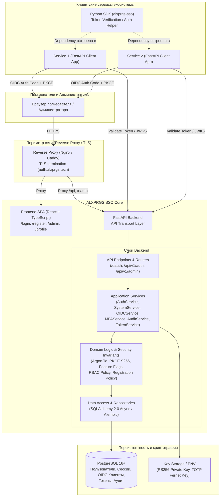
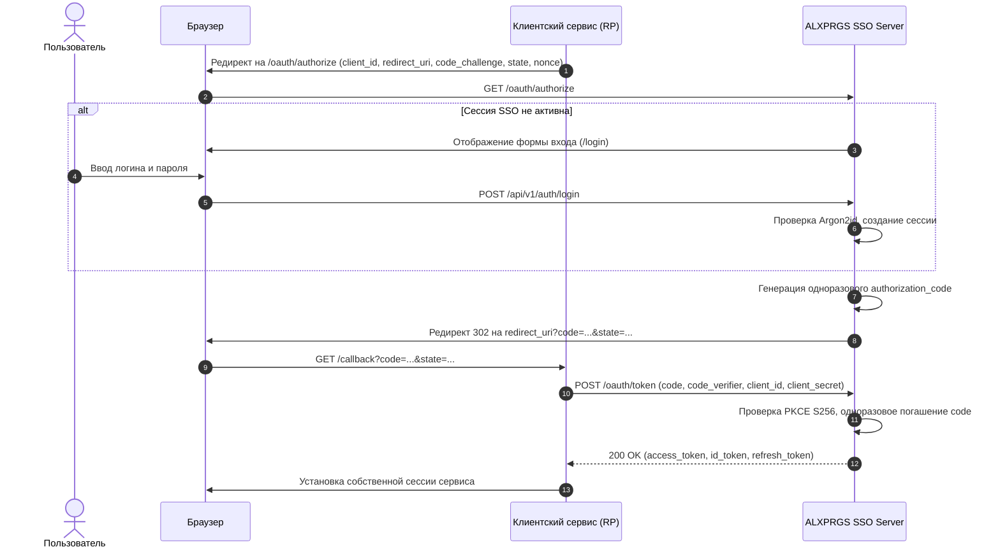

# Архитектура ALXPRGS SSO

- Обозначение документа: ALXPRGS.SSO.ARCH-01
- Версия документа: 1.0.0
- Дата: 2026-09-24T11:38:00+03:00
- Статус: Утверждён

---

## 1. Введение и назначение системы

ALXPRGS SSO — централизованная закрытая система единого входа и управления идентификацией (Identity and Access Management / Single Sign-On) для доменной зоны `alxprgs.tech`. Система обеспечивает:
- Централизованную аутентификацию пользователей по логину и паролю (Argon2id).
- Выдачу токенов доступа и идентификации по протоколу OpenID Connect (OIDC Core 1.0) с поддержкой Authorization Code Flow и PKCE (RFC 7636).
- Интеграцию внешних сервисов экосистемы через стандартизированный протокол и отдельную клиентскую библиотеку Python SDK (`alxprgs-sso`).
- Поддержку расширенных факторов аутентификации (TOTP, WebAuthn Passkey, Recovery codes), отключённых по умолчанию, и обязательное подтверждение email перед созданием самостоятельно регистрируемого пользователя.
- Ролевое разграничение доступа (RBAC) и единый административный интерфейс.

---

## 2. Архитектурная схема компонентов

---

## 3. Модель разграничения сред и сессий

### 3.1. Браузерная сессия SSO (Кабинет и Аутентификация)
- **Механизм**: Серверные сессии, идентификатор сессии хранится в подписанной защищённой cookie `__Host-alx_session`.
- **Флаги Cookie**: `Secure=true`, `HttpOnly=true`, `SameSite=Lax`, `Path=/`, без указания атрибута `Domain` (Host-Only cookie). Это предотвращает утечку cookie на соседние поддомены `*.alxprgs.tech`.
- **Защита от CSRF**: Двойная отправка токена (Double Submit Cookie) либо заголовок `X-CSRF-Token`, связанный со значением в сессии для всех мутирующих запросов (POST, PUT, DELETE, PATCH).
- **Срок жизни**:
  - Idle timeout: 12 часов неактивности.
  - Absolute timeout: 7 суток с момента создания.

### 3.2. Токены API и OIDC
- **Access Token**: JWT асимметричной подписи RS256, срок действия 5 минут (300 секунд).
  - Claims: `iss`, `sub`, `aud`, `exp`, `nbf`, `iat`, `jti`, `scope`, `roles`.
- **ID Token**: JWT асимметричной подписи RS256, срок действия 5 минут. Выдаётся клиенту вместе с access token при запросе scope `openid`.
  - Claims: `iss`, `sub`, `aud`, `exp`, `iat`, `nonce` (если был передан), `email`, `email_verified`, `preferred_username`.
- **Authorization Code**: 60 секунд, одноразовый (single-use), привязан к `client_id`, `redirect_uri`, `code_challenge` (S256), `nonce`.
- **Refresh Token**: Ротируемый токен, срок жизни 7 дней. При каждом обмене старый токен отзывается, выпускается новый. При попытке повторного использования старого токена (Replay Attack) автоматически отзывается всё семейство токенов (Token Family).

---

## 4. Потоки OpenID Connect и Single Sign-On

### 4.1. Авторизация (Authorization Code Flow with PKCE)

### 4.2. Бесшовный вход во второй сервис (SSO Single Sign-On)
1. Пользователь обращается к Сервису 2.
2. Сервис 2 направляет браузер на `/oauth/authorize`.
3. Запрос содержит Host-Only cookie сессии SSO.
4. Сервер SSO валидирует сессию: пользователь уже аутентифицирован.
5. Сервер SSO моментально генерирует `authorization_code` для Сервиса 2 и возвращает 302 редирект на Сервис 2 без запроса пароля.
6. Сервис 2 производит обмен кода на токены.

---

## 5. Архитектура отложенных возможностей (Feature Flags)

Согласно требованиям GOAL.md и AGENTS.md, в системе предусмотрены 4 флага возможностей:
- `FEATURE_TOTP_ENABLED` (по умолчанию `false`)
- `FEATURE_PASSKEY_ENABLED` (по умолчанию `false`)
- `FEATURE_RECOVERY_CODES_ENABLED` (по умолчанию `false`)
- `FEATURE_EMAIL_VERIFICATION_ENABLED` (совместимый параметр; всегда `true`, значение `false` отвергается)

### Архитектурные инварианты:
1. **Single Source of Truth**: Сервер является единственным источником правды.
2. **Fail-Closed**: При выключенном флаге:
   - Роуты TOTP, Passkey и Recovery codes возвращают `404 Not Found` с кодом `feature_disabled`; подтверждение email доступно и необходимо для самостоятельной регистрации.
   - Закрытый режим самостоятельной регистрации не создаёт заявку и не отправляет письмо.
3. **Безопасная витрина возможностей (Capabilities)**: Эндпоинт `/api/v1/auth/capabilities` возвращает фронтенду булевы флаги доступности интерфейсов. Фронтенд скрывает элементы UI, но не принимает решений безопасности.
4. **Защита от bypass**: Если пользователь ранее привязал второй фактор в тестовом профиле, а затем флаг был отключён, вход не должен автоматически пропускать проверку без административного вмешательства.

Для самостоятельной регистрации `RegistrationService.start` создаёт `pending_registrations`, не `users`. `confirm` под блокировкой строки проверяет шестизначный HMAC-код либо хеш одноразовой ссылки и атомарно создаёт подтверждённого пользователя. `EmailVerificationService` сохраняет прежний путь для уже существующих пользователей. Общий MIME-шаблон `services/verification_email.py` содержит text/AMP/HTML и отправляется через SMTP либо SES API v2 Raw (`services/ses_email.py`) согласно `EMAIL_PROVIDER`. Сырой код и токен попадают в in-memory sink только при `ENVIRONMENT=testing`. Ссылка `/verify-email` погашается действием пользователя. Подробнее: [ADR-0007](adr/0007-ses-email-provider.md), [ADR-0008](adr/0008-registration-after-email-verification.md).

## Sentry (ADR-0010)

FastAPI и React отправляют application errors в отдельные проекты EU; shared immutable VERSION/SHA release. Runtime browser config не обращается к PostgreSQL и не содержит backend DSN/credentials/user data. Transaction/static mode позволяет очищать complete traces; outgoing backend propagation выключена, browser ограничен same-origin API/OAuth. Security audit остаётся PostgreSQL, stdout использует безопасный JSON formatter. Replay — отдельный staging-only chunk/worker; все чувствительные views blocked. Private maps отделены от deploy output, token доступен единственному trusted release step. Подробности и ограничения: [observability.md](observability.md).

## Третий email transport — Resend

По EMAIL-RESEND-01 существующий verification_email dispatcher поддерживает native Resend через отдельный async HTTPX adapter. Settings/ошибка доставки/API сценарии прежние; selector smtp(default)/ses/resend. Resend использует RESEND_API_KEY и SMTP_FROM_EMAIL/ALXPRGS, передаёт text/HTML, без AMP, retry/fallback/queue/webhooks. SES raw MIME, boto3 credentials/retry и SMTP MIME/verified STARTTLS сохранены. finite provider allowlists в аудите и Sentry дополнены resend без снятия scrubbing. См. [ADR 0020](adr/0020-resend-email-provider.md), [приёмка](https://github.com/alxprgstech/sso/blob/3603d5721938f594d7892c8c33ba33912906bcb4/docs/acceptance-resend.md).
