# Модель данных ALXPRGS SSO

Сверка документации: 06.10.2026, продукт 0.2.0. [Реестр и границы](index.md), [статус](status.md). Прежние измерения/PASS относятся к указанным датам и ревизиям.

- Обозначение документа: ALXPRGS.SSO.DATA-01
- Версия документа: 1.0.0
- Дата: 2026-09-24T11:38:00+03:00
- СУБД: PostgreSQL 16+

---

## 1. ER-диаграмма сущностей

Общие поля ORM организованы в `TimestampedBase`: единые `metadata`, registry и
`created_at` с UTC. Абстрактный `Base` добавляет UUID `id` для прикладных сущностей;
`SystemConfiguration` наследует `TimestampedBase` и сохраняет собственный integer
`id = 1`. Это разделение уточняет Python-типы и не меняет PostgreSQL-схему:
проверки чистых миграций, предыдущей версии и отсутствия schema drift сохраняются.

```mermaid
erDiagram
    USERS ||--o{ USER_ROLES : has
    ROLES ||--o{ USER_ROLES : assigned_to
    USERS ||--o{ SESSIONS : establishes
    USERS ||--o{ PASSWORD_CREDENTIALS : authenticates_by
    USERS ||--o{ TOTP_CREDENTIALS : binds
    USERS ||--o{ WEBAUTHN_CREDENTIALS : registers
    USERS ||--o{ RECOVERY_CODES : holds
    USERS ||--o{ EMAIL_VERIFICATION_TOKENS : receives
    USERS ||--o{ AUDIT_EVENTS : triggers

    OIDC_CLIENTS ||--o{ OIDC_REDIRECT_URIS : allows
    OIDC_CLIENTS ||--o{ AUTHORIZATION_CODES : requests
    USERS ||--o{ AUTHORIZATION_CODES : authorizes
    OIDC_CLIENTS ||--o{ REFRESH_TOKENS : issues
    USERS ||--o{ REFRESH_TOKENS : owns

    USERS {
        uuid id PK
        varchar username UK
        varchar email UK
        boolean is_active
        boolean is_superuser
        boolean email_verified
        integer security_revision
        timestamp_tz created_at
        timestamp_tz updated_at
    }

    PASSWORD_CREDENTIALS {
        uuid id PK
        uuid user_id FK
        varchar password_hash
        varchar algorithm
        boolean requires_change
        timestamp_tz temporary_expires_at
        timestamp_tz temporary_consumed_at
        timestamp_tz created_at
    }

    ROLES {
        uuid id PK
        varchar name UK
        varchar description
    }

    USER_ROLES {
        uuid id PK
        uuid user_id FK
        uuid role_id FK
    }

    SESSIONS {
        uuid id PK
        integer security_revision
        timestamp_tz auth_time
        uuid user_id FK
        varchar session_token_hash UK
        varchar ip_address
        varchar user_agent
        timestamp_tz expires_at
        timestamp_tz last_activity_at
        timestamp_tz created_at
    }

    OIDC_CLIENTS {
        uuid id PK
        varchar client_id UK
        varchar client_secret_hash
        varchar client_name
        varchar client_type
        varchar allowed_scopes
        boolean is_active
        timestamp_tz created_at
    }

    OIDC_REDIRECT_URIS {
        uuid id PK
        uuid client_id FK
        varchar uri
    }

    AUTHORIZATION_CODES {
        uuid id PK
        integer security_revision
        timestamp_tz auth_time
        varchar code_hash UK
        uuid client_id FK
        uuid user_id FK
        varchar redirect_uri
        varchar code_challenge
        varchar code_challenge_method
        varchar nonce
        varchar scope
        boolean is_used
        timestamp_tz expires_at
        timestamp_tz created_at
    }

    REFRESH_TOKENS {
        uuid id PK
        integer security_revision
        timestamp_tz auth_time
        uuid family_id
        varchar token_hash UK
        uuid client_id FK
        uuid user_id FK
        varchar scope
        boolean is_revoked
        timestamp_tz expires_at
        timestamp_tz created_at
    }

    TOTP_CREDENTIALS {
        uuid id PK
        uuid user_id FK,UK
        text encrypted_secret
        boolean is_confirmed
        timestamp_tz confirmed_at
        timestamp_tz created_at
    }

    WEBAUTHN_CREDENTIALS {
        uuid id PK
        uuid user_id FK
        varchar credential_id UK
        text public_key
        integer sign_count
        varchar transports
        varchar name
        timestamp_tz created_at
    }

    RECOVERY_CODES {
        uuid id PK
        uuid user_id FK
        varchar code_hash UK
        boolean is_used
        timestamp_tz used_at
        timestamp_tz created_at
    }

    EMAIL_VERIFICATION_TOKENS {
        uuid id PK
        uuid user_id FK
        varchar token_hash UK
        varchar email
        boolean is_used
        timestamp_tz expires_at
        timestamp_tz created_at
    }

    AUDIT_EVENTS {
        uuid id PK
        timestamp_tz created_at
        varchar event_type
        uuid user_id FK
        varchar ip_address
        varchar user_agent
        jsonb details
    }
```

---

## 2. Принципы хранения секретов и безопасность данных

1. **Пароли (`PASSWORD_CREDENTIALS`)**:
   - Алгоритм: **Argon2id**.
   - Соль: криптографически стойкая случайная 16 байт на каждого пользователя.
   - Открытый текст пароля никогда не сохраняется в БД и не передаётся в логи.
2. **Секреты TOTP (`TOTP_CREDENTIALS`)**:
   - Секретный ключ TOTP шифруется симметричным алгоритмом Fernet (AES-128-CBC и HMAC-SHA-256;32 байта материала ключа) с использованием отдельного ключа шифрования `TOTP_ENCRYPTION_KEY`, передаваемого через переменные окружения.
   - Расшифровка выполняется только в памяти при генерации QR-кода (при enrollment) и при проверке кода.
3. **Резервные коды (`RECOVERY_CODES`)**:
   - Пользователю показываются в открытом виде **только один раз** при генерации.
   - В БД сохраняются исключительно SHA-256 нормализованных32-символьных случайных кодов (≈165 бит энтропии); plaintext и собственная соль не сохраняются.
   - Погашение кода происходит атомарно в транзакции: `UPDATE recovery_codes SET is_used = TRUE, used_at = NOW() WHERE code_hash = :hash AND is_used = FALSE RETURNING id`. Если возвращено 0 строк — код недействителен или уже использован.
4. **Секреты клиентов OIDC (`OIDC_CLIENTS`)**:
   - `client_secret` для confidential clients хешируется с использованием Argon2id с библиотечной случайной солью. Клиенту секрет показывается один раз при создании или ротации.
5. **Authorization Codes и Refresh Tokens**:
   - В базе данных хранятся криптографические хеши (`SHA-256`) кодов и токенов обновления. При получении токена от клиента он хешируется и сверяется с базой.
   - Погашение authorization code происходит атомарным запросом `UPDATE authorization_codes SET is_used = true WHERE code_hash = :hash AND is_used = false AND expires_at > NOW()`.
   - Семейство refresh токенов (`family_id`): при попытке обменять уже отозванный или погашенный токен из семейства все токены с данным `family_id` немедленно отзываются (`is_revoked = true`).
6. **Конфигурация системы (`SYSTEM_CONFIGURATION`)** (GOAL-02):
   - Таблица-синглтон (`id = 1` через `CHECK (id = 1)`):
     - `id`: integer PK (строго 1);
     - `registration_mode`: varchar (`closed` по умолчанию, `open`);
     - `bootstrap_completed`: boolean (`false` до завершения первого запуска, `true` после);
     - `bootstrap_completed_at`: timestamp_tz (UTC время завершения bootstrap);
     - `updated_at`: timestamp_tz.
   - Читается и обновляется централизованно всеми экземплярами backend без необходимости перезапуска процессов.
   - Защита от конкурентной инициализации реализуется блокировкой строки `SELECT ... FOR UPDATE`.
7. **Все даты**: Хранятся строго в `timestamp with time zone` (UTC).

## Privacy — миграция 0004_privacy

`users` содержит nullable UTC deletion_requested_at/deletion_scheduled_for (парная DB CHECK) и deletion_request_allowed_at; `is_active` сохраняет независимую admin-блокировку. `sessions.purpose` CHECK full/deletion_management/password_change (с0009). `pending_registrations.legal_versions` JSONB и legal_accepted_at переносятся в `legal_acceptances` после email; UNIQUE(user_id,document_id,version).

`deletion_authorizations` связаны FK CASCADE с user/session: hash unique, action request/cancel, stage factor/authorized, expires_at, failed_attempts 0..5, bound WebAuthn challenge. `totp_credentials.last_verified_step` защищает от повтора OTP через FOR UPDATE. `privacy_rate_windows` хранит HMAC ключ bucket/IP либо user UUID и краткое окно, без raw identity; counters атомарны и не зависят от аудита. `deleted_subjects` без user FK хранит только subject UUID и deleted_at (служебные id/created_at), retention 30 дней.

При erasure PostgreSQL CASCADE удаляет credentials/roles/sessions/codes/refresh/consents/permissions. Связанные audit rows очищаются в той же транзакции. Account row lock предшествует token row locks; общий admin advisory lock согласует удаление/блокировку/роли, worker owner lock допускает одного обработчика за tick. Схема rollback не восстанавливает ранее очищенные geo/UA/PII.

## Security lifecycle — миграции0005…0010

Актуализация: 2026-10-04T14:05:32.539979+03:00, Codex. Диаграмма выше описывает основные сущности, а не полную DDL; точный источник — `backend/app/models` и Alembic. Real PostgreSQL autogenerate comparison проверяет их совпадение. Служебный `test_database_marker` не является application model и существует только в явно выделенной тестовой БД.

| Данные | Назначение и ограничения |
| --- | --- |
| `users.security_revision`; snapshots в sessions/codes/refresh/email/MFA-step/actions | Инкремент и отзыв под User row lock до дочерних rows. Offline access JWT у RP имеет остаточное окно до exp; сервер дополнительно проверяет текущую revision |
| `authentication_steps` | Хеш одноразового MFA-step, user/revision, expires_at/consumed_at; consume+factor+session в одной транзакции |
| `security_authorizations` | Хеш proof, user/session FK, revision, action/body hash, stage/failures/expiry, WebAuthn challenge. Короткое одноразовое подтверждение чувствительной операции |
| `totp_credentials.pending_*` | Pending encrypted secret/expiry/session отдельно от активного encrypted_secret; подтверждение атомарно заменяет factor. `last_verified_step` предотвращает повтор текущего OTP |
| `webauthn_challenges.session_id` | Registration challenge связан с текущей SSO-сессией; origin/RP/challenge/signature/UV проверяются реальной библиотекой |
| `sessions.auth_time` и `purpose` | Время фактического login, API его не обновляет. Purpose full/deletion_management/password_change; ограниченная смена временного пароля10min, без обычных grants |
| `password_credentials.requires_change/temporary_*` | Admin recovery credential15min, restricted one-use, после смены обычного пароля нужен новый login |
| `oidc_clients.allowed_scopes` | Сохранённый набор отдельно от ролей; default `openid profile email`, issuer проверяет подмножество и подавляет лишние claims |
| `privacy_rate_windows` | Общая PostgreSQL инфраструктура quotas с отдельными namespaces/HMAC identifiers; DB timestamp и атомарный counter, независимый quota commit до expensive Argon2 |

Email verification привязана к точному адресу и revision. Pending user change не меняет прежний подтверждённый адрес до атомарного подтверждения; admin email change сразу очищает verified и прежние challenges. Уникальность адреса защищена PostgreSQL, concurrent collision возвращает безопасный отказ. Процедура перехода схемы и отдельных ролей — [migration](migration.md), [operations](operations.md).

## Полнота модели

Диаграмма основных сущностей не заменяет DDL. Перечень — backend/app/models и десять Alembic migrations, head 0010_registration_session. pending_registrations предшествуют users; email_verification_tokens обслуживают существующие аккаунты. Дополнительные таблицы: authentication_steps, security_authorizations, webauthn_challenges, legal_acceptances, deletion_authorizations, deleted_subjects, privacy_rate_windows. DDL drift проверяется на PostgreSQL, не статической сверкой.
